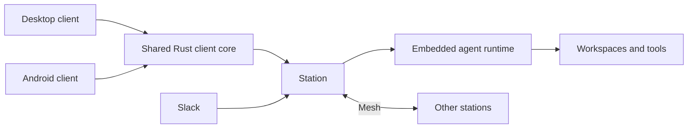

# Zork

A local-first workspace for running durable AI agents across your own devices.

Zork brings conversations, coding workspaces, model connections and background
agent work into one system. Use the native desktop or Android client, connect
Slack when you need an external entry, and connect devices through a mesh.
Workspace files and runtime state stay on your devices; model requests go to the
providers you configure.

## What you can do

- **Work through conversations.** Choose agents and models, send messages and
  files, follow progress, and manage work from a native client.
- **Keep agents running.** Each agent session has a durable mailbox and event
  history. A Station can run in the background independently of the client.
- **Use your existing workspaces.** Agents run tools in an explicitly selected
  directory. They can read and edit files, run shell commands and use configured
  MCP services and skills.
- **Connect your devices.** Mesh membership, invitations and permissions connect
  stations and clients; agents can delegate work to another device.
- **Bring your own model connections.** Profiles manage provider credentials and
  model access. Slack is optional; the native conversation entry works without it.

## How it fits together

**Station** is the node service, now named `zork-station` (formerly
`zork-gateway`). It owns conversations, delivery, device APIs and mesh coordination.
The `zork` supervisor starts one Station process, which embeds the agent runtime.
The standalone `zork-agent` binary is available for independent use.



Clients submit business intents through `zork-client-core` and render its state.
Agent transcripts are execution context; visible chat messages are sent explicitly
through the chat tools. See the [client boundary](docs/client-core-ui-boundary.md)
and [chat contracts](docs/chat-tools-design.md).

## Project status

Zork is under active development. This repository contains the macOS desktop
client, Android client, native Station, agent runtime and shared client core.
The Web design workspace is an interactive reference and component showcase.

Native node packaging targets macOS and Linux on ARM64 and x64. Source and
packaging workflows are available; use a published native release only when its
complete assets are present on the [Releases page](https://github.com/HOOLC/zork/releases).
Desktop app packaging and signing follow a separate workflow. See
[native releases](docs/native-releases.md) for platform requirements and validation.

## Run from source

You need Rust, Node.js 22.15 or later and pnpm 10.33.0. Coding tools also use
`git`, `gh` and `rg` from `PATH`. Native desktop builds require the platform
toolchain described in the [desktop README](crates/zork-gui/README.md).

```sh
git clone https://github.com/HOOLC/zork.git
cd zork
pnpm install --frozen-lockfile
pnpm build
pnpm dev
```

`pnpm dev` starts the supervisor and Station with the default data directory
`~/.zork`. For an isolated node:

```sh
pnpm dev -- --data /absolute/path/to/node-data
```

On macOS, start the desktop client from the same checkout:

```sh
python3 scripts/lib/build_env.py -- cargo run --locked -p zork-gui
```

Configure model connections and agents in Settings, then select an agent from the
conversation sidebar. The client can manage its local node or connect to other
devices. Product settings live in the node's `config.json`; local build settings
may use an ignored `.env`. See [desktop setup](docs/desktop-node.md) and
[Android development](apps/android/README.md).

## Install a native node

Once a complete native release is available:

```sh
curl -fsSL https://github.com/HOOLC/zork/releases/latest/download/install.sh | sh
```

The installer selects and verifies a native package and starts a persistent
Station. Node.js and npm are not required on an installed node. To join a mesh,
use the pinned invitation command from Settings → Device connections.
[Native release instructions](docs/native-releases.md) cover offline installs,
version pinning, service management and upgrades.

`zork update` restarts an existing node with already staged binaries.
`zork upgrade --version X.Y.Z` downloads and activates a complete release.
Neither a fresh install nor joining a mesh silently upgrades a running node.

## Repository map

| Path                                                       | Responsibility                                                |
| ---------------------------------------------------------- | ------------------------------------------------------------- |
| `crates/station`                                           | Station: conversations, delivery, node APIs and orchestration |
| `crates/agent`, `crates/agent-http`, `crates/agent-server` | Durable agent runtime and optional HTTP host                  |
| `crates/zork`                                              | Supervisor, installation, services and upgrades               |
| `crates/zork-client-core`, `crates/zork-client-types`      | Shared client operations, state, sync and contracts           |
| `crates/zork-gui`, `crates/zork-ui`                        | Desktop application and reusable GPUI components              |
| `apps/android`, `crates/zork-android`                      | Android application and Rust bridge                           |
| `crates/zork-mesh`                                         | Device transport, enrollment and synchronization support      |
| `crates/profile`, `crates/slack`                           | Model profiles and Slack integration                          |
| `apps/zork-design`, `crates/zork-gui-web`                  | Design references and Web component showcase                  |
| `scripts`, `.github/workflows`                             | Development, packaging and validation                         |
| `benchmarks`                                               | Independent benchmarks and experiments                        |
| `docs`                                                     | Architecture, contracts and operating guides                  |

## Development checks

```sh
pnpm format:check
pnpm lint
pnpm build              # rebuild binaries before process tests
pnpm test               # JS and process contracts
pnpm test:rust          # backend Rust tests
pnpm test:desktop       # native desktop tests
python3 scripts/check-client-boundary.py
```

Design workspace: `pnpm design:dev`, `pnpm design:check`, `pnpm design:test` and
`pnpm design:build`. DeepSWE adapter tests: `pnpm benchmark:deep-swe:test`.
Functional tests and performance measurements have separate entry points; see
[validation](docs/zork-agent-status.md) and [repository content](docs/repository-content.md).

## Further reading

- [Station naming and compatibility](docs/station-naming.md)
- [Agent architecture](docs/zork-agent-architecture.md)
- [Chat and message tools](docs/chat-tools-design.md)
- [Client core and UI boundaries](docs/client-core-ui-boundary.md)
- [Mesh and device connections](docs/local-mesh.md)
- [Native releases and upgrades](docs/native-releases.md)
- [Design workspace](apps/zork-design/README.md)

## License

[MIT](LICENSE). Bundled third-party components retain their own license and
attribution files alongside the source and assets.
