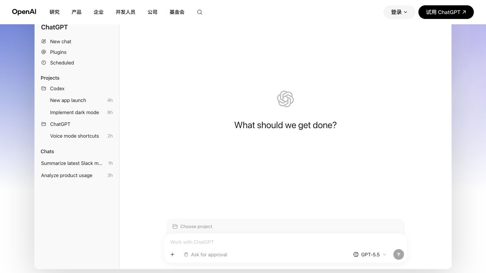
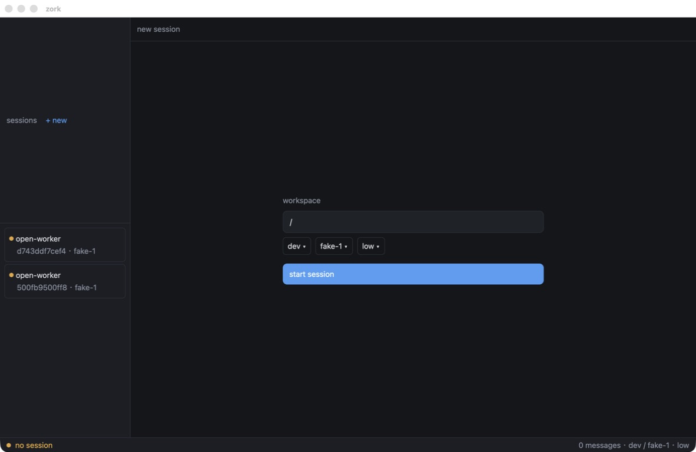
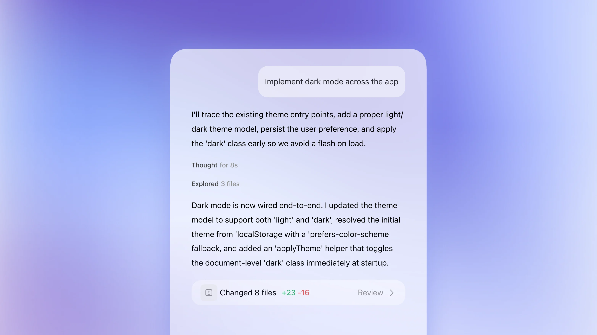
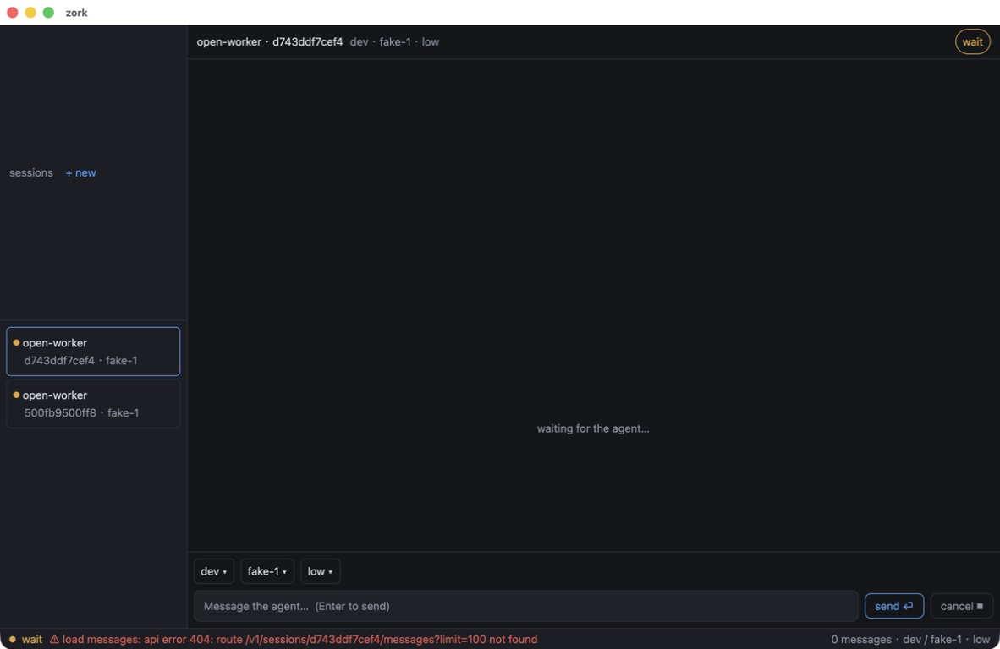

# zork-gui Codex parity audit — baseline

## Audit scope

- Surface: native `zork-gui` desktop client.
- Flow: new task → select recent task → read task → follow up.
- User goal: operate the real zork agent through an interface that is
  immediately recognizable as the Codex task experience.
- Reference: official OpenAI Codex shell and task imagery captured on
  2026-08-26, plus the live native client captured at 1280 × 800.

## Step 1 — new task shell: poor

Strength: the current screen exposes workspace and model selection directly.

UX/design risks:

- The dark admin-dashboard treatment, hard panel dividers, tiny labels, and
  full-width blue submit bar do not share the Codex reference hierarchy.
- The sidebar is a generic bordered session list rather than a quiet task
  navigator with an app header, primary new-task row, grouped tasks, and soft
  selected fill.
- The empty state is a developer form instead of a clear prompt-led starting
  point with the composer as the primary surface.
- Low-contrast small text and compact click targets create visible
  accessibility risks; keyboard semantics and screen-reader labels cannot be
  confirmed from screenshots.

## Step 2 — selected task and follow-up: poor

Strength: the screen has the necessary task list, transcript area, status, and
composer regions.

UX/design risks:

- The session identifier/model string dominates the header while the actual
  task title and workspace context are weak.
- Status is split between a top chip and a global bottom diagnostics strip;
  Codex treats thinking, tools, waits, and completion as inline task activity.
- The transcript is edge-to-edge and visually empty rather than a centered
  readable column with differentiated prompt and prose treatments.
- The composer is a thin toolbar. Codex uses a substantial rounded surface
  with multiline prompt space and secondary controls inside it.
- Raw API errors in the global status bar are visually louder than the task
  itself and do not provide a calm recovery path.

## Highest-impact changes

1. Replace the dark dashboard shell with the light Codex canvas and quiet
   grouped task sidebar.
2. Replace the full-width transcript/header/status stack with a centered task
   column and inline activity rows.
3. Replace the toolbar composer and separate global status bar with a fixed,
   rounded prompt surface containing the relevant controls.
4. Preserve the working agent behaviors while removing the old visual branch
   completely.

## Evidence limits

- The official website reference is a current OpenAI product mock rather than
  an accessibility tree from the user's signed-in Codex window; direct Codex
  app capture is intentionally unavailable to automation.
- Screenshot evidence can identify visible contrast, hierarchy, density, and
  target-size risks but cannot establish keyboard or assistive-technology
  compliance.
