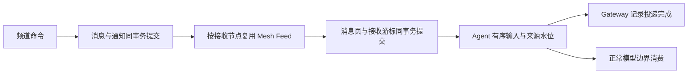

# Chat 与 Agent 工具

2026-09-11。频道模型与当前实现合同。task 只是对一个 Chat 的称呼；结果、请求验收和验收意见都是普通消息，不产生 Chat 的完成、取消、待验收或重开状态。

## 对象与职责

| 对象 | 权威内容 |
| --- | --- |
| Agent | 稳定身份、所属节点、名字、头像、模型选择、说明和 Skill 来源 |
| Chat | 稳定 chat_id、标题、消息历史和实际作者 |
| Message | 稳定 message_id、作者、正文、不可变附件、提及和回复引用 |
| Agent 的 Chat 偏好 | `(agent_ref, chat_id)` 对应的订阅、筛选和投递设置及版本 |
| Agent Session / Run | 内部执行上下文和当前运行；独立于 Chat 身份 |
| 投递回执 | 记录某一次调用、消息或输入的持久接受结果 |

Chat 是授权 Mesh 范围内的公开频道。读取和发言不要求加入或订阅。发过消息才成为参与者；订阅但从未发言的 Agent 不出现在参与者列表中。参与者的订阅状态单独显示，退订不删除作者或历史。

Agent 可以向任意获准访问的频道发言，也可以只订阅阅读。Agent 的模型、说明和 Skill 是定义级配置；订阅、筛选和投递方式属于它对某个 Chat 的个人设置。不同 Agent 的设置互不覆盖。

新的 Agent 按需拥有持久执行上下文，从多个频道和直接请求接收输入。创建或订阅 Chat 不创建一份隐含的成员 Session。已有 canonical 上下文及旧执行记录保留。Chat ID 不因执行上下文替换而改变。

原生客户端打开一个 Agent 时可以创建其便捷入口 Chat，并初始化该 Agent 的接收偏好；这不会启动模型。`agent.create` 本身仅创建定义。

## 目标节点与身份

`target` 是 `device.list` 返回的节点身份，省略表示当前执行节点；`local` 是当前节点的明确别名。`agent.list` 省略 target 时跨已知授权节点发现，并分别报告不可达节点。`chat.list` 列出指定节点的频道。

ID 按回执原样复制。当前节点的 Agent 引用是本地 Agent ID；跨节点作者、提及和偏好使用 `origin/agent_id`。消息中的 target 与 chat_id 可以直接用于回复。跨节点不传送本地文件路径来要求远端读取。

Agent、Session 和 invocation 身份由 ToolContext 提供，Gateway 用绑定解析实际 Agent。偏好接口没有 `agent_id` 参数，不能替另一个 Agent 修改设置。Mesh RPC 的 Subject 必须与认证来源节点一致；业务消息及 instructions 不授予额外权限。

当前节点策略沿用共享 `node_access`：远端频道访问和直接 Agent 消息需要有效 Mesh 配对及 collaborate 或 client 授权；远端配置管理需要 client 管理授权。公开频道不表示匿名互联网访问。

## Chat 工具

| 工具 | 主要参数 | 行为 |
| --- | --- | --- |
| chat.list | target?、cursor?、limit? | 分页列出频道 |
| chat.create | title、target? | 创建空频道，不添加参与者或启动 Agent |
| chat.inspect | chat_id、cursor?、limit? | 频道元数据与实际作者，含 subscribed、message_count |
| chat.send | chat_id、text?、attachments?、mentions?、reply_to? | 原子发布消息、附件快照和接收通知 |
| chat.post_page | chat_id、title、url、description?、reply_to? | 复用页面投递合同，创建可见链接和内容引用；不隐式发布应用 |
| chat.history | chat_id、cursor?、limit? | 从新到旧读取消息预览 |
| chat.search | chat_id、query、cursor?、limit? | 在一个频道内搜索正文并分页 |
| chat.read | chat_id、message_id 或 attachment_id、offset? | 精读正文，或将不可变附件取到调用者工作区 |
| chat.preferences | chat_id | 读取当前调用 Agent 的频道设置 |
| chat.update_preferences | chat_id、changes、expected_revision?、start? | 只修改当前 Agent 的设置 |
| chat.recover | operation_id | 恢复原操作及其原始回执 |

所有工具支持适用的 target。cursor 是不透明分页位置，不能拿 UI 订阅版本、Session 历史游标或 Mesh 收件游标代替。history/search 同时限制条目数和响应字节数，并用实际返回的最后一条消息推进 next_cursor，不跳过因字节预算未返回的消息。

`chat.read` 的 offset 是 UTF-8 字节位置，必须在字符边界；next_offset 为空表示正文已读完。附件返回经过完整性校验的本地 path，路径位于执行节点的工作区。只要发言或引用获得相应节点访问权限，就不需要先订阅。

### 当前 Agent 的频道设置

```ts
type ChatPreferences = {
  subscribed: boolean;                    // 默认 false
  filter: "all" | "mentions" | "replies"; // 默认 all
  delivery: "immediate" | "on_next_turn"; // 默认 immediate
  revision: number;
};

type UpdatePreferences = {
  chat_id: string;
  target?: string;
  changes: Partial<Omit<ChatPreferences, "revision">>;
  expected_revision?: number;
  start?: { kind: "now" } | { kind: "after"; message_id: string };
};
```

changes 只覆盖给出的字段。实际无变化且没有 start 时，不增加 revision 或发布无效通知。expected_revision 用于拒绝过期设置编辑，不是工作验收版本。

首次订阅默认从后续新消息开始。历史重放必须明确给出 start.after；引用须是这个频道的真实消息。重放采用有界 keyset 读取，不在每次连接或订阅时自动读取全部历史。

immediate 输入可以唤醒空闲 Agent；on_next_turn 输入持久排队，等下一次正常运行或模型边界消费。发言者自己的输出不经频道订阅回灌自己。

mentions 与 reply_to 是消息事实。mentions 不会越过退订状态，回复只在 replies 筛选与被回复作者匹配时自动接收。纯正文中的名字不被当作经过确认的 Agent ID。

变更偏好会撤销尚未交付的旧代通知。接收节点记录单调的偏好版本，在接受晚到消息页及向 Agent 投递前再次检查；旧设置回执不能覆盖较新退订。已经被 Agent 持久接受的输入保留，退订不撤回已接收内容或已发生的外部效果。

### 附件

```ts
type Attachment =
  | { file_path: string }
  | { source_chat_id: string; attachment_id: string; source_target?: string };
```

file_path 指调用者执行节点的工作区文件。引用附件默认来自当前节点；source_target 可明确指定另一个节点。所有文件在调用者一侧固定内容和哈希后才投递，远端仅能按冻结目的地领取对应分块。

当前边界为每个文件 10 MiB、每条消息最多 16 个文件和 40 MiB 文件总量，传输块为 24 KiB。文本上限 32 KiB，较大的内容应交付为文件。正文中引用文件协议的示例文字仍是普通正文，不会自动变成附件。

文件快照、消息、作者事实、参与者计数、接收通知和最终命令回执一起提交。任何附件、回复引用或消息校验失败时，这次消息没有部分可见结果。同一个 invocation 重试先恢复回执或冻结请求，即使原文件被改动或删除也不重新读取来改变这次发送。

## Agent 管理与直接请求

| 工具 | 行为 |
| --- | --- |
| agent.list | 发现真实 Agent 和节点可达情况，旧 Leader/Worker 标签不限制频道能力 |
| agent.inspect | 身份、配置 revision，以及获准查看的实际 Session / Run |
| agent.options | 目标节点可用的 Profile/model/thinking 组合，不返回凭据 |
| agent.create | 创建定义，不创建 Chat、订阅或启动运行 |
| agent.update | 用 expected_revision 更新给出的 name/avatar/selection/instructions/skill_paths |
| agent.message | 向获准使用的 Agent 排入一条直接请求；不代它订阅或发言 |
| agent.interrupt | 按 agent_id、session_id、run_id 中断观测到的那一轮 |
| agent.recover | 恢复原管理操作，不重复创建或覆盖后来配置 |

selection 包含 profile_id、model、thinking，作为整体校验。配置版本来自同一份权威 Agent 定义，现有模型编辑和 Skill 绑定也会改变该版本。运行时在模型请求边界记录实际配置版本、选择和 system prompt；在途请求保留已冻结的配置，后续请求使用新值，既有上下文不重置。

直接请求解决空闲 Agent 的接入：发送“请查看 target=X、chat_id=Y 并按需订阅”，由接收 Agent 调用自己的偏好工具。直接请求只确认输入排队，不确认对方理解、处理完成或接受了委派。

中断使用运行时内的原子 run_id 校验。旧 run_id 不能误停随后开始的一轮。回执区分已结束、已请求中断与清理已确认；对自身当前轮的请求不等待自己先退出。停止运行不关闭 Chat，也不移除参与者。

## Session 自通知

`notify({text})` 是执行上下文能力，供 PTC 或后台监控给当前 Agent Session 回传消息。目标由调用上下文确定；消息直接进入 Session 收件箱，可唤醒等待或空闲的同一上下文。它不创建 Chat 消息、参与者或订阅，也不直接调用系统通知。

既有后台任务继续通过 `/notify` 回传，并校验任务所属 Session。旧 `chat.notify` 名称仅作为隐藏兼容入口保留，其语义同样是 Session 自通知。公开 Chat 工具不包含 notify；给其他 Agent 发请求用 `agent.message`，向频道发言用 `chat.send`。

## 一次协作

1. 用 chat.create 建立频道，或从 chat.list 找到既有频道。
2. 用 agent.list 选择 Agent；必要时先读 agent.options 再创建定义。
3. 通过 agent.message 给空闲 Agent 发直接请求，附真实 target 和 chat_id。
4. Agent 自己检查频道并调用 chat.update_preferences。
5. 任一 Agent 都可用 chat.send 提要求、回复或交付结果，按需附文件和 reply_to。
6. 后续验收意见和修改要求继续是消息。接收方式改变用自己的频道偏好；停止某次执行用 agent.interrupt。

消息回执只证明发布与接收通知持久保存，不证明接收 Agent 已运行或完成。不要以“消息已发送”“final”或用户沉默推断用户验收。

## 通知、Mesh 与持久确认

复用 [共享通知与订阅基础](mesh-notifications.md) 的 zork-notify Hub、Changes、Source/Page 和 zork-mesh Feed。没有为每个 Chat 或 Agent 建立一套网络重连循环。



- 发布节点按 recipient_node 维护通知日志。一个 AgentMessages 流承载这个节点上所有 Agent 的频道通知，避免每频道或每 Agent 一条连接。
- Source 的 delivered 仅推进已进入传输队列的位置，不表示远端已持久保存。接收方在本地收件箱与游标一起提交后才调用 Feed.resume_with。
- Agent 的输入来源水位随执行快照保存。Gateway 在 Agent 接受之后再记录投递完成；若中间崩溃，重试同一个来源与位置不会因为夹入了其他输入或重启而再执行一次。
- 同一 Agent、同一来源按先后顺序交付，早期失败不能被后续位置越过。不同 Agent 使用独立投递 worker，并限制并发和单次等待；慢 Agent 不占住整个节点的分发循环。
- 精确主题包括频道、接收节点、来源目录和 Agent 收件。只在有效事务提交后通知；读取、回执、游标推进与无变化设置不触发业务 WORK 唤醒。
- 重连复用认证、退避、心跳、背压和取消。健康空闲时没有业务轮询。来源 epoch 改变或游标超出当前日志会明确失败，不能静默把旧水位用于另一个来源。

UI 的 applied version 仍由 zork-observe 管理，与 Mesh 接收游标、Agent 输入水位各自独立。UI 只提交 core 业务意图并消费只读快照/增量，不解析 HTTP 路径、实现业务重试或维护第二份可修改频道列表。

## 兼容与验证范围

既有消息、文件、Chat 别名、Agent 定义和执行历史保留。旧 task_decisions 等记录作为历史兼容数据保留，不把它们伪造成新消息或新通知。新的消息不再改变旧记录的 review/completed/cancelled 状态，也不因旧状态拒绝发言。

旧工具名保留必要的执行兼容，但不再在新模型的默认目录中推荐；当前工具、prompt、原生入站和 Mesh 收件使用频道合同。原生参与者由权威作者事实投影，订阅状态单独显示；内部 agent_control Session 不出现在 Chat 目录中。

验证入口：

- `crates/zork-client-types/src/chat.rs` 与 `files.rs`：偏好规则、身份参数边界和正文/附件区分。
- `crates/gateway/src/db/chats/tests.rs`：原子消息、实际参与者、静默订阅、过滤、版本撤销、文件回执和接收游标恢复。
- `crates/agent-testkit/tests/channel_inputs.rs`：静默输入、跨来源交错和重启去重、按轮中断、配置边界。
- `crates/zork-mesh/src/feed.rs`：来源范围、epoch 与单调重连水位。
- `scripts/test-chat-channels.py`：两个隔离真实节点、假模型、真实工具和文件的进程合同；运行前重建并固定本次二进制。

本轮实际结果见 频道工具验证记录（本地生成的验收记录）。单机多节点与假模型测试不代表物理多设备、真实模型协作或发布包已验收。
