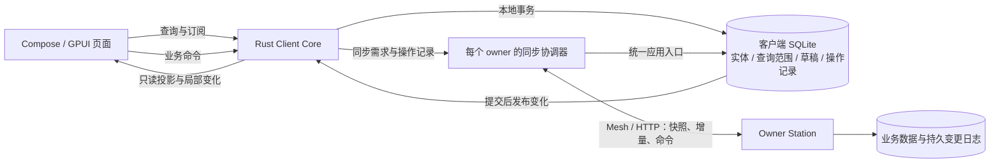

# Zork 客户端数据与同步架构

> 实施状态与后续边界见 [客户端数据同步实现记录](client-data-sync-implementation.md)。本文仍是目标架构，不表示所有阶段已经迁移完成。
2026-09-08。架构方案，基于设计时的源码核对；下文“当前基础”保留设计时的基线，已实施部分以顶部链接为准。目标是让桌面与 Android 获得一致、可恢复的本地数据体验，同时保留现有多节点执行、授权和消息发送策略。

## 1. 架构结论

采用 **明确的对象写入权威 + 客户端持久副本 + 可恢复的增量同步 + 本地命令记录**。

页面读取客户端副本，网络负责更新副本。业务操作由对象所属节点裁决；客户端先持久保存用户意图，再展示待确认状态。客户端数据库是 UI 的统一读源，所属节点是业务事实的写入权威，二者的职责不同。

每个对象有明确 owner，多台节点可以分别拥有不同对象。跨 owner 的视图最终收敛；不要求全网一个中心节点，也不提供断网时任意节点都能独立裁决同一个 Task 的承诺。owner 离线时，已有内容仍可读，本地编辑仍可保存，需要 owner 确认的操作等待处理。

复用 SQLite、`zork-client-core` 和现有 Mesh/HTTP 传输。同步协议传递产品对象及其版本，文件使用内容校验和按需获取。无需为了这个目标替换数据库、复制整个数据库文件或把所有业务对象改成 CRDT。

## 2. 当前基础与结构性缺口

当前源码比早期设计文档已有进展；以下以实现为准。

| 已有实现 | 当前限制 | 演进方向 |
| --- | --- | --- |
| `state::Device`、`state::Conversation`、只读订阅、按业务域通知 | 桌面已接入较多；Android 仍使用 `Client/Session` JSON 快照和 Kotlin 状态映射，部分设置绕过这些状态 | 扩展现有 state 模块；JNI 成为同一状态系统的适配器 |
| `ClientStore` 的 SQLite、草稿/outbox 事务、消息缓存 | 存储中同时存在 `agents` / `http:/v1/node/agents`、`messages:<id>` / `http:.../messages` 等表示；部分数据仅内存存在 | 统一实体身份、读模型和迁移规则 |
| Station 提交驱动的 Realtime 通知 | revision 是进程内计数；按域发 changed 通知，不是可持久续传的完整变更记录 | 持久 Change Journal；现有推送继续用于唤醒同步 |
| LiveFeed 先订阅再沿分页寻找消息锚点 | 很适合现有消息补齐，但消息 ID 锚点不能覆盖所有实体修改、删除、权限和数据库恢复 | 快照、水位、版本和删除记录组成统一恢复协议 |
| 单次发送、原 ID 手动重发、持久 outbox | 主要覆盖聊天；其他配置/任务写入的回执、冲突和恢复方式不统一 | 统一命令记录和确认机制，保留不同命令的发送策略 |
| Profile/config 文件及文件监听 | 文件替换与 Station SQLite 事务不是一个提交边界 | 明确文件写入恢复流程及可同步的公开投影 |

Android 的具体症状是：设备设置页新建一个空状态，然后连续读取设备信息、队员、Profile 和 Provider；这些 GET 走 `Request`，不经过通用 HTTP 快照缓存。桌面的 `Device::refresh(PROFILES)` 当前也只发布内存状态。因此这不是仅限 Android 的一个漏缓存点。

此外，缓存写入失败后仍能发布新内存状态、网络请求与状态管理混在同一等待锁内、页面拥有部分数据生命周期，都会让“当前显示”“本地已保存”“对端已确认”逐渐分离。

源码入口：

- [共享状态](../crates/zork-client-core/src/state/mod.rs)、[Device](../crates/zork-client-core/src/state/device.rs)、[Conversation](../crates/zork-client-core/src/state/conversation.rs)。
- [Client/命令](../crates/zork-client-core/src/lib.rs)、[移动端 Session](../crates/zork-client-core/src/session.rs)、[本地存储](../crates/zork-client-core/src/store.rs)。
- [LiveFeed](../crates/zork-client-core/src/live.rs)、[投递](../crates/zork-client-core/src/delivery.rs)。
- [Station 通知](../crates/station/src/realtime.rs)、[SSE/Mesh 推送](../crates/station/src/desktop_events.rs)。
- [Android ViewModel](../apps/android/app/src/main/java/surf/zork/android/ClientViewModel.kt)、[JNI](../crates/zork-android/src/lib.rs)、[桌面导航](../crates/zork-gui/src/desktop/navigation.rs)。

## 3. 数据分类与所有权

不能把所有 JSON 响应都当成同一种缓存。

| 数据 | 写入权威与冲突规则 | 客户端保存与同步 |
| --- | --- | --- |
| 设备名称、Agent 配置、Profile 公开配置、会话、Task | 所属 Station；带版本的命令，冲突由 owner 裁决 | 持久实体和增量同步 |
| Run 的执行事实 | 指定 executor；Task 的验收、取消等产品决定仍归 Task owner | 保留来源、运行代次及 Task/Run 关系；复用现有委派边界 |
| 可见消息、批注、结果、文件清单 | 相应会话/产品对象的权威节点接纳；稳定 ID 和修订号 | 持久保存已同步的范围；显式编辑/删除也可传播 |
| 草稿、编辑中的附件、滚动位置、展开状态 | 草稿和 UI 状态默认归当前客户端 | 必须本地持久；跨端草稿续写另设产品规则，不让两台设备静默覆盖彼此输入 |
| 已读状态 | 若提供跨端一致体验，按用户和会话建对象 | 使用消息顺序水位合并；“标为未读”是独立操作，不能用简单 max 覆盖它 |
| 在线、输入中、临时执行进度 | 当前连接/运行实例，带存活期限 | 在线状态不从旧缓存恢复为真；最后已知状态与当前可达性分开 |
| 用量、配额、探测结果等外部派生信息 | 所属节点采样和验证，带采样时间 | 有限时效的公开快照；按需请求重新采样，不承诺像本地事务数据一样实时 |
| 文件内容 | 来源节点发布的确切内容版本 | 元数据先到，字节按需下载、校验、固定保留或淘汰 |
| 模型密钥、OAuth refresh token、节点私钥 | 所属节点的凭据存储 | 不进入通用复制投影；客户端自身的认证材料由客户端安全存储管理 |

实体键至少包含授权空间、owner、类型和稳定 ID；授权空间可先对应现有 Mesh group/授权边界，不引入必需的中心账户服务。IP、端口、显示名不参与身份。桌面本机连接的别名应在认证后映射到 Station origin，避免同一个节点通过本机地址与 Mesh 地址出现两份数据。

不同版本不能依靠客户端墙钟比较。Task revision、同步日志位置、UI 通知 revision、运行 generation 各有用途，不混用。

## 4. 客户端结构



继续演进 `state::Device/Conversation`，逐步让 Android 的 `Session` 与 Kotlin 映射成为同一核心的薄适配层。不要再增加第三套页面缓存管理器。

同一客户端数据目录、授权空间和 owner 只有一个协调器；多个页面共享它。视图只决定读取什么、优先同步什么，以及选择/滚动等界面状态。离开设备设置页不会删除设备信息，关闭一个会话页不会销毁整个设备目录的同步状态。

应用生命周期决定网络预算：前台手机维护目录和必要的活动会话；后台按平台能力暂停网络，保留本地数据库和同步进度；再次前台恢复续传。桌面常驻与手机受限后台使用相同协议，不承诺手机被系统暂停时仍实时收消息。

网络 IO 使用每个 owner 有界并发、请求合并和优先级调度。读取/编辑本地数据不等待网络锁，也不在数据库事务里 await 网络。多窗口共享同一核心；若未来多个进程共享一个客户端数据目录，要经明确的单写入者/IPC 机制，不能只靠进程内 registry 假设它们已协调。

UI 始终从核心的本地读模型订阅。远端读取、推送、命令回执最终都进入同一个 apply 路径，不允许某个 HTTP 回调直接覆盖页面状态。

核心可保留热数据的不可变内存索引，数据库承担持久性；订阅发布发生在提交之后。局部 ID 变更、消息窗口和分页查询替代每次序列化整段会话。慢 UI 消费者可以合并通知并重新读取当前窗口；网络同步游标不能因此跳过尚未落盘的变更。

## 5. 存储模型与页面状态

从按接口保存整块 JSON，演进到按实体和集合范围组织数据。首版可继续在 payload 中存类型化 JSON，但身份、版本、索引和事务语义要稳定。

概念表：

- `entities`：授权空间、owner、kind、id、epoch、revision、payload、删除状态。
- `messages` / 关系索引：会话、消息顺序、发送者、修订号及内容引用，支持按窗口读取。
- `sync_scopes`：授权范围标识、协议版本、持久游标、已完成快照代次。
- `coverage`：集合/历史哪些范围已加载、是否完整、分页锚点、校验时间。
- `operations`：命令 ID、类型、载荷、基础版本、依赖、投递策略、确认/拒绝/不确定状态。
- `drafts`、本地 UI 偏好，以及 blob 的可用性、校验和保留元数据。

每种资源分开记录：

```text
availability = absent | partial | ready
sync         = idle | syncing | error
connection   = unknown | reachable | unreachable | revoked
pending_operations = ...
```

有旧数据且正在刷新时继续显示旧数据。读取成功且集合为空，才显示“没有模型/没有队员”。网络失败、尚未加载和确实为空不能都落成空数组。Profile 请求失败也不应直接把整个设备标记离线。

时间到期触发校验，不删除内容。缓存淘汰是本机可用性变化，不是业务删除；草稿、未解决的操作和用户固定保留的内容不能当可重建缓存清理。

## 6. 服务端可恢复的同步协议

### 6.1 写入与变更日志

Station 保留现有业务表。对需要复制的持久对象，在同一个 SQLite 事务里提交：业务变化、公开同步投影、Change Journal，以及适用的命令回执。提交成功后再唤醒订阅者。

这是一份可截断、可通过快照恢复的同步日志，不要求把全部业务改为事件溯源，也不要求保留所有历史事件才能启动 Station。

变更至少携带 owner、数据集 epoch、日志位置、对象类型/ID、对象 revision、upsert/delete 和安全投影。一个业务事务涉及的关联变化按完整批次应用，避免用户看到引用已经更新、被引用对象却还没出现的半个状态。

现有进程内 changed 通知继续用于低成本唤醒。客户端正确性依靠持久日志：握手、重连、前台恢复、手动刷新及低频水位校验都能发现遗漏。推送及时到达能降低延迟；偶尔丢一条提示不会导致永久不一致。

### 6.2 首次同步和续传

建议提供版本化的能力协商、snapshot、changes 和 commands 接口；具体路由名称在实施时确定。HTTP 与 Mesh 复用同一授权、查询和 apply 语义。

1. 握手确认对端身份、协议版本、授权范围、数据集 epoch 和日志保留边界。
2. 首次同步获取指定范围的一致快照及水位 H。多页快照必须来自固定快照/可重建的同一版本；不能每页读取随时变化的当前表，再宣称它们一致。
3. 客户端先写 staging generation，所有必要页完成后，在本地事务中切换该范围的可见代次并保存 H。大快照采用有限生命周期的导出/版本机制，避免长期读事务无界阻塞服务端 WAL 回收。
4. 从 H 之后读取变更批次。实体变化、删除记录、集合成员关系和游标在同一个客户端事务提交，随后发布 UI 通知。
5. 中途断线或进程崩溃，从最后已提交游标重放。重复数据幂等，旧 revision 不覆盖新 revision。
6. 游标过期、权限范围变化或 epoch 不匹配时，对受影响范围重新 bootstrap。原本地内容可标为重新校验中；草稿和未解决操作独立保留。

游标是 owner/epoch/授权范围绑定的协议值。服务端过滤权限后出现原始日志序号跳号，不等于客户端丢包；客户端以服务端承诺的前后游标和批次边界续传，不自行要求原始 seq 连续。空增量也可推进检查水位。

数据库重启通常保留 epoch；从旧备份恢复、重建日志等可能回退历史的操作必须改变 epoch。旧 epoch 的待处理命令不能盲目重投；特别是去重回执丢失时，要保留“不确定”并核对，不能靠新的请求 ID 猜测重做。

### 6.3 范围、分页和删除

设备目录同步身份、公开配置、会话/任务摘要等元数据；打开或固定的会话同步相应消息范围，文件内容另行调度。以业务复制范围管理游标，不把页面上的关键词/排序变化直接变成新的事实来源。

扩大复制范围时必须为新增部分 bootstrap，不能把旧范围已经推进的游标套上去。未打开的会话可以只更新摘要与未读；已有历史页面的 freshness/coverage 要诚实反映是否补齐。长时间离线后的大缺口可以分批修复或重新取最新窗口，但不能跳过缺口后宣称完整历史已同步。

历史分页和在线变更通过对象 revision 合并，避免较慢的旧分页响应覆盖新编辑或使已删除消息复活。完整范围快照可以替换该范围的成员关系；普通分页里“没出现”不能解释为删除。显式 tombstone 或完整快照替换负责删除传播。

服务端日志和 tombstone 的保留期必须与可恢复游标匹配。过期客户端获得 reset-required，走范围快照；不能静默从日志尾开始。

## 7. 写操作、回执与冲突

UI 提交类型化意图，例如 RenameDevice、UpdateAgent、SendMessage、AcceptTask，而不是任意 PATCH 后自行改几份页面状态。

```text
本地保存命令和必要的 UI 待确认层
    → 按该命令的策略发送
    → owner 校验授权、ID 与 expected_revision
    → 业务变化 + 去重回执 + 同步日志提交
    → 客户端统一 apply 确认状态
```

同一命令 ID 和载荷重送返回原结果；同一 ID 换载荷必须拒绝。任务验收、配置修改等使用明确的基础版本和业务前置条件。发生冲突时保留用户输入并展示差异或要求重新提交；不用客户端时间戳静默覆盖。

乐观状态是独立的本地待确认层，不伪造 owner revision。RPC 回执和同步流即使乱序到达也按同一对象版本合并。某个命令回执可先确认该对象，但不能凭它跳过整个增量日志的中间部分；移除待确认层应与已获得的权威结果衔接，避免消息短暂消失。

统一 outbox 不等于统一重试政策。当前聊天发送保留“单次尝试、失败手动重发、复用原请求 ID”。同步拉取和回执查询可自动恢复，但不会因为网络重连悄悄重新发送失败消息。配置编辑、任务控制等分别定义离线保存、提交时机、取消和超时后的核对方式。

owner 的“持久接收”“业务提交”和 executor 的“执行完成”是不同回执。断线不算任务取消，HTTP 超时也不证明对端未执行；任意 shell/外部 API 副作用没有由此获得 exactly-once 保证。

## 8. 多存储边界与授权

Profile/config 当前保存在文件中，Agent runtime 也有自己的持久事件。不能把 SQLite commit hook 当成覆盖所有来源的原子同步方案。

SQLite 内的产品数据直接同事务写日志。外部存储采用可恢复流程：先持久记录操作 → 幂等写入或核对外部结果 → 将安全公开投影及其变更日志提交到 Station SQLite → 完成相应回执。进程重启恢复未完成步骤。既有配置文件的外部编辑，由文件监听加启动/周期核对导入公开投影；监听是发现手段，不承担唯一持久性保证。

目标状态中，设备、Agent、Profile 的可同步公开配置由 Station 产品事务存储持有，密钥由专用凭据存储管理，运行时通过引用读取。原有可编辑配置文件逐步成为版本化的导入/导出接口；修改通过命令及版本校验进入产品状态。过渡期仍由文件持有的数据只能按上述恢复流程提供一致投影，不能宣称已经获得跨文件/数据库的原子提交。

凭据或文件版本可以先以不可变版本持久暂存，随后提交数据库引用、公开投影和日志；失败留下的未引用版本由恢复/回收流程处理。仍被运行引用的版本保留到释放。这样无需把模型密钥加入同步数据库，也无需把两个存储系统假设成一个事务。

Agent 内部 token/tool 活动按需要做轻量瞬时推送；最终消息、Run 结果、任务决策通过持久投影进入同步日志。避免每个 token 都变成需要长期复制的产品事务。

权限由服务端每次同步/命令执行校验，Mesh 认证身份只是基础。同步 DTO 使用字段白名单；不能直接广播含凭据的原始 Profile JSON。撤销后停止新同步和命令，并按产品策略隐藏/清理对应本地空间；保留在别处的已导出数据不能靠撤销追回。权限扩大需要补齐新增范围，收缩需要撤销已有范围，二者都不能仅修改一个 online 布尔值。

第一版按 owner 直接同步。未来通过其他节点提供副本或转发时，保留原 owner/来源和版本，并建立可验证的导入规则；缓存节点不能自动变成业务写入者。现有 Synch/Iroh 继续负责连接、身份和内容传输，产品协议负责版本、冲突和业务授权。

## 9. 迁移顺序

| 阶段 | 具体交付 | 完成标准 |
| --- | --- | --- |
| 1. 统一客户端读写入口 | 在现有 state 模块补全设备公开详情/Profile/Provider 等类型和持久性；Android 改为订阅同一状态；迁移旧缓存键；移走页面网络编排 | 重开页面/重启应用/断网都能读取已有数据；各端只有一套业务状态；写盘失败不被标成已同步 |
| 2. 持久同步协议 | Station journal、版本化快照/增量、epoch、删除记录、范围与游标原子提交；旧协议能力协商回退 | 漏推送、重连、旧分页响应、删除及长离线均可确定恢复 |
| 3. 通用命令确认 | 扩展现有 outbox/去重机制到配置与任务命令；版本冲突、回执核对、持久待确认层 | ACK 丢失与双方重启不重复业务决定；保留现有聊天重试策略 |
| 4. 范围和资源治理 | 元数据常驻、历史/附件按需、配额和固定保留、权限变更与日志 GC | 大数据不要求整库进内存；旧客户端超出保留期可重建；未解决意图不被淘汰 |

第一阶段先接设置和目录域，形成跨桌面/Android 的完整纵向切片。随后接入已有会话与消息路径；不要一次替换已经验收的发送、历史补齐和运行恢复实现。

迁移期可由统一核心适配现有 HTTP 读与 changed 提示，并在后台校验刷新。它能立刻改善本地体验，但应标为旧协议兼容模式；仅靠缓存和全量重读不宣称已经获得第二阶段的严格增量恢复能力。

旧缓存按已知类型导入，未知/不完整版本标为需要校验。不得清库解决迁移，尤其保留身份、草稿和 outbox。未完成的旧命令保留原 ID 和重试语义。分域切换读取者后移除对应旧写入者，避免长期双写两套状态。

## 10. 验收不变量

- 已有本地数据时，进入页面不等待网络、不先清空列表；导航保持现有小于 100 ms 的首屏目标，按真实设备和固定数据集实测。
- 两个客户端分别修改设备、Agent、Profile、任务后，另一个端无需重开页面即可收敛；页面关闭期间发生的修改也能在重新打开时出现。
- 模拟快照分页期间并发修改、删除和新增，完成后既不漏数据也不产生幽灵条目。
- 丢失提示、重复/延迟批次、写盘中断、双方重启、cursor 过期和备份恢复后，游标与可见数据一致。
- ACK 丢失、提交超时和用户重发不创建第二次同 ID 的业务操作；失败聊天消息不因重连自动重发。
- 旧版本数据不覆盖已确认的新版本；本地缓存删除不发送业务删除；未加载不显示成业务空集合。
- 撤权、换授权空间、旧连接迟到响应和双端配置冲突有明确结果，不串数据、不丢用户输入。
- 本地存储失败、单一资源刷新失败、设备不可达与任务执行失败分别呈现，不能互相替代。
- 消息规模验证按仓库当前 100000 条混合类型基准，检查首/中/尾、分页、内存、可见节点和增量应用成本；这里的架构设计尚未执行该验证。
- 普通 Android 回归使用任务独立模拟器与构建产物；最终跨设备/LAN/relay/手机生命周期验收再串行使用实机。

先把这些不变量变成协议和故障测试，再迁移页面。目标是让页面天然读到可恢复的数据，而不需要每个页面自行证明它的缓存、刷新和重连是正确的。
