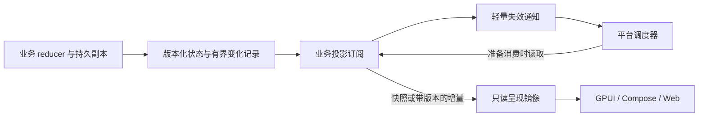

# Rust core 到 UI 的订阅抽象设计

状态：核心机制与首轮跨端接入已实现，2026-09-11。实际接口、平台接入及保留的兼容路径见[当前合同](client-state-subscriptions.md)，测试与性能数字见[验证记录](client-subscription-validation.md)。下文保留设计动机与目标；第 1 节是改造前盘点，不是当前源码描述。

实现沿现有共享控制器演进，统一为**按业务投影订阅、通知与读取分离、带版本的快照及增量、平台按需调度**。性能工作同时覆盖生产、传递和消费；仅替换 channel 或减少 UI 重绘不能消除发布之前的复制与序列化。

Session 执行概览由 SSE 的首个权威 snapshot 建立，再跟随后续提交；重连同样从 snapshot 开始。历史是用户按需读取的具体执行记录，补历史不带 snapshot，统计与摘要不依赖全部历史加载。客户端只在 core RAM 保存这些读模型与已请求详情，不建立执行历史磁盘副本。

## 1. 改造前盘点（2026-09-10）

| 层 | 实际入口 | 已有能力与限制 |
| --- | --- | --- |
| 通用观察原语 | `crates/zork-client-core/src/state/observable.rs` | `watch::Receiver<Arc<T>>` 保留最新值；`snapshot()` 同时标记已读，`changed()` 等待后立即取值；`publish()` 在 watch 写锁内对整个 `T` 做 `PartialEq` |
| 设备 | `state/device.rs::DeviceSubscription`、`Device::commit` | 八个领域的独立 revision 能保留慢订阅者错过的领域；所有订阅者仍先被同一 source 唤醒，再检查 domains；navigation 在设备提交后重新投影 |
| 会话 | `state/conversation.rs::ConversationSubscription::accept`、`Conversation::commit` | 基于每个订阅者的旧快照计算 splice，合并语义正确；消息变化后每个订阅者都扫描前后缀。写侧保留 `before`，再对 `Arc<Vec<TranscriptLine>>` 做 `make_mut`，因此修改会复制整个已加载列表，包括行内 String/metadata |
| 消息维护 | `state/conversation.rs::apply_event`、`message_bytes`；`transcript.rs::reconcile_delivery` | 消息去重按 ID 线性寻找，消息变化后重新遍历全部行估算字节数；这些成本也在通知之前 |
| 历史与设置 | `state/history.rs`、`state/profiles.rs`、`state/agent_catalog.rs` | 分别维护旧快照和差异算法；历史在仅状态变化时也会执行 entries 前后缀比较。缺少统一的版本、首次读取和关闭协议 |
| GPUI | `crates/zork-gui/src/views.rs::start_background/start_sse` | await 更新后立即计算和应用，再使 Regions 失效；当前订阅循环没有按帧合并这一层工作。框架自身可能合并绘制，这不代表 core diff 和视图映射已经合并 |
| Android 会话 | `crates/zork-client-core/src/session.rs::Session::poll/fields` | 等待变化最多 300 ms，变化后再批处理 8 ms；消息变化时重建全部消息 JSON，再比较得到 upsert，同时发完整 `message_order`；设备元数据也重新构造 |
| Android 调度 | `crates/zork-android/src/lib.rs::call`、`NativeBridge.kt`、`ClientViewModel.kt::startLive/applyState` | 会话 poll 与其他非本地命令共用 Kotlin networkGate 和 Rust Client 锁；每次 poll 后固定 delay 100 ms；Kotlin 按完整 ID 顺序重建显示列表 |
| Android 设置 | `ClientViewModel.kt::watchSettings`、`settings.rs::poll` | 每 250 ms 经本地通道读取副本/操作状态并比较版本串；没有接入事件唤醒。其业务同步来自 core，UI 轮询的是本地投影 |
| Web 展台 | `crates/zork-gui-web/src/api.rs` | 通过 `#[path]` 编译 observable、Profiles、Agents 源码，提供内存 Gateway；不是完整的 Web 客户端，也尚未通过公开模块契约复用 |

需要保留的已有设计：同一设备/会话复用控制器、只读快照、通知有界、消费者独立基线、领域版本、core 负责消息身份与归并、控制器与观察者分离的生命周期。`MessageActivity` 的累计 sequence 加最近 32 个 ID，也比逐条排队动画事件更适合慢 UI。

现有 `benches/messages.rs` 测的是消息持久化、分页与旧 JSON 缓存成本；100,000 条消息的 GUI 基准测渲染。两者都不能单独证明本设计涉及的“提交 → 订阅 → 平台应用”链路能承受高频更新。

## 2. 先定义数据语义

| 数据 | 订阅语义 | 慢 UI 的行为 |
| --- | --- | --- |
| 在线状态、运行状态、当前速率、操作进度 | latest state | 跳过中间显示值，读取最新值 |
| 消息/任务列表、历史记录、文件列表 | versioned state + patches | 合并期间的变化，或在无法补齐时重置该投影 |
| 消息到达动画、新增计数 | 累计计数 + 有界提示 | 保留数量，只保留有限个展示 ID；新订阅者不播放历史动画 |
| 命令结果、送达、权限撤销等业务事实 | core 状态机和需要时的持久记录 | UI 不消费也必须正确；不可依靠一次瞬时回调完成业务 |

未来若展示流式正文，文本片段先在 core 按顺序累积，UI 接收截至某版本的追加/替换变化。允许跳过中间帧，不允许丢掉组成最终文本的片段。若产品要求显示每条日志，则提供有界窗口和历史读取契约；不能把无限日志放进 UI 通知队列。

动画、滚动、鼠标位置和逐帧插值留在 UI。业务速率的计算和采样窗口留在 core。视频/画面等大块二进制数据采用专用缓冲和平台能力接口，状态订阅只携带描述与进度。

## 3. 三层职责



**状态源**负责串行提交、不可变读取版本和变化记录。**业务投影**负责哪些状态相关、如何生成结果以及列表/权限/送达等规则。**平台绑定**只负责唤醒、线程/帧调度、应用 core 给出的变化、释放订阅。

投影以业务对象命名，例如 `DeviceNavigation(device)`、`ConversationTranscript(device, session)`、`ConversationActivity(device, session)`、`ProfileDetail(device, profile)`。不把 `header`、`composer`、`left-panel` 等组件名写入 core。一个 UI 区域可以绑定多个投影；一个业务操作也可以影响多个区域。

首版采用有限的、带类型的投影与明确依赖。订阅注册时按 source、topic 和对象 key 路由变化，不先唤醒全部消费者再执行任意 selector。共享投影按 key 复用；一次变更生成一次业务变化描述，读取时再做消费者所需的汇总。暂不引入自动追踪任意闭包依赖的响应式运行时。

例如同一条流式正文在两帧之间变化 20 次：core 仍处理完整的 20 次业务输入，记录累计文本与版本；平台只收到一次待处理通知，读取并应用这段时间的合成变化。另一个只观察连接状态的组件不被唤醒。通知扇出仍与相关观察者数有关，不能承诺有任意多个观察者时发布成本恒定。

观察原语保持不依赖 GPUI、Compose、HTTP、SQLite 或 Tokio runtime 的启动方式。已由 workspace crate `zork-observe` 承载机制，并通过 `zork-client-core` 重新导出；业务投影与 reducer 留在 core。当前 Web fixtures 已改为公开 core 契约及内存适配，原生依赖按目标平台隔离。

## 4. 公共订阅协议

下面保留契约草图；实际 API 以 `zork-observe`、`zork_client_core::state` 和 `zork_client_core::subscriptions` 为准。具体泛型和 FFI 命名不同，但版本与确认语义一致。

```rust,ignore
struct Cursor {
    stream: StreamId, // 源实例 + 业务投影身份；重建/换授权/换窗口后变化
    revision: u64,
}

struct Versioned<S> {
    cursor: Cursor,
    value: S,
}

enum Update<S, D> {
    Reset { current: Versioned<S>, reason: ResetReason },
    Delta { from: Cursor, to: Cursor, changes: D },
}

impl<P: Projection> Subscription<P> {
    async fn ready(&mut self) -> Result<(), Closed>;
    fn prepare(&mut self) -> Result<Prepared<P>, ReadError>;
    fn acknowledge(&mut self, batch: BatchId) -> Result<(), AckError>;
    fn discard(&mut self, batch: BatchId) -> Result<(), AckError>;
}
```

- `subscribe` 先注册观察，再取得起始版本；首次 `prepare` 返回 Reset 快照，即使初值为空也明确返回。`ready` 的唤醒计数与已应用 revision 是不同状态。
- `ready` 仅表示有未消费变化或终止状态，不比较大列表、不编码 JSON，也不推进已应用游标。等待必须可取消且空闲时不定期醒来。
- `prepare` 针对该消费者最后确认的版本生成结果。每个订阅最多有一个 prepared batch；重复 prepare 返回同一批次，避免出现两份互相依赖的在途增量。
- `acknowledge` 只接受该订阅已发出的 batch，表示平台呈现镜像已完整应用。随后重新检查最新版本，再决定立即通知还是等待。不是网络送达回执，也不等待 GPU 呈现完成。
- `discard` 丢弃未应用的 batch，保持已应用游标不变；下次从旧基线到最新版本重新生成。取消/编码失败不能自动确认。原生可用 RAII 封装，FFI 需明确 close/discard。
- Delta 只可应用于完全匹配的 `from`。版本落后超出保留范围、source 重建、投影切换时返回 Reset。不同 stream 的 revision 不可比较；它与服务器游标、持久副本 sequence、对象 revision 均不同。
- native Snapshot 使用共享不可变数据；JNI/WASM wire result 使用相同的版本与变化语义，不要求跨语言共享 Rust 指针。FFI 同时携带 subscription ID 和 generation，关闭、换设备、A→B→A 切换后的旧回调不能应用到新订阅。
- producer 消失时返回 Closed，最后已提交但未读的状态应仍可按约定读完。撤权须先发布清除受限内容的投影并使旧 generation 失效。平台已有数据的清除不等待下一次可见帧；core 不再允许旧句柄读取或重新填回受限内容。

UI 对 patch 的机械应用属于呈现镜像；消息去重、冲突处理、撤回和送达判断仍由 core 完成。Android 不能重新构建这些业务规则。

### 提交与通知必须属于同一个版本

同一 source 的 state root、revision、topic revisions 和变化日志水位在一个提交临界区内确定。捕获快照和对应 patch 边界后才释放锁进行编码，不再分别读取“当前状态”和“另一个时刻的变化”。锁内不执行平台回调、JSON 编码、网络 IO 或任意用户 selector。

业务 reducer 在修改时产生 `ChangeSet`，只对涉及的字段/记录检查 no-op。通用发布层不再要求 `T: PartialEq` 并遍历整棵业务状态。不能用任意 dirty 标记代替幂等判断；相同数据不推进版本、不通知。

一次提交影响多个 topic 时一次发布。跨 source 默认只保证各自有序；如果一个界面结果要求原子一致，例如草稿清空、outbox 加入和待发送消息出现，应在 core 的聚合投影中从同一次业务提交发布，不让 UI 自己用多个异步流拼出业务原子性。

## 5. 高频数据的存储与增量

### 大集合不能继续采用整 Vec 写时复制

消息采用稳定 ID、逐记录共享的不可变值，以及支持按索引访问/区间读取的分块持久序列。更新一条记录时只复制其路径和相关块；维护 core 内的 ID 索引与增量字节计数。ID 索引指向稳定记录/序列位置标识，不因历史前插而重写全部整数下标。UI 根据 ID 缓存排版，根据核心给出的变化失效相关行。

单纯改为 `Arc<Vec<Arc<Message>>>` 只能避免复制正文，仍要复制 N 个指针；用 `Arc<Vec<Chunk>>` 同样仍有块目录复制。这可以是过渡实现，但不能声称是与总量无关的追加。最终集合实现需通过相同负载比较；目标是单次追加/替换的集合维护为 O(log N + 本次变更量)，并保留虚拟列表所需的索引访问。

流式正文也应保留已完成文本块，只更新尾块；不能每个 token 都复制已生成的完整 String。正文变化与运行状态、速率变化分开，状态更新不扫描历史正文。

### 增量由写侧记录，读侧按基线汇总

源保存按 revision 排序的、有界变化记录，描述 `InsertRange`、`RemoveRange`、`UpdateRecords` 等。变化携带必要的插入/替换数据，不要求 Android 再发一次请求取正文。常见的连续追加和同一记录重复更新可以汇总；复杂操作首版允许保留有序 patch 批次，不强求最小 diff。

变化合成必须定义每个索引相对于批内哪一步的列表，或直接使用稳定 ID/锚点。不能把若干 producer splice 的 mask 合并后，只保留最后一个 splice。当两个相距很远的记录更新时，也不应强迫 UI 失效两者之间的整个区间。

记录保留同时受条数与字节预算约束；超限回退 Reset。订阅者保留一个已应用基线和最多一份 prepared 结果，不为慢订阅者积压每个历史快照。由于 UI 可以持有已交付快照，预算描述的是 core 自己的保留，不是整个进程的硬内存上限。

大列表的 wire 投影包含总量、稳定窗口锚点及窗口内记录；Reset 只重建已订阅窗口，页面扩大窗口仍通过 core 操作。不得在每次落后时默认序列化十万条历史。原生可以共享更完整的持久集合；两种传递方式维持相同的 ID、顺序、权限和版本契约。

## 6. 各平台的调度

通知表示 dirty，只在从“没有待处理工作”进入“有待处理工作”时请求平台调度。pending 保持到应用确认；期间更新继续进入 core 的最新状态与有界日志。

典型路径：**提交并标脏 → 唤醒一次 → 平台准备处理 → prepare → 应用 → acknowledge 并重新检查**。最后一步必须同时处理更新在 prepare、应用或重新挂起期间到来的情况，不能先清 pending 再无条件睡眠。先用现有 watch 等成熟原语实现这一握手；是否需要 ArcSwap/无锁结构由锁竞争测量决定。

| 平台 | 绑定职责 |
| --- | --- |
| GPUI | 封装重复的订阅任务和 drop 管理；可见高频投影通过 `on_next_frame` 安排一次读取与应用，调用 Regions 使相关区域失效。首屏、命令反馈可及时应用，帧回调必须实际请求一帧，不能只注册后等待别的事件 |
| Android/Compose | Rust 持有独立 subscription registry，等待订阅不持有命令执行锁；轻量回调投递 handle/generation，通过 Choreographer 或已有帧时钟合并。JSON/二进制编码与解码在后台，主线程只原子应用准备好的呈现变化并确认；每个 handle 只允许一个在途批次 |
| Web | 相同契约经 WASM 导出；可见时用 requestAnimationFrame 合并，后台不可见时不持续轮询。回前台读取最新值或窗口 Reset；Web 展台接入确定性内存 source 和测试调度器 |

Android 可以按一次平台调度批量 drain 多个 dirty handle，并批量确认。确认是轻量控制消息，无需再次传完整状态；后续可以把确认与重新挂起组合，避免额外唤醒。去掉目前固定 100/250 ms 的 UI 轮询，但不把 JSON 编码直接搬进帧回调。刷新率、窗口可见性属于平台，不在 core 写死 16 ms 或 60 Hz。

平台显示模型按稳定 ID 和记录 revision 复用，只转换变化的记录；集合镜像使用分块/持久结构或有界窗口。若接收到一个 append 后又构造完整 Kotlin List 或重新 materialize 全部原生行，仍未完成性能改造，必须纳入应用阶段的测量。

Kotlin StateFlow 适合发布最新的只读呈现状态或 revision；增量先按顺序应用到呈现镜像，再发布结果。**不能直接用 conflated Flow 承载依赖前序状态的 raw patch**，否则被跳过的补丁会破坏基线。同样不要用 Kotlin 大列表结构相等比较再次充当变化检测器。[StateFlow 的官方契约](https://kotlinlang.org/api/kotlinx.coroutines/kotlinx-coroutines-core/kotlinx.coroutines.flow/-state-flow/)明确说明最新值合并及基于 equals 的抑制。

关闭窗口、Composable 离开或 Web 隐藏，只解除本次观察/调度；业务控制器的保留、操作取消以及应用级 pause/resume 继续由 core/runtime 的既有策略决定。业务事件处理绝不等待 UI 的帧或 acknowledge。

## 7. 验证与性能目标

先建立独立 `subscriptions` 基准，再做实现。构建完成后单独运行，分别报告原语、业务 reducer、native 订阅、wire 编码和平台应用成本。以下是测试矩阵，不是性能结论：

| 维度 | 工作负载 |
| --- | --- |
| 已加载/可访问总量 | 1,000、10,000、100,000 条混合消息，包含长文本、Markdown、附件与 metadata |
| 变化 | 单条追加、同一条正文连续更新、远距离两条记录更新、前插历史、删除/撤回、仅 activity 变化、重复事件 |
| 速率 | 60、240、1,000 次提交/秒及一次 10,000 次突发；这些是压力输入，不代表产品实际频率 |
| 观察者 | 1 和 8 个相关消费者，加不相关 topic 消费者；一个消费者暂停两秒，另一个继续读取 |
| 平台 | 原生共享读取；JNI/wire 的字节数、编码解码、队列及应用耗时；真实 Android 测量单独报告 |
| 生命周期 | 订阅与写入交错、prepare 后取消、ack 时写入、超出日志预算、关闭和 source 重建、A→B→A、撤权与在途结果 |

验收不先承诺任意机器上的 ns 数字。首先守住以下可重复验证的性质，再据真实设备数据设绝对延迟预算：

- 单条消息变化的复制/编码量随变化量及索引路径增长，不随整个历史正文量增长；activity 更新不扫描消息集合。
- 重复业务输入不推进版本、不产生平台更新；无相关变更时订阅链路没有定期 poll，没有数据库读写。业务自身的重连/恢复时钟单独统计。
- 不相关 topic 不唤醒 UI；同一高频订阅在一个待处理周期里最多安排一个回调，平台每帧最多应用一次该投影的常规高频更新。
- 慢订阅者不会阻塞生产者或快订阅者；落后超限可 Reset 后继续，最终状态等于 core 当前状态，内存不随未消费事件总数持续增长。
- property/model tests 将随机变更、合并、丢弃 prepared、Reset 后的呈现镜像与完整权威投影比较；覆盖 ID 顺序、内容、权限及 activity 累计数。
- 分别记录提交/prepare/编码/解码/应用的 p50/p95/p99、分配量、字节数、每秒唤醒数、日志峰值和 reset 次数。native 端到端可见延迟另测，不从虚拟帧或 core 微基准推算 FPS。

## 8. 实施状态与后续边界

1. 已落地原语的 source/cursor、首次空快照、关闭、prepare/ack/discard、撤权与有界日志。增加了独立耗时、分配及 wire 基准；同步便捷包装与显式平台协议分别记录。
2. Conversation 已使用逐记录共享的持久列表、稳定位置索引、增量字节统计和写侧 edits。History 进一步接入按步骤/调用 ID 的增量聚合、模型选择及等待边界索引，写侧直接维护有序 entry edits；新页不再重放、排序并比较全部历史。首次建表、受新证据影响的大范围模型标注，以及 UI 分组/时间轴布局分别记录，见 [History 验证](history-incremental-validation.md)。
3. GPUI 的 Device/Conversation/History 按帧准备及应用；Android 独立句柄、JNI 轻量回调、窗口投影、后台编码解码和应用确认均已接入。旧 Session 全量 JSON diff、完整 message_order 和会话/设置轮询命令已删除。
4. Device 使用提交时的 topic 路由。Profiles/Agents 与 Web 展台共享公共 core 和应用确认协议；小目录比较与同步消费仍保留，未来大目录的逐 key 路由、流式正文分块及完整 Web 会话桥接不在当前完成项中。

不在这次抽象中重做同步协议、命令总线、业务状态机或 UI 组件体系。它们继续使用 [core/UI 边界](client-core-ui-boundary.md)与[同步空闲合同](sync-idle-contract.md)；本设计替换的是状态发布和平台消费的公共机制。

补充参考：[Tokio watch](https://docs.rs/tokio/latest/tokio/sync/watch/) 的 latest-value、`borrow_and_update` 和关闭语义，以及 [Android Choreographer](https://developer.android.com/reference/android/view/Choreographer) 的帧调度入口。通用原语实际使用标准锁、持久结构和 `AtomicWaker`，不依赖 Tokio watch；库行为和性能以锁定源码、测试与单独测量为证。

## 页面与按需资源的接入记录（2026-09-11）

页面引用和发布记录复用 Device 的 catalog Resource 数据及 artifacts domain；对话文件/页面归属索引由 core 在相关内容变化时重建。Directory 只聚合各设备的发布记录，普通消息更新保留未改变的页面 Arc。此处仍是低频目录快照和索引重建，不代表已迁为逐条持久列表 patch。

MCP、Skill 和服务详情复用共享 Resources value source；原生视图通过 FrameDelivery 准备、应用并确认快照。撤权和连接替换隔离在途旧响应，详情缓存有界，读取由打开或刷新触发。现有客户端订阅协议未增加另一套帧时钟或业务轮询。

原生入口、实际 Mesh 读写、重启和浏览器状态验收见 [页面与资源合同](mesh-resources.md)。十万条混合消息回放已记录 CPU 帧耗时与构建行数；这些证据不等同于 Android 新入口迁移或高频 wire 编码性能验收。

对话内容现按页面、文件生成独立索引；浮层只读取有界预览，完整列表复用右侧原生标签页。分组、排序和搜索投影由 core 提供，查询或相关数据变化时更新；原生沿 RootView 的既有订阅与 artifacts domain 消费，不为每个标签增加轮询或订阅。索引仍随目录变化重建，未声称本次已迁为逐条列表 patch。
