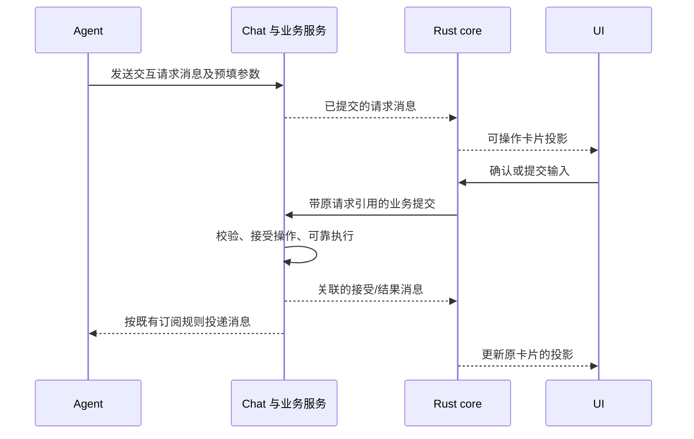

# 消息中的交互请求与结果投影

状态：讨论稿，尚未实现。2026-09-11。本文基于当前工作树盘点；消息、授权和订阅的已有实现不等于下述交互闭环已经具备。

## 已确认的方向

Agent 可以在 Chat 发出带完整参数的创建 Agent 消息。用户在卡片上确认，客户端通过 Rust core 调用业务 API；实际操作产生关联的结果消息。权威消息源中的请求和结果保持 append-only；客户端缓存可以修改，core 收到结果后直接更新缓存中原消息的交互状态，并将变化发布到同一张卡片。Agent 通过原有订阅接收结果，继续工作。

客户端先收到结果、尚未收到请求时，持久暂存按原请求引用关联的结果；以后拉到请求时完成合并。首版沿用普通消息分页与增量追赶，不要求另建按请求 ID 补齐关联消息的接口。

同一机制用于配置修改、权限授权、登录、输入和选择。公共能力围绕消息与业务操作建立，不引入独立的 Task/Workflow 状态机。以下字段、模块和实施顺序是技术建议。

## 当前实现与缺口

| 范围 | 当前实现 | 需要补齐 |
| --- | --- | --- |
| 消息合同 | [chat.rs](../crates/zork-client-types/src/chat.rs) 包含正文、附件、作者、提及和 reply_to | 带版本的交互请求及结果内容、结果的可信来源 |
| 客户端协议 | [im_entry.rs](../crates/station/src/im_entry.rs) 已输出 reply_to 等字段；[api.rs](../crates/zork-client-core/src/api.rs) 的 MessageMetadata/TranscriptMessage 尚未保存这些关联字段 | 结构化内容和关联贯穿历史、实时事件、Mesh 与客户端解码，避免经过中间层后丢失 |
| 消息提交 | [db/chats/messages.rs](../crates/station/src/db/chats/messages.rs) 将消息、附件、通知和发送回执一起提交 | 支持结构化消息；业务效果与结果消息可靠关联，结果写入不依赖窗口存活 |
| 命令恢复 | [channels/api.rs](../crates/station/src/channels/api.rs) 与 [db/chats.rs](../crates/station/src/db/chats.rs) 已有参数指纹、稳定对象 ID、回执及恢复 | 将经过认证的用户确认接入；同一请求在多端确认也只接受一次有效提交 |
| Agent 配置 | [channels/agents.rs](../crates/station/src/channels/agents.rs) 有 agent.create/update，但创建默认 Leader；[state/agent_catalog.rs](../crates/zork-client-core/src/state/agent_catalog.rs) 的表单入口仍要求角色，且编辑字段范围不同 | 卡片、设置页和工具复用相同的配置校验及写入；补齐创建队员、调用授权与预期配置版本 |
| 客户端操作 | [settings_actions.rs](../crates/zork-client-core/src/settings_actions.rs) 已表达业务意图；[delivery.rs](../crates/zork-client-core/src/delivery.rs) 和 [store.rs](../crates/zork-client-core/src/store.rs) 的 outbox 面向消息发送 | 增加有类型的交互提交及恢复，复用可靠投递机制，不能将它伪装成普通正文发送 |
| 消息投影 | [transcript.rs](../crates/zork-client-core/src/transcript.rs) 当前基本是一条消息对应一行；[state/conversation/data.rs](../crates/zork-client-core/src/state/conversation/data.rs) 已有 ID 索引及增量编辑 | 跨消息的关联索引、结果折叠、当前可用操作和字段校验投影 |
| 缓存与分页 | [store/messages.rs](../crates/zork-client-core/src/store/messages.rs) 保存已投递消息，按连续范围分页，目前不改写重复消息 | 原消息缓存可保存合并后的交互状态；结果先到时持久暂存，原请求到达后合并；旧页面不能覆盖已归并结果 |
| 授权与登录 | [state/profiles.rs](../crates/zork-client-core/src/state/profiles.rs) 有授权开始、轮询、取消与代次检查，但客户端只有一个活动授权槽位；[node.rs](../crates/station/src/node.rs) 的 Provider 授权尝试保存在内存 | 按交互/尝试绑定状态，明确重启后的恢复或过期行为；凭据与公开消息分离 |
| 多端呈现 | [zork-ui/components/message.rs](../crates/zork-ui/src/components/message.rs) 渲染 Markdown；[subscriptions/conversation.rs](../crates/zork-client-core/src/subscriptions/conversation.rs) 发布窗口增量；Android 有自己的消息 DTO | 各端消费相同卡片投影、渲染控件和提交意图；业务归并仍只在 core |

## 最小公共模型

普通 Message 增加可选、带版本的结构化内容，继续提供可读正文。首版一条请求消息对应一项交互，原 message_id 即其稳定身份。确认、拒绝、提交表单、打开登录入口可以是这项交互的不同操作，不需要为每个按钮再创建产品对象。

公共内容分为两类：

| 内容 | 必要信息 |
| --- | --- |
| 交互请求 | 业务种类与协议版本、目标对象/节点、预填参数或输入要求、可读说明 |
| 交互事实 | 原请求的完整消息引用、执行尝试标识、该尝试的单调事件位置、接受/待补充/结果等事实、可公开的结果数据 |

完整引用包含来源节点、Chat 和消息 ID；不要只用当前窗口或可替换的 Agent Session 定位。reply_to 继续表达普通回复关系；交互内容明确保存根请求引用，后续多步消息也能关联同一张卡片。

配置创建、修改、输入和登录分别使用自己的有类型参数。消息可以携带 agent.create 等已注册业务种类，不携带任意 HTTP 方法/路径或可执行脚本。模型不能通过自定义按钮授予其未获授权的业务能力。

结果事实由负责操作的服务生成。普通 chat.send 不能冒充已创建、已授权或已登录事实。确认记录保留后端实际认证的操作主体；不能把一个 Agent 发出的“用户已同意”当作用户确认。需要扩充来源表示时，系统回执不应被当作新 Agent 加入实际参与者列表。

未知内容版本仍保留原始数据和可读正文，客户端呈现“此操作暂不支持”；不生成可点击的猜测操作，也不因旧客户端读取而破坏消息。

## 确认、执行与结果回写

UI 提交原请求引用、操作标识和用户输入。core 提供表单默认值、校验错误、实际可执行动作，负责网络与恢复；UI 保留未提交输入、焦点、选区、展开和动画状态。平台负责打开浏览器、文件选择等能力，业务流程不归窗口或控件管理。

业务服务在执行时重新读取权威请求并校验输入、当前权限、目标配置版本和操作是否仍可接受。用户编辑过的参数随本次提交固定，接受事实记录实际执行的非敏感参数；不修改原始建议消息。配置修改卡片显示变更及影响范围，沿用 expected_revision 等并发校验。

core 为一次提交生成并保存稳定的重试身份。服务端还须对根请求/当前有效尝试做原子准入：两台设备的不同请求 ID 不能各创建一份 Agent。同一提交在未知结果时恢复原回执；明确失败后，用户再次尝试才开启新尝试。旧尝试的迟到结果不覆盖新尝试；取消与成功竞态由业务服务的实际结果决定。

本地同一数据库中的配置写入、结果消息、通知和命令回执应共用事务或等价的可靠提交边界。当前 Agent 写入和 Chat 发消息分别开事务，需要抽取内部提交入口，不能简单顺序调用两个现有 API 后宣称原子。

跨节点或外部服务不能承诺一个数据库事务覆盖全部效果。执行端保存效果回执与待回写结果，使用稳定消息 ID 持续恢复原投递。网络超时表示结果待确认，不能自动变成失败后重新执行。不得把“已创建但结果未写回”误报为未创建。

消息回放、读取历史、窗口重新打开只更新投影，绝不发起或重放副作用。授权结果与后续任务进展属于不同事实：创建成功不表示队员已接任务或已运行；后续沿现有 Agent/Chat 投递继续，展示真实进展。

## Core 归并与可修改缓存

append-only 约束权威消息源，客户端缓存是可修改、可重建的派生数据。core 在消息入库时归并关联结果，直接修改缓存中原消息的交互状态、结果及动作字段，保留原消息 ID、排序位置和请求参数。缓存修改不回写权威消息源；Agent 订阅及逐条原始历史仍以源消息为准。

归并不依赖原卡片是否正在显示，也不依赖 Conversation 控制器是否已经加载该行。core 的消息缓存入口维护按根请求引用查询的索引，并处理以下情况：

| 到达情况 | 缓存处理 |
| --- | --- |
| 请求先到，结果后到 | 保存请求；收到结果时按引用更新原消息缓存，发布对应卡片的变化 |
| 结果先到，请求后到 | 结果写入持久的待合并记录；请求到达时先合并已有结果，再发布卡片，避免先闪现可确认状态 |
| 重复页面或旧请求再次到达 | 补齐源数据并保持已归并的状态，不用请求的初始状态覆盖完成结果 |
| 多阶段或重复结果到达 | 按执行尝试和权威事件位置归并、去重，旧事件不覆盖已接受的后续事实 |

待合并记录不能只放内存，否则重启后会丢失先收到的结果。请求到达时，归并结果与清理已消费的待合并记录在同一事务完成；同批消息入库、结果归并或暂存，与该批对应的分页/追赶水位一起提交。记录遵循现有设备绑定和撤权清理规则。

同步游标继续按原始消息流推进，独立于折叠后的展示列表。结果不再单独显示，不代表该消息未被接收；不能用最后一张卡片的 ID 代替消息追赶锚点。已经合并的缓存直接用于重开页面和翻阅旧消息，不需要为重建卡片重新查询服务端关联关系。

普通消息读取继续保证所覆盖范围连续，并从持久水位追赶增量。append-only 本身不保证客户端已经同步最新内容，但这属于现有同步进度问题；首版不以此引入专用关联补齐 API。尚在追赶时如实展示同步状态，缓存不能冒充服务端当前的可执行性。

Conversation 从缓存变化更新受影响的卡片及必要的列表位置，沿现有 ListEdit 和 prepare/apply/acknowledge 发布。不同消费者相对于各自已应用版本接收变化；不能每次更新都扫描完整历史，或让 Android 再实现一次结果归并。当前卡片动作由已归并缓存、core 当前操作和当前权限/可用性共同产生。

点击前后仍可能发生并发确认或撤权，因此最终执行继续由服务端校验。离线时可保留输入草稿；具体动作是否允许排队由其业务适配决定，过期登录流程不能按普通消息发送策略盲目重试。

## 扩展方式

公共层负责请求/事实关联、提交恢复、可修改缓存的归并、card 投影与基础控件。每个业务接入提供输入合同、默认值与校验、授权/执行/恢复逻辑、公开结果到展示的映射。现有设置页与卡片调用同一业务服务，避免两套 Agent 或 Profile 配置写入。

| 业务 | 请求及交互 | 权威结果 |
| --- | --- | --- |
| 创建/修改 Agent | 预填配置，确认或编辑 | 实际 Agent ID、配置版本和变更结果 |
| 权限授权 | 明确受益主体、资源、权限范围和有效条件 | 实际提交的授权或拒绝，不从按钮点击推断已获权 |
| 普通输入/选择 | 有界字段、默认值、选项、必填规则 | 经校验接受的输入；提交后仍可追加后续修改请求 |
| 登录/连接账户 | 请求登录、打开受支持入口、等待业务完成 | 实际账户连接结果、失败或过期；打开浏览器不是成功 |
| 文件选择等后续能力 | core 请求平台选择，再验证和导入 | 沿现有文件/附件服务得到的持久引用 |

首版控件以确认、选择、短文本、多行文本及现有配置编辑器为主。具体业务可以有专用卡片，统一提交和结果合同即可；不必先做任意布局、条件表达式或脚本表单系统。多步登录由现有登录业务推进阶段，追加事实供同一张卡片更新，不让通用层承担业务编排。

### 登录和敏感输入

当前 Chat 在授权 Mesh 范围内是公开频道。密码、API key、token、OAuth verifier 和回调中的凭据内容不写入普通聊天历史，也不作为给 Agent 的订阅输入。敏感字段的处理由业务合同固定，不能由模型把它标成公开字段。

敏感输入通过已有凭据通道交给实际负责者；Chat 只追加可公开的“输入已接受”“已连接”等事实及非敏感引用。某个用户才能使用的登录入口或验证信息由认证 API 提供给该用户，不通过公开消息向所有读者复制。打开链接或复制内容这类平台动作沿 core 能力接口执行。

每种操作明确一个生命周期所有者：节点配置与 Provider 登录由目标节点业务负责；当前本机 Cue 登录由 client core 的 AccountFlow 负责。两者复用交互消息合同，分别处理浏览器回调、取消和结果回写，不把所有登录都硬塞进同一后台任务。

Provider 授权客户端目前是单活动槽位，接卡片时需要按交互/尝试定位，继续保留同一 Profile 的单个有效凭据写入者。服务器尝试目前只在内存中：节点重启后必须明确使旧卡片失效或提供真实恢复，不能永久显示等待登录。是否持久恢复敏感挑战由具体登录实现决定，不由公共消息层默认保存秘密。

## 建议的改动分组

1. **公共消息合同与透传。** 在 zork-client-types 定义结构化内容与关联；扩充 Station 消息存储、历史/SSE、Mesh、工具 schema 和客户端 TranscriptMessage。先让一条交互消息和它的结果能原样走完整条链路。
2. **可靠业务提交。** Station 复用现有回执机制，增加用户响应入口、原子准入和结果回写；core 增加有类型的交互提交。Agent 配置入口抽取为共享写入，明确队员创建与授权参数。需要人工确认时发请求消息，不用先调用会实际写入的 agent.create。
3. **Core 缓存与投影。** 消息入库时更新原消息缓存，持久暂存先到的结果，重复原消息不覆盖归并状态；缓存与 outbox 补齐交互记录的身份/恢复语义。Conversation 沿现有观察协议发布稀疏变化。
4. **多端控件。** 在 zork-ui 与 Android 加卡片呈现，JNI/WASM 传递同一只读模型和业务意图；Web fixtures 复用 core 的确定性实现。普通正文和不支持的交互都有可读回退。
5. **第二种业务验证与后续适配。** 首批用“创建队员”和“普通输入/选择”两种不同效果验证公共能力；再接配置修改、权限授权与登录。登录接入时处理当前单槽位和内存尝试的具体限制。

这些能力放进现有类型、Station 和 core 模块即可；初始可新增小型 interaction 模块组织代码，不以新增 crate、Workflow 引擎或另一套同步通道为前提。

## 实现时的验收重点

- 创建一次队员后，同一个 Chat 追加真实结果，桌面、Android 和新连接客户端收敛到同一卡片状态，Agent 按原订阅收到结果。
- 两端同时确认、重复点击、接受后断线、效果完成后回写失败、重启恢复都不重复创建。配置被其他入口修改时拒绝过期确认。
- 结果先于原消息加载时持久暂存，重启后收到请求仍可合并；翻到旧卡片直接读取归并缓存，重复原消息、重复事实、旧尝试迟到和历史重放不会重新执行或错误恢复操作按钮。
- 缓存归并、待合并记录与消息水位提交一致，折叠显示结果不影响消息追赶；崩溃恢复不会出现水位已推进而结果未归并或暂存的情况。
- 拒绝、取消、过期、未知结果与成功有真实来源；不能把本地发送完成当成业务成功。
- 输入请求复用相同基建，字段错误由 core 返回。登录完成与开浏览器分开验证；秘密不出现在公共消息、Agent 输入或日志中。
- UI 只提交业务意图；原窗口关闭后按实际操作所有者继续或取消，不能依赖一次 UI 回调写回结果。
- 大历史中更新一张卡片只影响相关记录；慢消费者、Reset、窗口切换与撤权遵循既有订阅合同。

具体实现阶段按当前 zork-validation、zork-client-boundary、zork-client-subscriptions 与相关同步技能选择测试。本次仅新增讨论稿并检查文档，尚未实现或运行上述行为验收。
