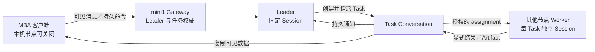

# Local-first Agent Mesh：客户端、节点与 Leader / Worker

2026-09-05。已确认的产品方向，依据用户反馈、Cue 当前产品模型及 Zork 现有实现。原始设计与阶段拆分见本文；当前使用方式和已实现范围见 [原生客户端与节点](desktop-node.md)。用户补充确认：真正退出客户端时关闭其管理的本机 Gateway；最小化继续运行；复用现有 Session 工作目录，后续增加自动归档。

## 1. 产品主线

客户端首次打开时没有已连接节点，也不自动启动本机 Gateway。用户可以启用本机节点，或者连接已有节点。节点托管 Profile 与 Agent；首页呈现已获授权的 Leader，用户与 Leader 进行长期对话。Leader 按需要创建持久任务，指派给本机或远端 Worker。每个 Worker Task 使用独立 Session，结果回到 Task、Leader 对话、Inbox 与 Drive。

用户已明确的方向：本机节点默认关闭；客户端可控制它；节点启动 daemon / Gateway；客户端可配置 Profile 和 OAuth；Agent 有 Leader 和 Worker 两种角色；Leader 固定单 Session；Worker 按 Task 创建 Session；首页直接对话 Leader；任务由 Leader 指派。

本文对“Worker 只会被 Leader 看到”的建议解释：Worker 不出现在首页的独立聊天入口；用户仍能在节点设置中创建和管理 Worker，在任务详情中查看其状态、结果及停止操作。Worker 的发现与调用权限由 Gateway 检查，不能仅通过隐藏 UI 或提示词约束。

## 2. 客户端和节点必须是两个对象

| 对象 | 职责 | 生命周期 |
| --- | --- | --- |
| Client | 原生 UI、设备连接、用户身份凭据、本地历史副本、草稿与命令 outbox | 打开应用即可使用，不要求启动 Gateway |
| Node | 托管 Profile、Agent、产品数据、工作区及执行权限 | 用户显式启用；与管理它的本机客户端共同退出 |
| Gateway | 节点的产品服务边界；认证、IM、Task、调度、复制与管理 API | 节点 daemon 的入口 |
| Agent runtime | 执行持久 Session、模型与工具 | 由节点管理，按工作需要启用 |
| Mesh transport | 已认证连接、消息与对象传输 | 不决定 Agent 权限或任务归属 |

产品上只展示“本机节点”一个开关。`zork` Supervisor 管理 Gateway 和 Agent；Synchronicity 通过库 API 成为 Gateway 自身 runtime 的异步组件。GUI 不各自拉起一套后台服务，多窗口复用同一个已登记节点。

**首次冷启动：** 0 个已连接节点、0 个 Agent、没有 Gateway / runtime / Synch 后台进程。首页仅有“启用本机节点”和“连接已有节点”。本机节点可以作为未启用的设置项显示，不冒充已注册在线节点。

**启用本机节点：** 初始化稳定节点身份和私有数据目录 → 启动 daemon → 等待实际 readiness → 显示“运行中，尚未配置 Agent”。失败显示原因与重试，不因开关已点击就显示在线。启动不自动添加模型账户、不创建默认 Leader、不授予远端执行权限。

**最小化与退出客户端分别处理。** macOS 保留原生 Dock 最小化能力；最小化时客户端和本机节点继续运行。真正退出客户端时，停止其管理的本机 Gateway 及 runtime / transport 子进程，不留下独立常驻 daemon，也不安装节点登录自启服务。退出先关闭任务入口、请求停止在途运行并持久化中断事实，再有界等待退出；不能为了等待整个任务完成而一直无法退出。异常关闭也要通过父进程生命周期绑定清理子进程。退出 MBA 不停止其他设备客户端管理的节点。停止不删除身份、Profile 或历史；停用与删除节点是不同操作。持久记录用户停用意图，监督器不把主动停止误判为崩溃而自动拉起。

节点状态拆成：进程可达、执行就绪、是否接新任务、当前活动。模型凭据过期应显示“节点在线，模型需重新登录”，不能把整个节点标成离线。

### 客户端不开节点时如何连接 Mesh

客户端仍需要网络和本地数据库，不能只剩远端 Gateway 的临时 UI 缓存。已同步历史、草稿和待发送消息保存在客户端自己的数据库中；关闭应用后重开仍存在。离线修改先成为本地命令，不冒充远端已接受；任务验收/取消等受权威端校验的操作显示待确认。

当前 `zork-mesh::Control` 依赖本机 Synch daemon，不能直接承诺已经具备“无本机节点的原生 Mesh 客户端”。实施时要补一个明确的客户端传输适配层：优先复用 Synch 的客户端能力；若必须启动 helper，则它只在用户连接远端且客户端运行期间存在，负责出站传输，不启动 Gateway/runtime、不接受执行任务。内嵌 transport 与 helper 的具体选择先做小型兼容性实验。

首次未连接时不启动 helper；GUI 退出后 helper 退出。纯客户端身份与可托管 Agent 的 Node 身份分开登记。SSH 连接可保留为过渡或高级连接方式，不能把它描述为完成了 P2P 端到端验收。

## 服务配置与 Cue 账号（追加确认）

默认发布预设使用 Cue relay，用户可以通过配置文件直接替换；开发测试使用本地 relay 和本地 Cue 账号服务。生产 relay URL 与 Zork OAuth client_id 在发布时注入配置，不填猜测值，不要求重新编译程序。

采用“随安装包提供的服务预设 → 用户配置文件覆盖”顺序；relay 列表替换整个默认列表，不悄悄合并公共 relay。显式直连模式关闭 relay 和地址发现，配置非法时给出错误，不静默回退到公共基础设施。Relay、发现服务、Cue 账号 issuer、client_id 分开配置，更换其中一项不强制替换其余项。凭据不写入发布配置。

Cue 登录可选。未登录仍能使用本机节点、Profile 和 Agent。Cue OIDC 登录与模型 Provider OAuth 是两种账户，分别管理。Cue 当前第三方 OIDC 仅提供身份（授权码 + PKCE），其 token 不授予产品设备 API 权限；若需要 Cue 设备发现、成员登记或 relay 准入，应按其实际服务协议单独接入，不能把身份 token 当万能产品凭据。切换 issuer/client_id 后清除该连接的登录绑定并重新认证，绝不把旧 token 发到新服务。

现有 Synchronicity v0.1.8 可通过 `--relay`（多个）、`--discovery`、`--offline` 接收网络配置。节点应用变更时有界重启 transport，保留节点密钥、Profile、Task 和历史。客户端设置页显示实际生效配置及来源；停止节点和撤销成员不由 relay 配置替换隐式触发。

## 3. Profile 是节点拥有的模型连接

GUI 可以为本机或获管理授权的远端节点配置 Profile。页面始终显示目标节点，例如“为 mini1 添加模型账户”。Profile 的密钥和 refresh token 留在该节点；GUI、Leader、Worker 及其他 peer 只获取脱敏元数据和使用权限。Agent 引用 Profile ID，不把完整凭据写进 Agent 配置或任务载荷。

同一节点的多个 Agent 可以使用同一 Profile，但各自有默认模型、thinking 与预算设置。删除/停用 Profile 应显示引用它的 Agent；认证失败阻塞相应运行，不自动换用其他节点的账户。

认证统一为 `AuthAttempt`，按 Provider 实际支持的能力展示：

- API key：明确提交到哪个节点；保存后不回传明文。
- OAuth Device Authorization：目标节点请求 code 并负责轮询；GUI 显示验证网址、用户码、过期时间和授权状态。用户在 MBA 浏览器确认，token 仍由 mini1 获取并保存。
- 浏览器 OAuth + PKCE：系统浏览器完成授权，采用 Provider 支持的回调和 PKCE；远端场景明确处理回调如何回到原发起节点，不能假定浏览器的 localhost 就是 mini1。
- 其他 Provider 专有导入/认证方式：独立能力，不伪装成 device flow。具体可用供应商按其当前支持和实际验收逐项开放。

AuthAttempt 绑定 `node_id / initiating_client / provider / profile_id / expiry`，UI 只拿随机公开 attempt ID 和必要展示字段，不把真实 device_code 或 PKCE verifier 当公开 ID。状态包括 waiting、authorized、denied、expired、cancelled、failed。轮询、`slow_down`、过期和取消由节点管理；关闭登录弹层与取消认证应有明确区别。模型 token 的 refresh 在目标节点串行提交，避免多 Agent 并发覆盖轮换结果。

Zork 已有 Provider catalog、device-code / PKCE 相关逻辑及 Profile 脱敏视图。现有 `DeviceCode` 抽象也承载了浏览器授权，且 `public_id()` 拼入了 device_code；新管理接口应重整这些边界，而非把旧返回值直接同步给任意 Mesh 客户端。macOS 优先用 Keychain 保管凭据，其他平台使用明确的安全存储适配；当前 JSON 文件权限保护不等于已经有跨平台凭据库。

标准依据：[RFC 8628](https://www.rfc-editor.org/rfc/rfc8628)、[RFC 8252](https://www.rfc-editor.org/rfc/rfc8252)。Device flow 适合远端无浏览器节点；它不是所有桌面 OAuth 的统一替代方式。

## 4. Agent、Conversation、Task、Session 的关系

| 关系 | 约束 |
| --- | --- |
| Node → Agent | 0:N；节点不是 Agent |
| Leader → canonical Session | 配置完成后恰好 1；惰性启动执行进程 |
| Leader → 首页 Conversation | 首版个人场景固定 1 条长期 `leader_chat` |
| Worker → Task Session | 0:N；同一 Worker 可以并行服务多个 Task |
| Task → Conversation | 恰好 1 条 `agent_task` |
| Task + Worker assignment → Session | 恰好 1；持久绑定，重试/重启复用 |
| Session → Run/turn | 0:N；多轮执行不创建第二份 Task |

**每个 Leader 单 Session，不是全网只能有一个 Leader。** 用户可以创建多个 Leader，分别拥有名字、职责、Profile、授权 Worker 集合及独立的长期上下文，在首页切换。首版先支持同一所有者的个人设备；不同隐私/协作范围使用独立 Leader，不把不同权限用户的上下文默认混入一个 canonical Session。

Leader 的所有输入，包括首页聊天、Worker 结果和任务阻塞通知，进入它的同一个持久 mailbox / canonical Session。每条输入保留来源 Conversation、Message、Task 及具体 sender。多个客户端同时对话也不能启动第二份 Leader Session；持久单写者按序处理输入。

固定 Session 不意味着无限长上下文。正常压缩与 handoff 保留逻辑 Session 身份；执行进程和上下文片段可以恢复。显式重置、更换 Leader 或节点迁移需要新的代次及审计，禁止旧执行器继续写当前会话。Leader 的停止控制走独立控制通道，不能排在它正在等待的任务之后。

Leader 委派后立即获得 Task ID，后续由持久通知重新唤起，避免一直占着一次模型调用等待 Worker。聊天与任务返回统一投递，但 Task 数据库负责追踪任务状态；不要求模型记住全部未完成 Task。

Worker 复用配置和能力，不复用不同任务的对话上下文。一个 Task 内补充要求、返工可以继续该 Worker 的同一 Session；并发 Task A/B 必须是不同 Session。若明确换执行器，则创建新 assignment 代次和新 Session，旧 Session 保留历史并失去当前提交权。首版可以先不开放换执行器。

**复用现有 Session 工作目录。** 已确认 `GatewayDb::ensure_session` 会按内部 IM 绑定分配独立目录；普通旧 GUI 的 `create_session_at_workspace` 则允许用户指定同一个目录。新 Worker Task 使用已有的独立目录分配方式，保留持久绑定和 CLI 上下文，不另建平行机制。外部源码目录/worktree 如有需要，应作为显式附加资源处理。

**后续自动归档：** 对已终结、无活跃运行/子进程、产物已保存的 Worker Task，经过可配置保留期归档其托管工作目录；归档不删除 Task/Conversation/Session 历史或 Drive 快照。Leader 的长期目录不自动归档，用户指定的外部项目目录不自动移动。归档记录 manifest、原路径、Session/Task ID 与恢复位置，作业幂等且可恢复；返工需先恢复当前 Task 目录。具体期限与存储格式留到归档阶段实施，本轮不自动清理现有目录。

### 共用内部 IM，不共用任务生命周期

`leader_chat` 与 `agent_task` 共用 Conversation、Message、Participant、投递游标和显式回复 API。Leader 首页对话没有目标完成/验收/归档 Task 的生命周期；只有实际工作任务才创建 Task 记录。

现有 Zork 是 session 与 Task 近似一一映射，需要拆开这一约束。Conversation 承载协作事实；Task 承载任务目标与唯一产品状态；runtime Session 承载模型执行。不能另外再给 Conversation 和 Task 各放一份可以独立写的任务完成状态。

Participant 是接收目标，sender 是消息作者：Task 可同时有 Leader Participant（绑定其 canonical Session）与 Worker Participant（绑定该 Task 的独立 Session）。普通 assistant transcript 仍不自动变成用户可见回复，沿用显式 IM 投递边界。

## 5. 跨节点任务的归属和权限

默认由 **Leader 所在节点**拥有该 Leader 的 Conversation 及其创建的 Task，Worker 所在节点拥有执行 Session 和运行事实。客户端只是命令发起与数据副本持有者；从 MBA 点发送不会让所有任务自动归属于 MBA。

这允许 MBA 客户端退出后，mini1 客户端仍运行或最小化时，其 Leader 和其他在线节点上的 Worker 继续工作。若 Leader 本身托管在 MBA，MBA 离线后 Worker 可继续已接收任务并保存结果，调度及验收等待 Leader 节点恢复。首版不静默切换 Leader，也不依赖“最在线的一台设备”自动抢占其身份。

节点配对只建立身份信任。执行授权还需要 `requesting_leader_id + authenticated_node_origin + target_worker_id + workspace_id + allowed_operations`。目标节点验证源节点确实有权代表该 Leader；不能相信模型 JSON 自报的 leader_id。需要区分客户端管理权限、用户聊天权限和 Leader 调用 Worker 的权限。

Worker 的 Agent 目录只向获授权的 Leader 暴露；不向全网广播全部 Agent、Profile 和本机路径。同节点调用也经过同一权限和幂等规则，不形成绕过授权的“本机捷径”。授予 Leader 调用 Worker 的权限，不同时授予它修改节点 Profile 或管理凭据的权限。

一个普通 Task 的流程：

1. Leader 提交目标、验收要求、输入产物引用及 Worker；Gateway 在一个事务里保存 Task、Participant、assignment 和 outbox。
2. 执行节点检查 Worker、授权、工作区和容量，持久接收后才返回 ACK；以 assignment 绑定同一 Session。
3. Worker 显式提交进度、结果和文件。源节点保留快照；接收方按 origin/path/full hash 验证文件后建立本地副本。
4. Task 权威节点记录结果并定向通知 Leader；Leader 可要求返工，也可整理用户可见回复。
5. 默认沿用人类验收：Leader 判断交付就绪后进入待验收，用户接受确切结果版本后完成。未来内部子任务可增加明确自动验收策略；这不等于 Leader 可以默认替用户验收所有任务。

Worker V1 无自行创建/转派其他 Worker 的权限；需要拆分时向 Leader 请求。Leader 工具面提供有界 Worker 发现、创建/查询/更新/取消 Task，不把整个节点管理 API 暴露给模型。

投递采用持久 ID、outbox/inbox、游标补齐及确定性去重。断线不等于取消，ACK 丢失不等于任务没运行。运行投递状态未知时进入需要处理，禁止自动补跑任意副作用。任务 owner 节点长期离线的恢复/迁移另行设计，local-first 不意味着网络分区时每个副本都能独立作出互相冲突的终态决定。

## 6. 客户端的数据属于用户

已连接 Leader 的可见历史、任务元数据和用户确认离线保留的产物，是客户端持久保存、可导出的副本；不会因为远端不可达而清空。草稿、发送中的命令及确认回执也持久化，显示“已保存 / 待连接 / 已接收 / 执行中”等真实阶段。

初次从未同步的数据无法凭空离线出现。远端停止时仍可本地写草稿、排队发消息；创建 Agent、修改授权和验收结果等命令要等待权威节点确认。关闭 GUI 后，纯客户端不承诺继续收取新事件，重开后按游标补齐。

对话与 Task 使用明确的 owner 及 revision；草稿可以先按设备保存；不把整份 Gateway SQLite 做多写同步。Profile 凭据、内部 transcript 和整个执行目录不在默认复制范围中。完整备份应区分产品副本、运行恢复数据和节点密钥，导出历史本身不等于可以恢复正在运行的 Leader。

此处遵循 local-first 的离线数据与用户所有权原则，同时明确协调执行需要单一有效写者的边界。[Local-first software](https://www.inkandswitch.com/essay/local-first/)

## 7. 用户真正看到的流程

1. 首次打开：没有节点，选择“启用本机节点”或“连接已有节点”。
2. 本机节点就绪：添加一个 Profile，按供应商能力完成登录。
3. 创建 Leader：名字、职责、Profile/模型、可使用的工作区与 Worker。可稍后再添加 Worker；Leader 此时可以正常聊天。
4. 创建 Worker：名字、职责、Profile/模型、工作区策略、并发上限，以及允许调用它的 Leader。
5. 首页选择 Leader 并聊天；长工作由 Leader 创建 Task，聊天中显示任务卡片。
6. Tasks 查看进度、Worker 来源与产物；Inbox 呈现需要用户处理和验收的事项；Drive 查看已提交文件。
7. 添加远端节点后，把其中获授权的 Worker 加入 Leader 的可用集合。用户聊天的入口保持一致。

节点管理放在“设置 → 节点”，具体节点内配置 Profile、Agent、工作区和授权。首页只展示可对话 Leader。初版不必保留空的推荐流或让用户每次发送都选 profile/model/执行设备；这些属于 Agent 默认配置，任务细节在需要时再调整。

## 8. 对现有实现的改造顺序

### A. 独立客户端与可选本机节点

去掉 GUI 启动必须连某个 Gateway 的前提，增加 client.db、零节点首页、本机节点管理、连接目录和状态；停止把 SSH 固定 mini1 作为产品默认入口。使用独立数据目录试验，保留既有安装、历史和回退方式。

验收：冷启动无后台节点进程；启用/停止可见且真实；最小化继续运行，真正退出和异常关闭均清理本机节点子进程；不开节点也能查看已同步历史。

### B. 节点 Profile 与 Agent 定义

复用 `zork-profile` 与现有 Provider 实现，新增按节点的管理授权和 AuthAttempt 状态机；增加持久 Agent 对象、role、Profile 引用、工作区授权及 canonical Session 约束。

验收：通过 GUI 完成实际支持的至少一种 device flow 和一种浏览器/API key 方式；令牌留在目标节点；创建/重启 Agent 不丢配置。

### C. 先完成一个本机 Leader → Worker 闭环

拆开 Conversation / Task / Session。首页进入固定 Leader Chat；Leader 能创建普通 Task，两个并行 Task 得到两个 Worker Session；两个 Task 的回执仍回到同一个 Leader Session。返工复用当前 Task Session，人类验收绑定结果版本。

验收：多窗口和重启都不复制 Leader Session；并行工作区隔离；任务通知不丢失、不重复；模型普通 transcript 不泄漏到可见聊天。

### D. 把同一套规则扩展到两台设备

复用现有 Synch 实验中的身份校验、对象传输、持久委派和故障测试，委派对象从“选择某节点的 workspace”升级到“调用某个 Agent”。补 client-only transport、节点配对及 GUI 内授权。

验收：MBA 纯客户端、本机节点关闭，操作 mini1 Leader → 远端 Worker；MBA 断线后执行继续；重连补齐；撤销权限拒绝后续调用；物理 LAN / relay 分别验证。

后续才扩展自动迁移、多用户共享 Leader、Workflow DAG、Worker 自主再委派、全量历史 GC 与配额。

## 9. 参考与实现差距

- Cue [PRODUCT_MODEL.md](../../cue/docs/architecture/PRODUCT_MODEL.md)：Router canonical Session、Worker 0:N、Conversation / Task、人工验收和显式可见回复。其文档开头与后面的当前 Group Chat 基数描述存在旧描述差异；本次以具体 canonical 路由代码及后面的 Single Session 章节为准。
- Cue [RouterConversationInput](../../cue/systems/apps/salix_im/lib/salix_im/router_conversation_input.ex)：固定 Group Router Conversation 与定向用户消息。
- Cue [AgentDeliveryPayload](../../cue/systems/apps/salix_im/lib/salix_im/agent_delivery_payload.ex)：Router canonical Session 与 Worker Participant 的独立 Session 选择。
- Zork [Profile Provider 接口](../crates/profile/src/providers/mod.rs)、[浏览器授权实现](../crates/profile/src/providers/anthropic.rs)、[device flow 示例](../crates/profile/src/providers/github_copilot.rs)：可复用基础，需重整公开认证协议。
- Zork [产品任务](../crates/gateway/src/db/tasks.rs)、[当前 Mesh 范围](local-mesh.md)：Task 与 session 的强绑定、一次 Mesh 委派限制需要演进。

Cue 的中心 Workspace/enrollment/compute 控制面不直接搬入此设计。我们保留其产品语义，把权威分配到用户明确控制的节点；没有运营方账户也能建立本机 Leader 和 Worker。
