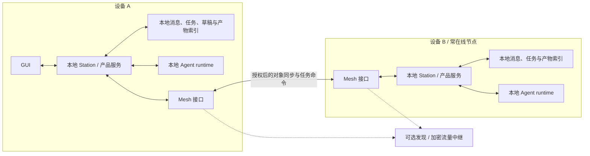

# Local-first Cue：功能差距、Mesh 方向与 GUI 样式

基线：2026-09-05，zork `3b20c38`，Cue `ac54574a3`。

用户确定的方向：zork 采用 Cue 客户端的样式，产品目标是 local-first，Agent 通过 P2P mesh 互联。本文区分已实现能力与后续建议；目前已追加本地产品任务与结果验收，并基于 Synchronicity v0.1.8 完成第一条远端任务闭环。本文表格保留初次差距研究，最新实施范围见 [Mesh 实现](local-mesh.md)。详见 [本地任务实现](local-product-tasks.md)。

2026-09-05 产品方向更新：客户端零节点启动、可选本机 daemon、节点 Profile、Leader 固定 Session 与 Worker 按 Task Session 的设计见 [Leader / Worker 方案](leader-worker-local-first.md)。该方案是讨论稿，后文保留早期差距研究。

当前 GUI 视觉与交互以 [已确认设计规范](gui-approved-design.md) 及其组件契约为准；本文的初次差距研究和 Cue 样式对照不覆盖后续确认的修改。

## 1. 结论

zork 已经有可以保留的本地执行基础：Station 的 SQLite 可见消息与入口映射、Agent 的持久 mailbox 和事件日志、恢复与取消、模型 Profile、工作目录和 shell/file 工具。GUI 目前主要服务“打开一个工作目录，创建任务，与执行中的 Agent 对话”。

Cue 已经形成更完整的工作台：长期 Assistant Chat、Router/Worker、独立 Task 生命周期、Inbox、Drive、Plugins、浏览器侧栏、原生设备能力和设置。差距最大的部分是产品对象与协作机制，而非单纯页面数量。

也不能把 Cue 理解成“完全没有本地或 P2P 能力”。它已有本地数据仓库、Drive 的 Synchronicity daemon 接口、Personal Mesh Registry 和 Iroh Relay 配置。但它的产品会话、Workspace 授权、Compute 和相关设备注册仍有中心服务参与。Registry 的成员变更通过中心数据库事务与 revision CAS 处理；Synchronicity 的 Workspace provisioning 也使用 Cue 身份和控制面。已有组件不等于生产 Mesh 已经完整上线；Cue 的架构说明明确保留了这部分生产验收事项。[C2][C8][C9][C10]

我们的关键差异应是：**即使没有运营方的控制面，用户仍能使用本机数据和本地 Agent，已配对节点仍能协作。** 可选中继、备份和模型供应商可以存在，但不承担整个产品的唯一数据或授权权威。这个目标与 local-first 强调本地可用、跨设备协作和用户所有权的原则一致。[E1]

## 2. 功能差距

“已有”表示在本次检查的代码中有实现；不代表本次已重新验收全部运行能力。“缺失”限定为当前 zork 仓库内未发现相应产品模型和实现。Cue 中的组件/路由存在也不等于所有部署均已启用。

| 能力 | Cue 当前实现 | zork 当前基础 | 面向目标的差距与处理 |
| --- | --- | --- | --- |
| 桌面工作台 | 75px 图标栏、Home/Inbox/Drive/Tasks/Plugins、独立内容面板 [C1] | GPUI 原生首页、任务栏、对话、输入器 [Z1] | 本次调整布局和样式；更多入口随真实功能加入 |
| 长期助手与独立任务 | Router 的长期 Chat 与 Worker Task 分离，Conversation 与 runtime Session 不是同一对象 [C2] | 新增独立产品 Task ID、目标、验收状态；Station 会话绑定到 runtime，多轮运行记录与 Task 分开 [Z2][Z3][Z8] | 本地 Task / Run 已分开；长期 Assistant、多个 Worker 和节点身份仍待实现 |
| 任务生命周期 | 列表/看板、归档、人工接受结果；自动成功与人类验收分开 [C2][C3] | 已有持久目标、候选结果、人工验收/取消/重开及运行记录；看板按产品状态与运行状态组合显示 [Z1][Z8] | 本地验收闭环已实现；跨节点状态权威、工作流、归档与协作授权仍待建设 |
| 多 Agent 协作 | Router/Worker、Participant 定向投递、可选有界 Workflow [C2] | 多 session；未见一等 Agent 委派、团队角色或 Workflow 模型 [Z2][Z5] | 先实现单个任务跨节点委派和结果回传，再扩展依赖图与并行审阅 |
| 可见对话 | 显式 Message、sender/recipient、附件；与内部 runtime transcript 分开 [C2][C4] | 显式 `chat.post_message` 边界已存在；GUI 是 user/assistant 文本 [Z1][Z3] | 保留显式投递；增加具体 Agent/节点身份、消息 ID、附件、引用和回执 |
| Inbox 与搜索 | 跨平台 Inbox projection、会话搜索与归档路由 [C1][C5] | 已有本地待验收/需要处理收件箱；无跨节点未读通知与全文搜索 | 本地索引消息、任务和结果；显示未读、待验收、阻塞和来源节点 |
| Drive 与产物 | 文件列表/预览/版本/同步、按设备版本采用、离线保留 [C6] | 已有持久任务文件、版本、文本/图片预览与另存副本；无跨节点同步 [Z5] | 分开本地 Workspace 和可分享 Artifact；先做预览、结果关联与按需传输 |
| Workspace | Cue Workspace 同时承担账户授权与 Agent 工作范围 [C2] | workspace 主要是本机 canonical path [Z2] | 创建稳定 Workspace 身份和每个节点的本地路径映射；不通过绝对路径识别远端资源 |
| Plugins、Skills、MCP | 插件目录、安装/卸载、授权与连接状态；输入器可提及 Skill 等对象 [C4][C7] | 本地版本化工具 registry；Station 尚无 MCP 接入 [Z5][Z6] | 插件包与安装生命周期、工具能力声明、节点范围授权、实际 MCP 客户端均待补 |
| 定时与主动工作 | Recommendation 有定时设置与刷新接口；Task Workflow 是独立机制 [C2][C11] | 后台脚本 job、重启恢复和 mailbox 通知 [Z7] | 不能把 job 等同于日历调度；补触发时间、时区、漏跑策略和明确执行节点 |
| 浏览器与桌面能力 | Electron 原生桥、浏览器侧栏、Computer Use/本地文件等模块 [C4][C11] | 原生文字输入、剪贴板、GUI 测试 API；后者不是 Agent 桌面操作能力 [Z1] | 浏览器/桌面工具与用户权限 UI 待建设；预览面板可以先于自动操作能力 |
| 模型与账户设置 | 产品设置、权限、设备 Compute 等完整设置面 [C11] | Profile、model、thinking、context 已有；Profile 管理主要在 Admin [Z1][Z2] | 将本地 Profile/节点配置引入桌面设置；凭据留在拥有它的节点 |
| 本地运行与离线使用 | 本地缓存/daemon 存在，但产品访问仍由 session lease 和服务端授权约束 [C8][C10] | Agent/Station 数据在本地；GUI 依赖指定 Station；草稿和待发送不构成持久 outbox [Z1][Z2] | 补草稿、离线读模型、待发送队列及可恢复确认；本地运行不等于全部产品数据可离线编辑 |
| 设备身份与成员关系 | Personal Mesh 签名、成员、撤销、endpoint、revision；中心 Registry [C9] | 未发现节点身份、设备配对、成员撤销模型 | 本地生成身份，显式配对，持久化信任与授权；定义设备丢失、密钥恢复和离线撤销边界 |
| P2P 传输与同步 | Iroh Relay/Personal Mesh 组件，Drive 另有 Synchronicity 集成 [C6][C9] | 未发现 P2P transport、发现、gossip 或复制协议 | 需要 peer 连接、重连、按对象同步、背压、消息去重与附件传输 |
| 计算节点与任务放置 | Compute Node、Environment、Allocation/Grant 与中心 Compute 写入者 [C2][C11] | Supervisor 管理本机 Station/Agent，session 使用本机工作目录 [Z2] | 节点发布能力，任务显式选择节点；执行节点验证权限、资源与 Workspace 映射 |
| 协作授权与隔离 | Workspace/Membership、运行授权和原生能力边界 [C2][C11] | 本机 runtime、可选 Agent bearer；shell 使用本机进程执行 [Z2][Z5] | P2P 信任不等于任意远程执行权限；补按 workspace/tool/任务的授权与必要的执行隔离 |

## 3. 建议的产品与节点模型

建议先以“一个人的多台设备”为首个可验收场景，再扩展不同用户间的 Agent 协作。这是分期建议，不是将多人 mesh 排除在最终目标之外。

| 对象 | 含义 | 不应混淆的概念 |
| --- | --- | --- |
| User / Owner | 数据与设备的控制者 | 模型账户、运行中的 Agent |
| Device / Node | 有独立身份、存储和可选执行能力的设备/进程宿主 | 不要求每个节点都运行 GUI 或模型 |
| Agent | 有配置、角色和能力的工作者 | 一台机器可以承载多个 Agent |
| Workspace | 可分享的逻辑工作范围 | 本机目录只是该节点上的映射 |
| Conversation | 用户与 Agent 的可见协作事实 | 内部模型上下文和工具日志 |
| Task | 有目标、参与者、结果和验收状态的工作对象 | 一次模型调用或 runtime Session |
| Run / Session | 某个执行节点上的一次持久运行上下文 | 一个 Task 可有多次 Run |
| Artifact | 可识别、可预览、可选择复制的结果 | 不默认同步整个工作目录 |

建议的物理结构：

本机仍可以有 Station 作为产品边界；“每台设备都有自己的 Station”和“所有设备依赖唯一中心 Station”是两种部署。现有显式消息入口可以保留。同步面只传递已授权的产品事件、任务命令和选定产物，默认不复制模型凭据和完整内部 transcript。

## 4. Mesh 必须补齐的语义

1. **本地确认。** 用户操作先写本机持久状态/outbox。UI 分别呈现“本地保存、对端接收、执行中、待验收”；网络送达和任务完成不是同一种确认。模型服务不可用时仍能读历史、编辑草稿、排队；要离线推理还需要本地模型，不从 local-first 自动推出这一承诺。
2. **身份与授权。** 区分设备密钥、Agent 身份、用户身份和授权范围。配对确认对端身份，能力授予决定它能读什么、能在哪个目录做什么。公钥认证只证明连接的是谁，不替产品决定其权限。
3. **发现与可替换中继。** 同网发现、邀请信息和可选 rendezvous 服务都只解决如何连上。已配对节点不必每次向中心申请执行许可。Iroh 可作为传输候选：其连接使用 Endpoint 公钥，能走直连或 relay；它本身不替代任务、复制和权限协议。[E2]
4. **可靠投递。** 使用持久 command ID、发送 outbox 和接收去重，明确断线重投与结果确认。不要承诺所有外部副作用 exactly-once；邮件、支付、shell 等要分别定义幂等或人工恢复方式。
5. **对象权威。** 首期让每个运行有明确执行节点；Task 状态由明确的对象拥有者串行裁决，其他节点提交命令并保存投影。不同对象分布在不同节点，这不要求全网一个中心。拥有者离线时可以排队，但不伪造已执行。
6. **迁移与失联。** 先做远端委派，不做失联后的自动抢跑。迁移要处理旧执行者仍活着、外部命令已经执行、结果迟到等情形；采用明确交接和阻止旧运行继续提交的机制后再开放自动故障转移。
7. **同步与冲突。** ULID 可用作标识，但当前单机事件顺序不能直接当作跨节点因果顺序。草稿/标签等可合并数据与任务控制命令采用不同规则；是否采用 CRDT 应按对象决定。文件冲突保存双方版本，由用户或任务明确采用。
8. **撤销与恢复。** 被撤销节点离线期间无法立即获知撤销；已拿到的数据也无法靠撤销“收回”。定义可接受的旧授权窗口、重连校验、设备恢复和备份策略。用户应能在没有原运营方服务时导出、恢复自己的数据。

这些是待设计的协议边界，当前 GUI 改动没有实现它们。协议落地时应有断线、重复、乱序、重启、撤销及旧执行者存活等故障测试；涉及所有权与活性承诺的部分另行建模验证。

## 5. 建议的建设顺序

| 阶段 | 交付 | 可验收场景 |
| --- | --- | --- |
| A：Cue 风格的本地工作台 | 本次视觉调整；下一步补任务产品对象、桌面设置、结果预览与本地草稿 | 不依赖 Cue 服务创建并继续本机任务；关闭/重启后找回历史和草稿 |
| B：两节点协作闭环 | 配对、信任与权限、节点列表、手选远端执行、持久命令与结果回传 | MacBook 发起任务，mini1 执行；任一端短时断线后恢复，重发不创建第二份任务 |
| C：多设备数据体验 | Conversation/Task 投影同步、Inbox、搜索、产物按需同步 | 两端读到相同任务结果；离线可读已有内容；文件冲突有明确展示与处理 |
| D：Agent mesh | 能力发现、任务依赖、多 Agent 委派/审阅、明确交接、日程执行 | 协调 Agent 将不同工作派给不同节点，断线显示阻塞，恢复后按对象状态继续 |
| E：更广的 Cue 能力 | 插件授权、MCP、浏览器/桌面操作、多人空间与细粒度权限 | 只向获授权的 Agent 开放本地资源与工具；新成员不会自动获得全部机器权限 |

避免先做所有 Cue 页面再补节点模型。近期 GUI 信息结构可以沿用 Cue 的 Home / Tasks，再按实际实现加入 Inbox / Files / Agents / Settings。Mesh 的节点、来源和执行位置应该在相关对象旁可见；尚未实现时不放无作用的“在线节点”或假连接按钮。

## 6. 本次样式实现与仍有的视觉差异

早期使用 Cue Storybook、Web 核对资源；最终以真实 Electron 客户端、源码尺寸及同尺寸截图进行对照。zork 保留 GPUI 渲染器及现有本地 Station/Agent，不依赖 Cue 后端运行。

- **直接使用 Cue 资源**：Inter Variable 正体/斜体、Central Icons 原始路径与对应变体；1.5px 光学笔画遵循 Cue CSS。字体嵌入应用，离线可用。来源和重生成方法见 [资源说明](../crates/zork-gui/assets/cue/README.md)。
- **窗口结构**：75px 图标导航、42px 顶栏、8px 外边距、12px 白色面板圆角、`#f5f5f5` 窗口底色。使用 Cue 的 Home/Tasks 图标和图标上、标签下的选中态。
- **Home 三栏**：按 Cue 的响应式尺寸显示日常推荐、底部紧凑输入框、任务栏；内容区低于 917px 折叠任务栏，低于 621px 再折叠推荐栏。空状态复用 Cue 应用标志，连接应用进入插件占位页。
- **输入器**：首页单行 50px，多行与自动换行按实测文字高度扩展；对话输入器从 102px 起。20px 圆角、30px 动作按钮；加号打开 Cue 353px 菜单，输入设置进入真实 workspace/profile/model/thinking/context 选择器。工作区使用系统目录选择器。
- **任务总览**：48px 工具栏、产品任务看板/列表、六类真实状态筛选；卡片打开原会话。任务 ID、目标和标题持久保存在本机，`wait` 不等于产品任务完成，`Finished` 仅显示“本轮完成”。
- **对话**：取消常驻右侧任务栏，最近任务通过顶栏打开；44px 标题栏、744px 最大正文宽度、24px 水平留白、顶部排列。正文与用户消息均为 13px/20px；用户气泡 12px 圆角、最大 500px，并保留 42px 左侧空间。Markdown 继续支持段落、列表、代码、表格和链接。
- **导航与状态**：`⌘B` 切换左侧导航栏，`⌘N` 新建任务；按 workspace 分组任务，显示真实连接/执行状态；原生最小窗口为 900×600。

当前已有页面使用同一套资源和设计参数，但还不能称为完整 Cue 的逐像素复制。尚有这些明确差异：

| Cue | zork 当前适配与原因 |
| --- | --- |
| Home 的 Routines、插件推荐 | 同样的日常推荐空状态；推荐生成、连接服务和设置尚未接入 |
| 顶栏全局搜索及前进/后退 | 已复制居中搜索入口及前进/后退；搜索内容显示“暂未接入” |
| Inbox、Drive、Plugins、Settings 等导航 | Inbox 已实现本地待验收与需要处理队列、筛选和结果预览；Drive 已实现任务文件、版本和预览；Plugins 仍显示“暂未接入”，Settings 提供语言选择 |
| Home 紧凑输入 / Cue 的模型和权限选择 | 已实现换行扩展、添加菜单和输入设置；语音与附件未接入，明确提示 |
| Task 产品状态、审阅和预览 | 已增加独立产品 Task、持久目标、运行历史与结果验收；Drive 已接入任务产物预览，Cue 的完整协作与同步能力尚未接入 |
| Cue 中文/英文切换、主题与动效 | 外壳、首页、输入菜单、任务总览与运行状态支持中英文并记忆选择；深色主题、动画和完整 Markdown 工具条仍有差异 |

以下截图主要记录 GUI 样式阶段，Mesh 实施和验证见 [最新说明](local-mesh.md)。代码入口：[设计参数](../crates/zork-gui/src/design.rs)、[界面](../crates/zork-gui/src/views.rs)、[GUI 说明](../crates/zork-gui/README.md)。验证记录与真实截图见 对照说明（本地生成的验收记录）。

## 7. 证据索引

### zork

- [Z1] [GUI API、状态与消息类型](../crates/zork-gui/src/api.rs)，[GUI 能力说明](../crates/zork-gui/README.md)。
- [Z2] [部署、持久存储、模型与工作目录边界](../README.md)，[Agent 架构](zork-agent-architecture.md)。
- [Z3] [Station 显式消息入口](../crates/station/src/im_entry.rs)，[SQLite 表](../crates/station/src/db.rs)。
- [Z5] [工具 registry 与本地执行](../crates/agent/src/session/tools.rs)，[进程执行接口](../crates/agent/src/session/ports/process.rs)。
- [Z6] [Station 当前路由](../crates/station/src/http.rs)。
- [Z7] [后台 JobSupervisor](../crates/station/src/jobs.rs)。
- [Z8] [本地产品任务](local-product-tasks.md)，[任务存储与迁移](../crates/station/src/db/tasks.rs)。

### Cue（旁边的只读参考 checkout）

- [C1] [产品路由](../../Cue/clients/packages/app/src/index.tsx)，[LeftRail](../../Cue/clients/packages/ui/src/components/left-rail/LeftRail.tsx)，[SidebarChrome](../../Cue/clients/packages/app/src/components/sidebar/SidebarChrome.tsx)。
- [C2] [产品模型与当前态边界](../../Cue/docs/architecture/PRODUCT_MODEL.md)，[架构说明中的待验收边界](../../Cue/docs/architecture/README.md)。
- [C3] [TaskWorkspace](../../Cue/clients/packages/ui/src/components/task-workspace/TaskWorkspace.tsx)，[TasksRoute](../../Cue/clients/packages/app/src/components/tasks/TasksRoute.tsx)。
- [C4] [Composer](../../Cue/clients/packages/app/src/components/chat/Composer.tsx)，[AiInput 样式](../../Cue/clients/packages/ui/src/components/ai-input/styles.ts)。
- [C5] [InboxRoute](../../Cue/clients/packages/app/src/components/inbox/InboxRoute.tsx)，[服务端产品路由](../../Cue/systems/apps/cue_web/lib/cue_web/router.ex)。
- [C6] [Drive daemon 接口及同步操作](../../Cue/clients/packages/app/src/components/drive/driveSynchronicityBackend.ts)，[DriveRoute](../../Cue/clients/packages/app/src/components/drive/DriveRoute.tsx)。
- [C7] [PluginsRoute](../../Cue/clients/packages/app/src/components/plugins/PluginsRoute.tsx)。
- [C8] [本地数据仓库](../../Cue/clients/apps/electron/src/main/modules/local-data/repository.ts)，[产品凭据权威](../../Cue/clients/apps/electron/src/main/modules/session/main-product-credential-authority.ts)。
- [C9] [PersonalMeshRegistry](../../Cue/systems/apps/salix_store/lib/salix_store/personal_mesh_registry.ex)，[Iroh Relay chart](../../Cue/k8s/iroh-relay/README.md)。
- [C10] [Synchronicity Workspace provisioning](../../Cue/systems/apps/cue_core/lib/cue/synchronicity.ex)。
- [C11] [AppSettingsRoute](../../Cue/clients/packages/app/src/components/AppSettingsRoute.tsx)，[ComputeNodeService](../../Cue/clients/apps/electron/src/main/modules/compute-node/index.ts)。
- 视觉参数：[grays](../../Cue/clients/packages/ui/src/tokens/colors/grays.ts)、[semantic colors](../../Cue/clients/packages/ui/src/tokens/colors/semantic.ts)、[typography](../../Cue/clients/packages/ui/src/tokens/typography.ts)、[radius](../../Cue/clients/packages/ui/src/tokens/radius.ts)。

### 外部原则与传输参考

- [E1] [Ink & Switch — Local-first software](https://www.inkandswitch.com/essay/local-first/)。
- [E2] [Iroh Rust API — Endpoint、身份与 relay](https://docs.rs/iroh/latest/iroh/index.html)，[Iroh FAQ — 身份交换与连接安全](https://docs.iroh.computer/about/faq)。仅作为候选传输的依据，本次未选择依赖版本或安装网络库。

## 第 1 项决策：窗口外壳

按用户确认，完整保留 Cue 顶栏和全部导航入口；未接入页面显示明确占位。
已调整原生窗口按钮、导航间距与颜色、面板底色/细边框/阴影；不扩展首页业务内容。
两边均为 1280×800 的原生窗口对照（本地生成的验收记录）。

### 第二项：首页对齐

已移除 Quickstarts 和中央说明，按 Cue 原始布局实现日常推荐与任务空状态、50px 紧凑输入框。输入文字后麦克风变为真实创建任务按钮；加号保留模型与工作区设置。后续第 4 项已统一首页和对话输入器。桌面同尺寸拼图见 home-step2（本地生成的验收记录）。

### 第三项：导航与首页 i18n

导航和搜索提示沿用 Cue 的中英文文案，首页、占位页与语言设置共用嵌入式 JSON 语言表。默认简体中文，设置中可立即切换英文并持久化；切换不清空草稿。第 4～6 项继续覆盖了选择器、任务总览和对话运行状态；用户内容、模型 ID、路径与后端诊断保留原文。见 同尺寸对照（本地生成的验收记录）。

### 第四至六项：输入、任务总览与对话

输入菜单与多行布局、任务总览以及对话正文已依次完成。实际客户端截图：
输入同尺寸对照（本地生成的验收记录）、
任务空状态同尺寸对照（本地生成的验收记录）、
最终 zork 对话（本地生成的验收记录）、
900×600 对话（本地生成的验收记录）。
最后两张为真实 GPUI 客户端；Cue 本地环境未创建成功 Task，因此对话 Task 页参数以源码为依据，未声称完成两端 Task 实景验收。

## 后续实现：本地任务生命周期

已完成独立任务对象、持久目标/标题、结果候选、验收/继续修改/取消/重开、真实运行记录与 GUI 状态筛选。旧会话增量迁入；运行结束不会直接变为已完成。读数据不依赖 Agent 在线，状态变更仍需确认当前运行停止。完整行为与当前范围见 [实现说明](local-product-tasks.md)。
