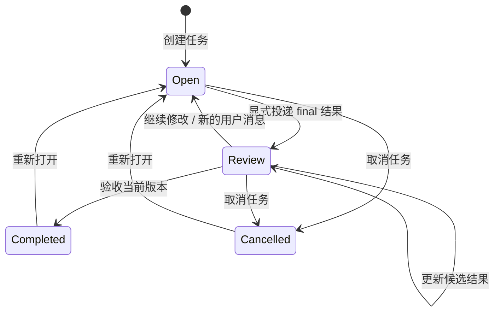

# 本地产品任务与结果验收

2026-09-05，在现有 Gateway / GPUI 工作台上实现的第一版产品任务闭环。

## 已实现的行为

创建桌面会话时，Gateway 同时建立独立 `task_id`。第一条用户消息保存为任务目标，并生成持久标题。继续对话不替换原目标。任务标题不再依赖 GUI 是否恰好加载到了历史第一页。

Agent 的一轮执行结束只增加一条运行记录。显式 `chat.post_message(kind="final")` 投递的消息成为候选结果，将任务置为待验收；普通进度消息不会触发验收。用户通过 GUI 的“验收完成”确认当前结果，之后任务才进入已完成。



已完成、已取消的任务仍可阅读目标、结果与消息，但发送新消息会返回 `409 task_closed_reopen_required`；GUI 隐藏输入器并提供重新打开按钮。任务可以跨多轮运行，也会在 Gateway 绑定更换底层 Agent session 时保留任务 ID 和先前运行记录。

看板和列表显示六类状态：待处理、执行中、需要处理、待验收、已完成、已取消。“执行中 / 需要处理”由运行状态组合得出，数据库的产品决策状态只有 `open / review / completed / cancelled`。`wait` 或 `finished` 不等于已验收。

任务详情提供完整目标、当前提交结果、提交的文件版本，以及最近 100 轮运行的状态。文件快照与预览见 [本地 Drive](local-drive.md)。常规 GUI 列表只加载摘要；长目标和结果按需读取。详情打开期间，版本和运行状态变化会触发更新。

## 本地收件箱

Inbox 汇总尚未关闭的待验收结果，以及运行失败、中断或已断开 runtime 绑定的任务。当前轮仍在运行时暂不进入队列；验收、取消任务或重新执行后随轮询更新。它不是所有对话的镜像，也不把一次查看当作验收。

左侧采用 Cue 的 320px 列表栏，提供全部、待验收、需要处理筛选；右侧按需读取完整目标和候选结果。点击“打开任务”进入同一任务的对话与验收控制。列表状态来自本机 SQLite，不额外保存通知副本；重启后重新构建，Agent 离线仍可读取。Gateway 断开时显示上次读取内容及重试提示。完整列表目前未分页。

这版尚无已读标记、通知归档、系统推送或跨节点同步。截图见 收件箱验证记录（本地生成的验收记录）。

## 持久化与一致性

数据仍保存在本机 `gateway.sqlite`，未引入中心服务或第二份产品数据库：

| 表 | 用途 |
| --- | --- |
| `product_tasks` | 独立任务 ID、Gateway 会话绑定、原始目标、持久标题、产品状态、版本和候选结果消息引用 |
| `task_runs` | 独立运行 ID，关联真实 Agent session / turn，记录开始、结束及运行结果 |
| `task_event_cursors` | 每个任务和 Agent session 的持久事件游标，用于断线与重启后的重放去重 |
| `task_decisions` | 验收、重新打开、取消的版本记录，以及该决定对应的结果消息 ID |

用户消息插入、任务状态更新在同一 SQLite 事务提交。已关闭任务的消息被拒绝时，不会留下一条未获准的用户消息。相同消息 ID 重放不会重复推进版本。运行记录和事件游标也在同一事务提交；重新订阅旧事件不会恢复已结束的运行，或改写已验收状态。

状态操作携带 `expected_revision`。新消息或新结果已经推进版本时，旧页面的操作返回 `409 task_revision_conflict`；GUI 提示核对刷新后的内容。验收记录引用所接受的那条具体结果，迟到的结果不会自动重新打开已关闭任务。

同一会话的本地发送与任务状态操作串行执行。状态操作先确认 Agent 已停止当前运行，然后在事务内再次检查运行投影与任务版本。运行中应先点输入器的停止按钮，再取消产品任务；取消产品任务不会被伪装成已停止一个尚未结束的运行。

## API

这些接口与现有本地 GUI API 使用同一个 Gateway runtime 地址：

| 接口 | 返回 / 行为 |
| --- | --- |
| `GET /v1/inbox` | 从本地任务/运行状态重建待处理队列，只含任务摘要 |
| `GET /v1/tasks` | 本地产品任务，包括当前没有 Agent session 绑定的任务 |
| `GET /v1/tasks/{task_id}` | 完整 `task` 与最近 100 条 `runs`，最新运行在前 |
| `POST /v1/tasks/{task_id}/transitions` | `{ "expected_revision": 2, "action": "accept" }`；action 也可为 `reopen`、`cancel` |
| `GET /v1/im/sessions` | 保留原有字段，增加不含完整目标/结果正文的 `task` 摘要和 `runtime_available` |

创建、消息、选择器和停止运行仍走原有 `/v1/im/sessions` 接口，保持现有客户端兼容。运行历史包含 `run_id`、`agent_session_id`、`turn_id`、状态及开始/结束时间；任务状态操作返回更新后的完整任务。

## 迁移及边界

迁移是新增表和幂等回填，不删除已有会话、消息或工作目录。历史桌面会话从第一条用户消息恢复目标和标题，以 `open` 迁入；不会把曾经空闲或结束的会话推断为已经验收。历史 Agent 事件重放可恢复运行记录。仅为 `local_gui` 创建产品任务，外部 IM 入口的消息行为保留。

这是本地产品层闭环，尚未实现 Mesh、跨节点委派、独立 Workspace 身份、长期 Assistant 与 Worker 拆分、跨节点未读通知或文件同步。GUI 目前仍按已绑定的会话打开对话；管理 API 清除 runtime 绑定后的未关闭任务保留在收件箱中，仍可阅读目标与结果。重新绑定后可继续对话。

任务和结果可以在 Agent 不在线时读取；验收、重新打开和取消目前要求连接 Agent 确认运行已停止。持久草稿、离线待发送队列和断网期间的状态命令尚未实现，不能由本次持久任务表推导出完整离线编辑能力。验收决策由本地 API 命令产生；节点身份、调用者授权与多节点审计仍属于后续 Mesh 权限工作。

## 验证

- Gateway + GUI：65 项 Rust 测试，包含迁移、运行替换、重放、摘要、冲突和消息事务回滚。
- Gateway + GUI 全目标 Clippy `-D warnings`。
- 任务与 Drive 两组真实进程 API 测试（各 2 项）：覆盖原消息投递边界、验收版本冲突、重启、同一任务多轮运行、运行中的取消拒绝、真实停止及 Agent 离线读取；文件 CLI 提交、版本和原始字节恢复。
- 1280×800、900×600 各 7 项原生 UI 测试：覆盖创建、结果详情、验收、重启、重新打开、取消、过滤和看板横向滚动，并保留此前语言、菜单、草稿与消息投递回归。

```sh
CARGO_INCREMENTAL=0 CARGO_PROFILE_DEV_DEBUG=0 CARGO_BUILD_JOBS=4 cargo test --locked -p zork-gateway -p zork-gui
CARGO_INCREMENTAL=0 CARGO_PROFILE_DEV_DEBUG=0 CARGO_BUILD_JOBS=4 cargo clippy --locked -p zork-gateway -p zork-gui --all-targets -- -D warnings
CARGO_INCREMENTAL=0 CARGO_PROFILE_DEV_DEBUG=0 CARGO_BUILD_JOBS=4 cargo build --locked -p zork-gateway -p zork-gui
python3 crates/zork-gui/tests/test_product_tasks.py
python3 scripts/test-desktop-headless.py
```

原生截图（本地生成的验收记录）。界面测试使用隔离 Gateway / Agent 和测试工作目录。
