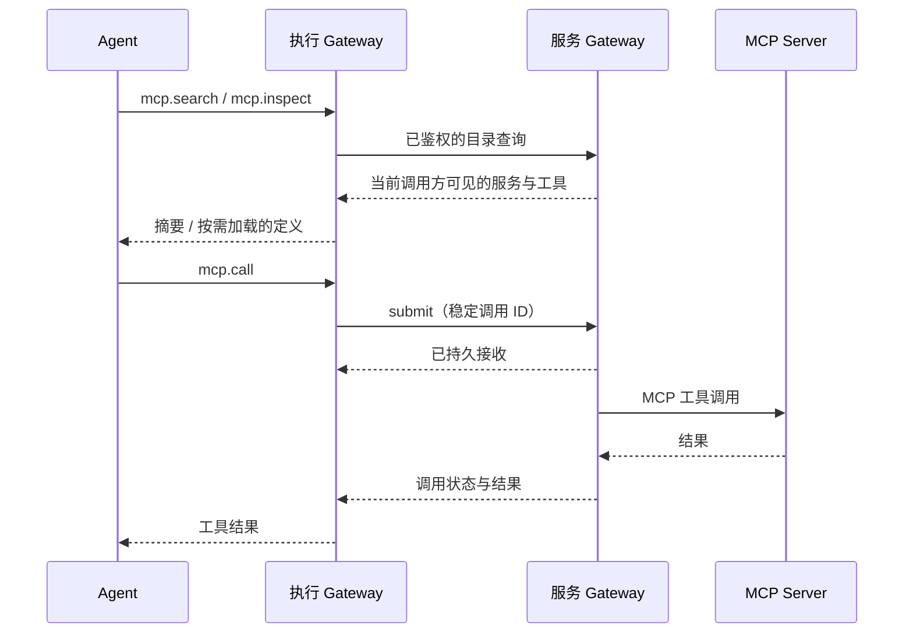

# Mesh MCP 服务设计

状态：Agent 安装管理工具与 Mesh MCP 后台已实现；下文保留整体设计，当前交付边界以“已实现与使用”一节为准。2026-09-10。

目标：每个 Gateway 可以安装或连接 MCP 服务，并将其共享到 Mesh；Agent 通过内置工具按需发现、查看和调用。安装、凭据、协议连接和实际执行归属服务 Gateway，调用方无需重复安装。

统一的设备、MCP 和技能工具入口见 [Agent 节点工具](agent-node-tools.md)。新工作优先使用 `device.*` / `mcp.*` / `skill.*`，以下 `mcp` 的 op 形式保留兼容。

## 已实现与使用

当前实现位于 `crates/gateway/src/mcp/`：runtime 处理 MCP 协议与连接，store 保存配置、调用账本和调用方 outbox，calls 处理发现/执行/结果，api 提供已鉴权的管理入口与 Agent 适配。暂不拆独立 crate。`management` 处理 Agent 的节点管理授权与安装流程。

已打通本机及跨 Gateway 的 search → inspect → call → status；服务及调用 ID 使用 ULID。`read` 分页取回大结果；`recover` 按原 invocation_id 恢复丢失的提交回执。Agent 的动态工具状态持久记录未完成及结果未知的调用。凭据不进入 Mesh 目录；当前 secret provider 支持从服务 Gateway 的环境变量读取引用。

### 通过 Agent 安装与管理

用户直接向 Agent 提出需求，例如“把这个 MCP 安装到我的桌面节点，并共享到 Mesh”。无需自己操作 zork CLI。Agent 使用同一个内置 `mcp` 工具完成：

1. `setup`：发现可管理的 Gateway、系统和可用运行程序；可指定 owner 查看单个节点。
2. `install`：传入目标 owner 与 config，创建 ULID 服务；支持 HTTP 与 stdio 配置。stdio 的裸 command 在目标 Gateway 上解析；省略 cwd 使用该节点的托管 MCP 工作目录，省略 PATH 使用目标进程 PATH。缺少的包由 Agent 使用目标设备的执行工具准备。
3. `probe`：在目标节点启动/连接并检查工具目录；探测成功后再报告可用。
4. `installed` / `configure`：查看服务与当前 config_revision。
5. `update` / `enable` / `disable` / `share` / `uninstall`：使用 server_ref 和 expected_revision 修改已有服务；share 的 grant 明确指定共享范围。

安装调用示例（外层仍为 Agent 的 call 动态工具）：

```json
{
  "tool": "mcp",
  "action": "安装并共享用户指定的 MCP",
  "arguments": {
    "op": "install",
    "owner": "key:<setup 返回的节点身份>",
    "config": {
      "name": "my-mcp",
      "transport": {"kind": "http", "url": "https://example.com/mcp"},
      "grant": {"scope": "mesh"}
    }
  }
}
```

本机绑定 Session 的 Agent 可管理本机 MCP；远端需要目标节点已授予调用 Gateway 节点管理权限（现有 peer.client）。MCP 调用 grant 或普通任务协作权限不会自动变成安装权限；管理节点列表通过目标节点实际鉴权取得，不从本机授予对方的权限反推。

管理变更与 ULID operation_id 回执在一个 SQLite 事务中保存。重试返回同一回执；回执丢失时使用 recover，重启后也不会重复安装或把已卸载服务恢复出来。安装登记与探测分别反馈；配置登记成功不代表程序依赖已经就绪。当前没有新增交互式 OAuth 或通用包市场。

### 底层配置及兼容 CLI

以下 CLI 是兼容与诊断入口，用户主流程由 Agent 工具完成。在目标 Gateway 所在设备准备 MCP 命令及依赖，然后创建配置文件，例如：

```json
{
  "name": "my-mcp",
  "description": "该服务的用途及账号标签",
  "transport": {
    "kind": "stdio",
    "command": "/absolute/path/to/mcp-server",
    "args": [],
    "cwd": "/absolute/work-directory",
    "env": {},
    "secret_env": {"API_TOKEN": "MY_MCP_TOKEN"}
  },
  "grant": {"scope": "mesh"},
  "enabled": true
}
```

`secret_env` 的值是 Gateway 环境变量名，不是 token 本身；若命令需要 PATH 等环境变量，通过 `env` 显式提供。默认共享范围为 local；上例显式选择 mesh，表示所有当前及未来有效 Mesh 成员均可调用。`selected` 使用 `subjects: [{"origin":"key:…","agent":"…"}]` 收紧远端主体；本机 Agent 仍可用本机服务。`tool_allowlist` 缺省允许全部工具，空数组不允许调用任何工具。 它同时约束本机和远端调用，不按 Agent 区分。grant 不授予安装或配置管理权限；管理 probe 成功也不表示当前调用方通过普通工具调用的权限检查。

停用阻止新调用，但不阻止原调用方读取其终态；读取仍检查调用归属、服务授权和工具允许列表。

已通过主体授权的调用方会分别收到 `mcp_disabled`（服务停用）和 `mcp_tool_not_allowed`（工具不在允许列表）；未授权主体仍只收到 `mcp_access_denied`。运行中配置版本变化报告 `mcp_definition_changed`，实际停用或撤权保留对应原因。调用已派发时仍保留 `outcome_unknown` 和副作用标记，错误原因明确不表示可以安全重试。

```sh
zork mcp add ./mcp.json --data /path/to/node-data
zork mcp list --data /path/to/node-data
zork mcp probe <server-ulid> --data /path/to/node-data
zork mcp get <server-ulid> --data /path/to/node-data
zork mcp update <server-ulid> ./mcp.json --data /path/to/node-data
zork mcp disable <server-ulid> --data /path/to/node-data
zork mcp enable <server-ulid> --data /path/to/node-data
zork mcp remove <server-ulid> --data /path/to/node-data
```

兼容 CLI 从指定节点配置中读取 control 地址与管理认证；不会另外启动节点。启用 Mesh 的节点在身份尚未就绪时返回 mcp_mesh_starting，此时不会创建服务记录或返回临时 local 引用。管理 API 位于该 control 监听器的 `/admin/api/mcp`、`/admin/api/mcp/{id}` 和 `/admin/api/mcp/{id}/probe`，沿用已有管理员鉴权。更新/删除使用配置 revision 做并发检查。`get` 返回管理员配置和凭据引用，目录只返回服务摘要。

HTTP 配置使用 `{"kind":"http","url":"https://example.com/mcp","secret_headers":{"Authorization":"MY_MCP_AUTHORIZATION"}}`；引用环境变量应包含完整 header 值，如 `Bearer …`。禁用 HTTP 重定向，远端要求 HTTPS，loopback fixture 可使用 HTTP。

### 本版协议与行为边界

- 明确支持 MCP `2025-11-25` 的 stdio 和 Streamable HTTP（JSON/SSE），包括初始化、工具分页和 ping；其他协商版本返回不支持。未声称覆盖当前所有 MCP 版本。
- 服务按需启动，连接按调用方/Agent/Session 隔离；空闲五分钟回收，周期最多再延迟三十秒。正常停用和退出会回收进程，Unix 下包含其进程组；HTTP 会话尽力 DELETE。强杀 Gateway 后不能保证任意脱离父进程的第三方进程已退出。
- 目录按需查询，不做后台全 Mesh 轮询；返回部分失败节点。当前不保存离线目录缓存或推送目录订阅。`ready` 表示最近一次成功探测/调用，不保证下一次调用必然成功。
- 单 Gateway 最多 64 个服务、32 个协议连接、16 个并发操作；inspect 时限 15 秒，调用时限 120 秒。单次调用请求最多 128 KiB，MCP 消息/累计目录最多 8 MiB；单个返回定义超过 96 KiB 会明确拒绝，不截断 schema。
- 结果大于 64 KiB 时通过 `read` 每次读取最多 32 KiB 的 JSON 文本片段；offset 是 UTF-8 字节位置，使用返回的 next_offset。较小结果中的图片会转换为 Agent 原生图片；大型图片目前随分片结果保存，不自动拼装为视觉输入。resources 的引用保留原值，不自动访问本机文件或抓取外链。
- 结果保留七天，结果正文总预算 64 MiB；超预算返回 result_unavailable。调用及路由去重记录分别上限十万条，拒绝超量新调用而不删除 tombstone。未确认 outbox 正文预算 32 MiB，收到回执后清除原请求正文；保留摘要和路由。
- 运行中取消通过关闭独占连接/终止进程尽力中断，无法确认第三方副作用时返回 outcome_unknown。重启时已派发调用也保留 outcome_unknown；确定未派发的 accepted 调用标为 not_dispatched，不擅自重放。调用方可用 recover 找回原回执。
- 本版提供 Agent 管理工具，以及兼容 CLI 与管理 API；原生管理页面、交互式 OAuth、MCP resources/prompts 操作、elicitation、sampling、Apps 与 Tasks 扩展尚未实现。

### 验证

按仓库构建环境加载规则，重建 `zork`、`zork-gateway`、`zork-agent-server` 和 `zork-gh` 后运行：

```sh
python3 scripts/lib/build_env.py -- cargo test --locked -p zork -p zork-gateway -p zork-agent-gateway-tools
python3 scripts/test-mcp.py
python3 scripts/test-mcp-management.py
```

进程验收使用两份隔离数据目录、真实 Gateway/Agent/Synch Mesh 和 stdio/HTTP fixture，模型为 fake。覆盖 CLI 与管理鉴权、同名实例、远端调用、去重冲突、调用方/服务方重启、schema 验证与失效、大结果、取消、撤权和 Agent 实际工具结果。它不等于物理设备跨网或真实第三方账号验收。

## 1. 架构与现有代码



图中的点号表示操作名称；模型实际通过现有 `call` 入口调用逻辑工具 `mcp`，用 `op` 选择操作。

当前可复用的基础：

- `crates/agent/src/session/tools.rs`：统一 `call`、动态工具合同、ToolContext 和 invocation_id。
- `crates/agent-gateway-tools/src/lib.rs`：Gateway 能力注册，可信 Session 坐标由 ToolContext 注入。
- `crates/gateway/src/mesh.rs`、`crates/zork-mesh/src/bridge.rs`：真实 peer 身份、显式 RPC、订阅及撤权检查。
- `crates/zork-config/src/lib.rs`：成员与产品权限分离；已有 client / collaborate / execute 权限不能自动充当 MCP 授权。

`shared_services.rs` 当前是 Session 拥有的临时 HTTP 端口租约。MCP 使用独立的持久服务模型，不继承八小时租约，也不通过浏览器 localhost 代理调用。现有 `isolated_mcp_servers` 只是未使用的配置字段，不是 MCP runtime。

## 2. 所有权与身份

服务唯一标识是 `(owner_origin, server_id)`：owner_origin 为 Gateway 的 Mesh 公钥身份，server_id 为该节点创建的稳定 ULID。名称仅用于显示与搜索。

MCP 新增的实体 ID 统一使用 ULID，包括 server_id 和对 Agent 返回的 call_id；统一输出 26 位大写字符串，Agent 原样引用，不自行生成或截短。既有 Mesh 公钥身份和 Agent invocation_id 保持原合同，版本摘要与分页 cursor 仍为不透明值，不改成实体 ID。

两个节点都安装名为 github 的服务，目录保留两个实例，并显示所属设备、管理员填写的用途和账号标签。Agent 必须使用发现返回的完整 `server_ref`；禁止按同名静默换节点、负载均衡或故障转移，因为账号与副作用可能不同。

Gateway 无 Mesh 时仍能使用本机 MCP；开启 Mesh 后发布共享视图。本地调用也经过同一授权、参数验证和调用账本。

“安装”有两种形式：本地 stdio 命令及参数，或远端 MCP HTTP endpoint。两者都由安装它的 Gateway 托管访问；HTTP 服务本身可能运行在第三方。首版提供配置/导入、连通性检查和启停，不建设包市场。运行依赖在所属设备准备；版本固定，不在每次调用时安装 latest。

## 3. 持久数据与运行状态

| 对象 | 主要字段 | 所有者与用途 |
| --- | --- | --- |
| McpServerConfig | id、name、description、transport、launch/endpoint、secret_refs、enabled、config_revision | 服务节点私有；命令、路径、环境变量和凭据不发布 |
| McpGrant | server_id、scope、subjects、tool_allowlist、policy_revision | 服务节点权威授权；scope 为 local / mesh / selected |
| McpDescriptor | server_ref、显示信息、能力摘要、catalog_revision、availability | 面向特定调用方的可见视图 |
| McpCatalogCache | owner、调用主体、revision、摘要、observed_at | 调用节点缓存；不能作为执行授权依据 |
| McpInvocation | call_id（ULID）、caller_origin、invocation_id、subject、server_ref、tool、arguments_digest、状态、结果引用 | 服务节点持久去重与恢复 |

配置持久化不等于运行状态持久化。Gateway 重启重新探测服务；旧的 ready 不能直接恢复。删除后 server_id 不复用；同名重新安装得到新身份。

生命周期分别表达配置状态与可用性：disabled、starting、ready、degraded、auth_required、failed。远端再叠加 reachable / stale / offline，不能把“目录里有记录”显示为“可调用”。

stdio 进程由 Gateway 监督，使用明确 executable + argv、独立工作目录和最小环境；记录有界且脱敏的 stderr。崩溃采用有上限的退避，反复失败进入 failed。停用先拒绝新请求，再处理在途调用与回收进程。

有状态 MCP 连接默认按 `(caller_origin, agent_id, session_id, server_id)` 隔离，避免两个任务共享隐式状态。stdio 因此可能有多个子进程，设置实例数、并发数、空闲回收与总内存/输出预算；这些是资源限制，不声称提供 OS 沙箱。仅管理员显式声明无会话状态时允许共享池。工具列表也按相同授权上下文缓存，管理探测拿到的目录不能直接泄露给所有调用方。

## 4. Mesh 注册与发现

注册表示“服务节点发布自己拥有的目录”，不需要额外中心注册服务器。成员来源复用现有 Mesh 成员目录。每个节点仅为自己的服务负责，不转发第三方广告。

第一版通过明确的 `mcp.catalog` RPC 按需查询已授权且协议兼容的 peer；每页限制数量和编码字节数，返回 revision 与分页 cursor。本机聚合搜索有界并发，结果携带 `partial` 与未响应节点，不能把查询超时解释成没有 MCP。

后续在现有订阅机制上增加 revision 失效通知；通知仅触发拉取，不直接替换授权目录。重连、revision 改变和 cursor 失效时重取视图。后台空闲不高频扫描；离线缓存标明更新时间。

目录先返回服务/工具摘要，完整 JSON Schema 按需取得。服务可以配置搜索标签；跨节点全量 schema 广播不作为发现前提。

`catalog_revision` 表示调用方可见工具定义的版本；`config_revision` 表示执行配置/账号绑定版本；`policy_revision` 用于权限失效。调用使用 inspect 返回的不透明 binding_revision 绑定工具定义及执行配置，版本变化在执行前返回 `definition_changed`，要求重新查看；权限仍每次实时判定。

旧 Gateway 不认识 MCP 时返回/被识别为 unsupported，不能因新增枚举破坏已有 Mesh 功能；新增协议能力需显式协商。

## 5. Agent 内置工具

注册一个逻辑工具 `mcp`，初始说明告诉模型“需要外部系统能力时先搜索，再查看定义并调用”。工具定义和返回内容都是外部数据，不能成为系统指令。

| op | 参数 | 返回 |
| --- | --- | --- |
| search | query?、owner?、cursor? | 服务引用、工具摘要、状态、分页及部分失败信息 |
| inspect | server_ref、tool?、cursor? | 工具列表或选中工具完整 inputSchema / outputSchema、binding_revision |
| call | server_ref、tool、binding_revision、arguments | 终态结果；较长调用返回 call_id 和 running |
| status | call_id | accepted / running / 终态及结果 |
| cancel | call_id | 取消请求是否已接收及当前状态 |
| read | call_id、offset? | 大结果的 JSON 文本分片与 next_offset |
| recover | 无 | 未确认提交的原调用回执与剩余待恢复状态 |

示例：

```json
{
  "tool": "mcp",
  "action": "搜索可用的 GitHub 工具",
  "arguments": {"op": "search", "query": "github pull request"}
}
```

```json
{
  "tool": "mcp",
  "action": "查询仓库的 Pull Request",
  "arguments": {
    "op": "call",
    "server_ref": {"owner_origin": "key:<节点公钥>", "server_id": "01ARZ3NDEKTSV4RRFFQ69G5FAV"},
    "tool": "list_pull_requests",
    "binding_revision": "<inspect 返回值>",
    "arguments": {"owner": "example", "repo": "demo"}
  }
}
```

工具名和业务参数仅作示意，真实参数由 inspect 决定。模型不能填写 caller、agent_id、session_id、凭据、endpoint 或底层 MCP session ID；适配器从可信上下文注入。call_id 绑定调用方，不能通过猜测 ID 读取其他任务结果。

## 6. 调用、断线与结果

Mesh 控制帧当前上限 256 KiB，入口处理存在 25 秒时限。使用 `mcp.submit` 快速持久接收；运行与等待结果不占用一次短 RPC。内部提供 status / cancel 和可选状态订阅。Agent 适配器可短暂等待，超过等待窗口返回调用句柄，并登记为 Session 的未完成工作。

去重键为 `(authenticated_caller_origin, invocation_id)`，invocation_id 来自 ToolContext。调用方在发送前持久记录目标、参数摘要与该 ID；服务节点以唯一约束写入 accepted。重复 ID 且内容相同返回同一次调用，内容不同返回 conflict。

服务节点首次持久接收时生成 call_id（ULID），与去重键原子保存；重复 submit 返回同一个 call_id。调用方保存 call_id 到目标 Gateway 的映射，status / cancel 据此路由。ULID 不充当访问凭据，也不替代版本号或跨节点事件顺序。

状态推进：accepted → dispatching → running → succeeded / tool_error / failed；取消另有 cancel_requested，确认后才标 cancelled。派发前检查停用、权限、版本和参数。dispatching 必须先持久化再向 MCP 写入。

服务节点在 dispatching/running 时崩溃且无法恢复结果，标记 outcome_unknown；不自动再次调用上游。accepted 且确定未派发可恢复执行。去重保证 Zork 不因传输重试重复派发，无法保证第三方副作用恰好一次。返回丢失、超时、取消请求发出，都不表示上游没有执行。

取消尽力传递给上游；不支持或不能确认时保留未知状态。撤权立即阻止新调用与后续结果读取，并请求终止相关在途调用；无法撤销已经发生的外部副作用。结果回传前再检查权限。

保留 MCP content、structuredContent 与 isError 的含义，区分业务工具错误和传输失败。支持文本、图片及资源引用的有界转译；大结果存为受相同调用权限保护的对象，控制帧只携带摘要与引用。远端 file:// 不自动映射成本机路径，未知外链不自动抓取。单个超大 schema 也使用受限对象读取，禁止静默截断成无效 JSON。

调用结果有保留期；去重 tombstone 的保留必须覆盖允许重放期限。超过期限的旧 ID 返回 expired，不能当作新调用执行。首次实现前需把期限、配额和状态终结规则定成配置合同。

## 7. 授权与凭据

安装时默认 local，管理界面可一次选择共享整个 Mesh 或指定主体；mesh 表示明确接受当前及未来有效成员，界面需说明。发现结果只包含有调用权限的服务和工具。

权限按 `(caller_gateway_origin, agent_id)` 授予，必要时收紧 tool_allowlist。agent_id 由调用 Gateway 从本地运行绑定派生，服务节点信任已认证 Gateway 对本机 Agent 的断言；这不是 Agent 独立密码学身份。跨节点委派使用实际执行 Agent 的授权，不能仅凭 Leader 的权限继承访问。

服务端同时检查有效成员身份、MCP grant、工具 allowlist、服务状态与调用归属。client 管理权限与 MCP 调用权限分别处理；Agent 的 mcp 工具提供安装与配置管理操作，但它们通过独立的节点管理权限检查，不借用 MCP 调用 grant；凭据仍通过本机环境变量引用。

共享使用安装时绑定的服务账号，明确展示账号标签；个人 OAuth 账号不能假装是每个调用者自己的身份。凭据由服务 Gateway 的本地 secret provider 解析，目录、工具结果和日志都不返回 secret 值。远端 OAuth 的交互与刷新属于后续独立能力，第一闭环支持本地凭据及预配置 HTTP 认证；需要交互授权的服务标为 auth_required。

工具 annotations 不能作为可信授权规则。已授予范围内的调用直接执行；需要逐次审批的外部写操作接入统一的工具授权机制，不在 MCP 中另外实现一套绕过现有约束的确认路径。

## 8. 协议兼容范围

Zork Mesh RPC 是产品内部协议，由所属 Gateway 终止并适配标准 MCP；不要求第三方 Server 实现 Mesh，也不对外宣称 Zork 已是一个通用聚合 MCP Server。

第一闭环优先支持实际配置服务使用的 stdio 与 Streamable HTTP 工具能力。实施时固定 SDK 版本及经过验证的 MCP 协议版本矩阵。已核对的 2025-11-25 协议支持上述两种传输、工具目录和调用；其 HTTP 连接需要处理 JSON/SSE 响应以及会话生命周期。[传输规范](https://modelcontextprotocol.io/specification/2025-11-25/basic/transports)、[工具规范](https://modelcontextprotocol.io/specification/2025-11-25/server/tools)。

当前 latest 已指向 2026-07-28，基础协议存在变化；不能把历史 initialize/session 行为假定为所有版本的共同要求。协议版本适配放在 runtime 内，通过兼容测试决定支持范围，不静默退回未知版本。[当前规范](https://modelcontextprotocol.io/specification/2026-07-28)。

完整 resources/read、prompts/get、elicitation、sampling、MCP Apps 及 Tasks 扩展不在首个闭环内；未实现能力不得对上游声明支持。Zork 的持久调用句柄不等于支持 MCP Tasks 扩展。后续可在同一个内置 mcp 工具增加对应操作。

## 9. 实施拆分与验收

建议增加 `crates/zork-mcp` 承担协议适配与进程/连接池；Gateway 增加 `mcp` 模块及 DB 表承担配置、授权、目录、调用账本。Mesh 只增加类型明确的消息与传输；agent-gateway-tools 增加适配器；Agent 核心保留通用动态工具与未完成调用机制。

按可验收的闭环推进：

1. 本机：配置一个 stdio fixture，动态发现/inspect/call，停用与重启，秘密不出现在目录和日志中。
2. 双 Gateway：A 安装，B 的 Agent 调用；两边同名服务正确区分；不同 Agent 授权隔离，伪造身份、未授权 inspect/call/status 全部拒绝。
3. 恢复：丢 ACK、重复 submit、相同 ID 不同参数、派发窗口崩溃、超时、取消、撤权，检查第三方实际执行次数与 outcome_unknown。
4. 兼容与容量：真实协议 HTTP fixture、schema 变化、分页失效、超大结果、会话隔离、并发预算、旧节点兼容、Mesh 断开与重连。
5. 产品管理：设备下的 MCP 列表提供添加、配置、共享、启停与错误详情；Mesh 视图展示聚合目录和所属设备。任务活动展示所用服务、节点、工具与状态，不展示私密参数。

管理界面的产品交互原型另行按 HTML 验证；本设计先确定后端合同。实现阶段按当前 zork-validation 选择检查并先重建进程测试产物。当前实现与实际验证入口见开头“已实现与使用”。
