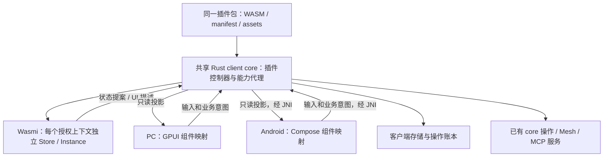
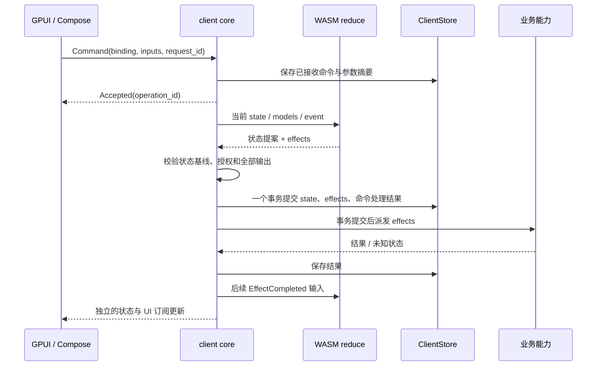

# 插件系统 v1 设计：同一插件运行于 PC 和 Android

状态：设计草案，2026-09-11；尚未实现或通过运行时、性能及设备验证。承接[插件系统调研](plugin-system-research.md)。本文以 PC 与 Android 同时可用为首版条件，取代调研中“先桌面、后补 Android”以及以 Wasmtime 为默认实例的表述。PC 以 Windows/macOS 为目标，Linux 保持相同契约；具体宿主平台的现有分发能力不由本设计宣称已完成。

UI 范围已修订为应用级界面。完整方案以[插件 UI 运行时设计](plugin-ui-runtime-design.md)为准：本文的组件映射、单一 present 入口、Wasmi 首选和小表单预算是初始假设，不能作为插件 UI 的最终能力边界或已选定的执行方案。业务事务、操作身份和跨端包的原则继续适用。

**交付单位是一份插件包：同一个 `plugin.wasm`、同一份资源和业务代码，在 PC 的 GPUI 与 Android 的 Compose 中生成原生界面。** 两端不要求逐像素相同，但功能、业务结果、错误和权限语义一致。默认在各自应用进程内执行 WASM，手机不依赖在线 PC 来运行插件逻辑；插件调用远端服务时才需要对应服务可达。

## 1. 首版决策

| 项目 | v1 决策 |
| --- | --- |
| 执行方式 | 进程内 WASM 沙箱，插件计算在 UI 线程外执行 |
| 运行时 | Wasmi 为便携基线候选；复杂 UI 探针通过后选定后端，保持 PC/Android 的共同 Wasm 与能力合同 |
| 二进制格式 | 普通 wasm32 Core Wasm；首版 Rust SDK 输出 `wasm32-unknown-unknown`，不要求 WASI、Component Model、Node 或原生动态库 |
| 业务入口 | core 调度插件处理器；处理器返回状态提案和待执行操作，core 校验、提交、执行 |
| UI 入口 | 插件运行 UI 程序，提交通用布局、标准组件与自绘事务；完整输入、场景和平台接入见 UI 运行时设计 |
| 宿主调用 | 小型稳定 ABI + 有界结构化数据；普通插件无 OS IPC、无直接 JNI/GPUI 调用 |
| 状态订阅 | 复用 `zork-observe` 的 prepare / acknowledge / discard 与消费者已应用基线 |
| 数据权威 | Zork 业务数据沿现有 core/服务端权威；插件私有持久状态由 core 按安装和授权上下文保存 |
| 同步 | 跨设备使用同一服务端对象时沿现有同步协议；插件私有本地偏好不自动跨设备复制 |
| 首版扩展位置 | 插件工作页、任务结果卡片、插件设置、宿主动作入口；全部提供 PC/Android 映射 |
| 自由画布/网页 | 自定义二维控件属于 UI 验证范围；Web UI 是完整路线的对照候选，不预先认定仅能兜底 |

Wasmtime 官方当前将 Android arm64/x86_64 列为 Tier 3，指出缺少相应 CI 测试和专职维护；这是成熟度差异，不是“不支持 Android”。[支持等级](https://docs.wasmtime.dev/stability-tiers.html)

Wasmi 提供轻量解释执行、跨平台 Rust 接入和 fuel 计量，适合本方案中的短时业务处理与 UI 描述生成。统一使用它可以减少两端运行时差异，也无需为了插件执行在手机上启用 JIT。这是选型判断，不能替代 Android 构建和实机验证。[Wasmi 项目说明](https://github.com/wasmi-labs/wasmi)

首个兼容性实验必须同时运行同一个 Wasm 文件于 PC 与 Android；未通过前不冻结公开 ABI。运行时、SDK 和编码库版本在该实验中锁定，不能把在线 `latest` API 文档直接当作已选定的依赖版本。

## 2. 代码归属与依赖



图中的共享 core 是两端应用内分别运行的同一套 Rust 实现，不是一个远端集中服务。

以下为拟新增模块，暂不创建空 crate 或无调用者的通用框架：

| 位置 | 职责与依赖 |
| --- | --- |
| `crates/zork-plugin-protocol` | 包格式、ABI 数据类型、动作与组件 schema、版本规则；只依赖便携类型与编解码库 |
| `crates/zork-plugin-sdk` | 插件作者使用的 Rust API、导出 ABI、类型检查和组件构造器；不依赖 GUI/core/网络库 |
| `crates/zork-client-core/src/plugins/` | 安装实例、运行时适配、调度、业务处理、能力代理、UI 描述校验与订阅 |
| `crates/zork-client-core/src/store/plugins.rs` | 插件包索引、私有状态、命令和效果账本；复用 ClientStore 的 SQLite 事务 |
| `crates/zork-gui/src/plugins/` | 只读 UI 描述到 `zork-ui` 的映射，以及呈现状态和平台能力适配 |
| `crates/zork-android/src/observations.rs` | 扩展现有订阅句柄适配，不执行插件业务规则 |
| Android `plugins/PluginSurface.kt` 等 | Compose 映射、视口、输入、IME、焦点与页面生命周期 |

现有 [zork-observe](../crates/zork-observe/src/source.rs) 已提供有界变化日志、独立消费者基线、准备和应用确认；[core 订阅桥](../crates/zork-client-core/src/subscriptions.rs)及 [Android Observations](../apps/android/app/src/main/java/surf/zork/android/Observations.kt)已经把通知和准备批次分开。新插件投影应复用这些机制，不能另建轮询链路。

现有 `LocalClient::observe` 和 `WireSubscription` 假定投影绑定一个设备。插件设置可以只属于本地安装，所以需要把订阅所属域扩展为“设备或插件上下文”，而不是伪造一个 peer。保留原设备投影的行为，插件投影通过自己的授权绑定取得 source。Android 的插件提交与订阅读取使用独立的 core 句柄，不在持有 `Host.client` 或 `networkGate` 时执行 WASM/等待变化。[当前 LocalClient](../crates/zork-client-core/src/client.rs)、[JNI Host](../crates/zork-android/src/lib.rs)

## 3. 插件包与兼容范围

插件包可使用 `.zork-plugin` ZIP 容器，解包后为只读的内容寻址目录：

```text
manifest.json
plugin.wasm
assets/...
locales/zh-CN.json
locales/en.json
```

示例 manifest，字段为本设计拟定：

```json
{
  "format": 1,
  "id": "example.task-lens",
  "version": "0.1.0",
  "entry": "plugin.wasm",
  "abi": "zork-core-wasm/1",
  "ui_catalog": "zork-native/1",
  "platforms": ["desktop", "android"],
  "state_schema": 1,
  "capabilities": {
    "required": ["tasks.read", "plugin-state.write"],
    "optional": ["resources.open"]
  },
  "contributions": {
    "surfaces": [
      {"id": "tasks", "slot": "workspace.panel", "scope": "peer"},
      {"id": "settings", "slot": "plugin.settings", "scope": "installation"}
    ],
    "commands": [
      {"id": "refresh", "input": "none"},
      {"id": "save-preferences", "input": "preferences-v1"}
    ]
  }
}
```

每个命令的参数 schema 随包声明，限定为有界、命名的记录与基础类型；例中的 `preferences-v1` 需要有相应 schema 定义。manifest 声明期望能力，core 的实际授权决定能否执行；插件不能通过修改 manifest 自授权限。缺失 required 能力时阻止激活并给出明确原因，缺失 optional 能力时保留主要功能并提供禁用原因或兼容操作。

入库先检查路径、解包体积、资源大小、模块 imports/exports、ABI 与组件集合，再登记内容摘要。安装不执行任意安装脚本。v1 包不携带 `.dll`、`.dylib`、Android `.so`、外部进程或平台路径；这些也不作为声明式 UI 的扩展口。

普通插件只使用共同组件目录，所以同一个插件包必须在 PC/Android 上都有可执行入口。新组件升级先同时完成两端映射，再增加 catalog 版本；不允许桌面悄悄支持一个新组件、手机直接忽略它。

## 4. WASM ABI：小接口，完整类型契约

v1 选择 Core Wasm 的稳定整数/内存接口，把 Component Model 留作独立升级选项。插件作者面对的是 SDK 的 Rust 类型，下面的指针交互只由 SDK 和 runtime 适配层实现。

| 方向 | 签名 | 作用 |
| --- | --- | --- |
| guest export | `zork_abi_version() -> i32` | 返回 ABI 版本 |
| guest export | `zork_alloc(len: i32) -> i32` | 在 guest 线性内存申请输入缓冲 |
| guest export | `zork_free(ptr: i32, len: i32)` | 释放输入缓冲 |
| guest export | `zork_call(kind: i32, ptr: i32, len: i32) -> i32` | 处理一次有界调用；kind 分别为 reduce、present、migrate |
| host import | `zork_v1.emit(ptr: i32, len: i32) -> i32` | 提交本次调用的唯一候选结果，仅暂存，不执行操作 |

输入/输出使用带版本的 CBOR 类型消息。采用明确的字段和枚举标识，不用 Rust 内存布局、默认 enum 序号或 serde 类型名充当稳定 ABI。限制消息长度、集合数量和嵌套；拒绝重复字段、不支持的标签、无限长编码和非有限布局数值。JNI 的初版兼容路径仍可用现有 JSON DTO；它是同一类型契约的另一种编码，不要求两种边界使用相同的二进制布局。

一次调用的顺序是：设置预算 → guest alloc → 检查区间并写入输入 → guest call → 接收唯一 emit → guest free → 校验完整输出 → 交给 core 决定是否提交。alloc/call/free 都计入本次执行预算；任一阶段 trap、失败、重复 emit 或缺失结果，都丢弃暂存结果并使运行实例失效。`emit` 后再 trap 不会留下半次业务提交。

宿主处理指针前使用 checked arithmetic 检查 `ptr + len`，在任何 host 分配前检查字节预算；复制后不保留 guest 内存引用，不跨 `memory.grow`、回调或下一轮执行保存裸指针。非法返回值只变成该实例的结构化错误。首版不链接 WASI 文件/网络/环境变量能力，也不提供任意 Rust 函数调用。

`zork_call` 的非零返回值表示 ABI 调用失败；业务拒绝、字段错误和能力不可用作为正常的类型化结果返回。trap 的异常路径不作为业务错误文案解析机制。

## 5. 业务处理与界面生成分离

SDK 暴露三个逻辑入口，以下是类型草图，不是可直接编译的 Rust 定义：

```rust,ignore
fn reduce(input: ReduceInput) -> Result<Transition, PluginError>;
fn present(input: PresentInput) -> Result<UiUpdate, PluginError>;
fn migrate(input: MigrationInput) -> Result<StateBlob, PluginError>;

struct ReduceInput {
    event: PluginEvent,
    state: Versioned<StateBlob>,
    models: ReadModels,
    capabilities: CapabilitySnapshot,
}

struct Transition {
    replacement_state: Option<StateBlob>,
    effects: Vec<Effect>,
    feedback: CommandFeedback,
}

struct PresentInput {
    state: Versioned<StateBlob>,
    models: ReadModels,
    operations: OperationSnapshot,
    surface: SurfaceContext,
    previous_tree: Option<TreeRevision>,
}
```

`StateBlob` 是插件自己的小型持久状态，例如筛选偏好和自定义规则，不存放完整任务/消息副本。Zork 数据通过 `ReadModels` 读取现有 core 的限域投影。插件领域校验可以由受 core 调度的 WASM 处理器实现；Zork 自身的权限和业务约束仍由原有业务操作验证。

`present` 只能输出 UI 描述，不能返回业务 effects 或持久化状态；`migrate` 也不能调用业务能力。WASM 内部可以有缓存，但它不是持久权威，不能依赖缓存恢复业务事实。三个入口都没有直接产生外部副作用的 host import。

效果类型使用已注册业务动作，例如 `RefreshTasks`、`OpenResource`、`SetDraft`、`CallMcpTool`，具体参数遵循各自 core 契约。插件生成的是动作参数，HTTP 方法、URL、凭据和重试由能力代理处理。不能暴露一个允许 UI 随意构造 Station 请求的 `Request(method, path, body)`。

写操作流程如下：



输入消息由 core 绑定安装、作用域和身份。用户命令按上下文串行处理；同一 request_id、相同参数返回已知状态，不重复执行；同 ID 不同参数明确拒绝。减量计算不持有数据库或全局 Client 锁。提交前复核私有状态 revision、授权版本与相关读模型基线；基线变化时丢弃提案，用新快照有限重算，持续冲突则返回可重试的冲突结果。

原有任务/消息/配置的实际变更仍可能在派发时遇到远端冲突，因此 underlying core 操作继续携带其自身的 expected revision。私有插件状态、效果 outbox 与外部服务并非一个分布式事务；有依赖顺序的操作由前一结果事件驱动后一操作，不能把一个 effects 数组说成跨服务原子提交。

每个 effect 获得稳定 ID，由 core 将它映射到已有业务操作的幂等 ID。现有 [client_operations](../crates/zork-client-core/src/store/operations.rs)绑定具体 Mutation/Receipt，不能直接塞入任意插件 JSON；新增插件账本保存关联关系，原有业务账本继续管理实际操作。结果丢失时查询/恢复原操作，无法确认时标为 `outcome_unknown`，不因重建 WASM 而重放。

`present` 在已提交状态上生成界面；若它失败，宿主显示插件界面错误。已经提交的业务效果不因呈现失败而被当作没发生，也不会由视图自动回滚。

## 6. 最初的标准组件样例（完整 UI 能力见后续设计）

以下是用于标准页面的共同组件样例，不是插件可以实现的控件全集。共同标准组件需要 GPUI/Android、键盘/触控、可访问性和错误状态映射；新自定义控件通过通用布局、交互和绘制能力构建，通常无需为每个控件升级宿主。

| 语义组件 | PC | Android |
| --- | --- | --- |
| `Page`、`Section`、`Stack` | 面板、章节、宿主间距 | 页面、卡片/章节、适配安全区和字体缩放 |
| `Text`、`Icon`、`Badge` | `zork-ui` 字体角色与图标 | Compose 对应字体角色和资源 |
| `Button`、`ActionMenu` | 按钮、快捷键提示、上下文菜单 | 触控按钮、明确的更多入口、菜单/底部操作面板 |
| `Field`、`Select`、`Toggle` | 原生输入与选择控件 | Compose 输入、软键盘、选择与开关 |
| `VirtualList` | 虚拟列表、键盘导航、鼠标选择 | LazyColumn 等虚拟化映射、触控与滚动 |
| `ListDetail` | 宽窗口显示列表和详情 | 窄窗口列表 → 详情；Android Back 返回列表 |
| `Markdown`、`Image`、`Progress` | 宿主渲染与资源缓存 | 对应移动渲染和资源缓存 |
| `Notice`、`EmptyState` | 宿主错误、空状态、重试入口 | 相同结果语义的移动呈现 |

响应式决定基于容器可用空间和输入能力，不简单依赖 `is_android`。窄 PC 窗口也可使用逐页 ListDetail；平板宽窗口可以并排。路由、选中行、滚动、焦点和弹层属于呈现状态，由平台保存；业务状态不因布局切换重建。

插件声明主/次动作和数据关系，不指定 Android 必须显示桌面侧栏。任何必要动作都有可点击入口，不能只依靠 hover、右键、快捷键或拖拽；系统文件导入在 PC 可以拖入，在 Android 可以通过选择器完成，最终提交同一种资源句柄。

布局仍需有界约束和稳定身份，但复杂 UI 还需要自定义布局、图层、裁剪、局部自绘和完整事件协议；不能以简单容器覆盖全部需求。平台原生视图指针或任意宿主代码不是插件 ABI。具体通用能力、共同场景事务和两端绘制接入见 UI 运行时设计。

类型草图采用平坦节点表，避免递归的跨语言对象图：

```rust,ignore
struct UiDocument {
    root: NodeId,
    nodes: Map<NodeId, Node>,
}
struct Node {
    kind: Element,             // 带类型的组件属性
    children: Vec<NodeId>,
}
enum UiUpdate {
    Reset { document: UiDocument },
    Patch { expected: TreeRevision, changes: Vec<UiMutation> },
}
enum UiMutation {
    SetProps { node: NodeId, props: ElementProps },
    InsertSubtree { parent: NodeId, before: Option<NodeId>, tree: UiDocument },
    Move { node: NodeId, parent: NodeId, before: Option<NodeId> },
    RemoveSubtree { node: NodeId },
}
```

NodeId 在同一 surface incarnation 中稳定，删除后该 incarnation 内不复用。patch 顺序应用到临时版本，检查组件属性、父子关系、重复 ID、循环、节点/深度预算；全部合法才原子替换已发布树。更新按钮标题或列表内容不创建新的输入框 Entity/Compose key。

列表数据从组件结构分离。`VirtualList` 绑定 CollectionId，数据通道提供总量、稳定记录 ID、当前窗口和记录变化；不在每次更新时发送全体记录 ID 或整个列表。视口请求携带稳定锚点和范围，由 core 准备对应窗口。宿主可以即时滚动并显示占位行，不能同步等待 WASM 才移动滚动位置。

对于“任务透镜”示例，插件提交一个 ListDetail：列表是任务摘要，详情是正文、进度与主动作。PC 并排展示，手机点击一行进入详情；排序规则和可执行动作完全相同。该例应成为两端共用的第一个生产组件 fixture。

## 7. 事件、输入法与操作绑定

插件声明动作 key 和绑定参数；core 将其注册为受当前作用域约束的 BindingId。平台只提交 BindingId 和输入值。绑定在动作、参数、权限或有效性变化时更新 generation；单纯的颜色、进度、标题变化不让正在点击的动作失效。

派发时验证当前绑定、授权、运行状态与业务输入，不要求事件的 UI revision 恰好等于最新整棵树 revision。否则高频进度变化会不断拒绝正常点击。已删除或更换对象的旧绑定必须拒绝。

`Field` 的文字缓冲、组合输入、选区与焦点留在宿主。字段事件携带 `(field_id, edit_seq, value)`；业务更新回传已处理到的 edit_seq。平台只用对应确认更新该输入基线，不能让较旧回执覆盖更晚键入的内容。外部变更与未提交输入冲突时显示冲突状态；主动重置需要明确的新字段 incarnation/重置意图。

提交按钮一次携带所需字段当前值，core 不依赖先前每一条字符事件都已送达。输入校验可以合并为最新值请求；提交、删除等业务命令可靠排队。选区、滚动、按下态、动画时钟不进入插件业务消息队列。

弹层通过宿主锚点呈现。关闭的顺序由平台处理为输入法/弹层/详情/插件页面，并按平台惯例确定；动作取消仍是一条独立业务意图，不能把 Android Back 或关闭面板解释为操作已取消。

## 8. 版本与订阅

| 身份/版本 | 作用 | 重建时的规则 |
| --- | --- | --- |
| installation + authority scope | 私有状态、授权和操作的命名空间 | 同一安装同一授权域可恢复 |
| runtime generation | WASM 实例和暂态调用句柄 | trap、重建、升级时变化 |
| private state revision | 插件私有状态的提交基线 | 随持久状态保存 |
| model cursor | Zork 业务读模型基线 | 沿原 core 合同，不能与 UI revision 比较 |
| surface incarnation / tree revision | 描述树的身份与版本 | 重新打开/撤权/不兼容重建时换 incarnation |
| subscription cursor / batch ID | 每个 UI 消费者已应用到哪里 | prepare 不前进；只有成功应用确认才前进 |
| operation ID | 已接受业务操作与效果关联 | 不随 WASM 重启改变 |

插件输出的 tree revision 由 core 在校验提交时分配，guest 只携带上次接收确认的基线。core 对候选 UI 更新的接收成功，与 GPUI/Compose 应用成功是不同确认边界。

平台先注册订阅再取初值，空状态也返回 Reset。最多保留一个未应用批次；增量从消费者已应用的版本合成，落后超过有界历史时 Reset 当前订阅范围。通知可以合并，依赖前序的 raw patch 不能只保留最后一个。日志和流式正文按业务顺序进入 core，只允许跳过中间显示帧。

PC 使用 `Arc` 投影；Android 在后台准备/编码/解码，只在主线程应用必要的呈现变化，随后确认。Android 的 StateFlow 若承载数据，必须承载已经顺序应用好的呈现镜像，不直接 conflation 未应用 patch。取消 collector 时先关闭独立订阅句柄唤醒 JNI wait，再回收等待任务；不能仅依赖 coroutine cancel 打断原生阻塞调用。

撤权或停用通过紧急失效路径立即使旧动作和句柄无效，并清除受限内容，不等待下一个可见帧。core 清除其可恢复投影与读取能力；平台丢弃对应镜像和呈现缓存。已经被授权插件读取过的数据不能通过协议“撤回”，所以不以数据清除机制宣称可以收回已泄露的副本。

## 9. Android 生命周期是共同合同的一部分

| 情况 | core 行为 | Compose/PC 对应呈现 |
| --- | --- | --- |
| 旋转、尺寸/折叠状态变化、Activity 重建 | 复用同一插件上下文与已提交状态 | 重新绑定 surface，恢复稳定行 ID、输入和导航状态；不重复激活业务操作 |
| 暂时退后台 | 停止新展示计算，撤销无用读取，保留已提交状态；按策略释放 WASM | 关闭或暂停呈现订阅；前台返回时读取新快照 |
| 内存压力 | 回收不可见实例和派生缓存，保留持久状态及操作关联 | 重新打开可从 Reset 恢复 |
| 系统直接回收应用进程 | 下次启动从 SQLite 恢复安装、私有状态和未决操作 | 不依赖退出回调保存业务；UI 仅恢复体积小的呈现状态 |
| 用户停用插件 | 立即拒绝新动作，取消未派发效果；在途操作按已有业务取消协议处理 | 展示停用状态，不自动重新激活 |

业务状态在变更提交时保存，不能等 `onStop` 才保存。Android 的 `SavedStateHandle`/`rememberSaveable` 仅放路由、输入等小型呈现状态或用于恢复的 key，不把整棵 UI 树、WASM 内存和全部列表塞进去。[Android 状态恢复说明](https://developer.android.com/develop/ui/compose/state-saving)

首版插件不承诺手机退后台后持续本地运行。需要长时间执行的任务经 core 提交到已经支持持久任务的服务节点，手机恢复后查询同一 operation；服务不可达时给出明确状态，不把任务悄悄转给另一台 PC，也不复制执行。

当前 Android 工程为 API 29+、arm64-v8a，使用 NDK 28。[构建配置](../apps/android/app/build.gradle.kts) 加入新的 Rust runtime 后，APK 中受影响的 `.so` 仍需在 4 KiB/16 KiB 系统页设备上验证；Wasm 自身的线性内存页与 Android 的 OS 页大小是不同概念。[Android 16 KiB 支持说明](https://developer.android.com/guide/practices/page-sizes)

## 10. 平台能力与数据位置

首版共同能力至少包括：订阅已授权任务/会话的有限投影、读写自身小型状态、打开资源、在已有业务合同内编辑草稿；MCP 调用按实际管理与调用权限单独声明。任何平台缺少 capability，都返回统一错误码与可展示原因，不在 Kotlin/GPUI 中重新推导授权。

文件和图片使用 ResourceId/AssetId。PC 文件路径与 Android content URI 由平台能力适配转换为有权限和生命周期的资源句柄；插件不能要求一个 Android 不存在的 POSIX 路径。资源字节通过有界读取提供，凭据通过能力代理使用，不把宿主 token、Cookie 或环境变量直接注入 WASM。

插件私有状态按 `(installation, authority_scope)` 保存。任务、消息等共享业务对象继续由原服务端保存和同步；PC 与手机不分别持有一份可修改的“插件版任务列表”。如果以后支持插件自定义跨设备业务对象，应单独定义服务端 schema、授权、冲突和复制合同，不直接同步整个 Wasm memory dump。

同包可运行与自动安装到所有设备是不同功能。v1 允许在两端分别安装同一摘要的包；经 Mesh 分发包属于后续安装能力，不能因设备配对就自动执行对方提供的插件。

## 11. 调度、资源与故障恢复

每个插件上下文一次只运行一个调用。调度器在上下文之间公平轮转；业务输入、结果处理与最新一次呈现任务分队列，不能被连续 render 请求阻塞。PC/Android 使用有界后台执行槽，模块解析/编译不在 GUI/JNI 主线程上运行，也不持全局 core 锁。

Wasmi 开启 fuel 后可在预算耗尽时停止执行；默认未开启，不能依赖库默认值。本版先使用有界完整调用，OutOfFuel 结束本次调用并释放/重建受影响实例，不依赖特定版本的 resumable API，也不把同步调用外包 `tokio::time::timeout` 当作可抢占中断。[Wasmi fuel](https://docs.rs/wasmi/latest/wasmi/struct.Config.html#method.consume_fuel)

宿主的 emit/解码只做有限复制与检查，没有等待网络或平台对话框的 host function。取消先使调用代次无效，再在有界调用返回时丢弃结果和回收实例；调用耗时上界需要同时测量 fuel、批量内存操作和宿主处理，不能把 fuel 数字换算成跨手机型号通用的硬毫秒上限。

下面是首次双端实验的初始配置，未实测，不作为性能达标声明。公共插件按 Android 基线设计，PC 可以获得更高总并发，但不能依赖额外额度才能完成基本功能。

| 项目 | 初始配置 |
| --- | --- |
| Wasm 模块 / 解包总量 | 16 MiB / 64 MiB；另限制函数、类型、数据段与单函数体规模 |
| 线性内存 | 单实例最多 32 MiB；一个 memory；不共享 memory，禁用 memory64/threads 与非共同 Wasm 特性 |
| Table / 调用栈 | 有界 table、显式递归/栈高度限制；根据 SDK 样本锁定合法范围 |
| 私有持久状态 | 每上下文 64 KiB；大业务数据走 core 对象/资源，不进入状态 blob |
| 单次输入 / 输出 | 各 256 KiB；最多一次 emit |
| 描述树 | 最多 2,048 节点、32 层；列表窗口初始最多 128 行，长列表单独分页 |
| 调用预算 | present 初始 200,000 fuel；reduce 初始 1,000,000 fuel；启动/迁移单独有界配置，双端一起校准 |
| 事件 | 每上下文最多 32 条未处理可靠输入；满时返回 Busy，不能先声称 Accepted 再丢弃；呈现只保留最新待算请求 |
| 驻留 | Android 最多 4 个、PC 初始最多 16 个活跃上下文；总 guest memory 预算分别为 128/512 MiB，不预先全量分配 |
| 执行槽 | Android 初始 2 个；PC 初始最多 4 个，保留 UI 与 core IO 的调度空间 |

内存增长限制针对各块 linear memory；运行时元数据、翻译代码、host 分配、图片解码、JNI DTO 和日志不属于该额度，必须另设全局预算和缓存回收。配置 guest memory 上限不能宣称整个进程 RSS 被硬限制。[Wasmi StoreLimits](https://docs.rs/wasmi/latest/wasmi/struct.StoreLimitsBuilder.html#method.memory_size)

生命周期分为 Installed/Dormant、Starting、Ready、Suspended、Faulted、Disabled。第一次打开入口按需激活；不可见时可 Suspended 并释放实例；trap、输出越界或预算耗尽进入 Faulted，关闭旧绑定并显示宿主错误块。用户重试从最后已提交状态创建新 generation，不重放导致故障的事件。短时间反复失败停止自动恢复，避免耗电和闪烁；主动 Disabled 不被恢复策略拉起。

runtime generation 失效只拒绝旧的计算/界面回调。已经进入 core 业务账本的 operation 不以旧 generation 为由丢失：结果继续入账，新实例通过当前状态读取其结果。业务命令 Accepted 但尚未提交 effects 时，可以明确恢复为未执行/需重试；已派发效果按业务回执查询恢复。

## 12. 升级与历史兼容

包版本、ABI、组件目录和私有 state schema 独立版本化。升级先验证新包、在隔离的临时实例上对旧状态副本执行 migrate，成功后原子切换包摘要和状态版本，再使旧 runtime generation 失效。迁移不能发 effects；失败保留旧包和原状态。

迁移前拒绝新写操作并等待有界的业务静止点；未决 effects 仍由旧版本的持久关联记录跟踪，不能因升级重发。v1 对有未决插件业务操作的上下文推迟 schema 升级，避免同时维护两套 reducer；其他无关插件不被阻塞。

旧结果的可读内容由业务结果记录保存，并提供宿主通用展示。缺少对应插件或 UI 版本不支持时，仍能读取正文/附件/结构化结果，不为了展示历史自动执行陌生版本插件。已执行业务操作之后回滚包不等于回滚外部副作用。

## 13. 实施顺序与双端完成条件

每一步都以 PC 和 Android 的共同合同为交付单位；不把 PC 做完作为首版插件能力完成。

| 步骤 | 工作 | 通过条件 |
| --- | --- | --- |
| M0：运行时和 ABI | 独立 Wasmi 实验、SDK 最小导出、包校验 | 同一 Wasm SHA-256 在 PC 与 Android arm64 执行相同输入；越界、栈溢出、无限循环、超限返回值只影响该实例；记录体积、内存和启动时间 |
| M1：最小原生 UI | Page/Text/Button/Field/Select/ListDetail 与两端映射 | 同一包同时显示并可操作；中文 IME、键盘/触控、窄宽切换、焦点与 Android Back 正确 |
| M2：业务与恢复 | reduce/事务/effects、已有 core 能力、私有状态 | 在相同业务 fixture 上，两端结果一致；trap 前未提交 effects 不执行，丢回执不重复副作用，应用重启可恢复已提交状态 |
| M3：订阅和长列表 | 原子 patch、稳定 ID、虚拟窗口与应用确认 | 双端 1 万条记录、每秒 100 次变化、慢消费者暂停 2 秒后最终投影一致；输入不被旧结果覆盖，无持续全量传输 |
| M4：完整样例和生命周期 | 任务透镜插件、安装/停用/升级、后台回收 | 同包在 PC 与 Android 完成同一任务流程；Android 旋转、字体缩放、分屏、后台/进程回收后正常恢复；独立失败插件不影响正常插件 |

PC 验收覆盖 Windows/macOS 的实际宿主构建；Android 从当前 arm64/API 29+ 基础执行，并包含 4 KiB/16 KiB 页配置。缺少某目标环境时明确报告未验证，不用另一个平台的成功结果替代。

性能记录同时包含：包体与宿主新增体积、冷/热启动、guest 与宿主分配、Android PSS、CPU、Wasm 边界传递字节、JNI 编解码、呈现应用 p95/p99、整帧与输入延迟、无变化时的唤醒。先保存同设备无插件基线；初始目标是普通小更新的平台应用 p95 不超过 2 ms、故障插件不使正常页面输入 p95 增加超过一个显示帧。未达到时先定位再调整实现，不把仅后台吞吐或仅截图作为通过。

本次设计检查只覆盖文档结构、例子及引用一致性。没有安装 Wasmi、生成 SDK、改动 Cargo/Gradle、运行 APK 或验证上述指标。
