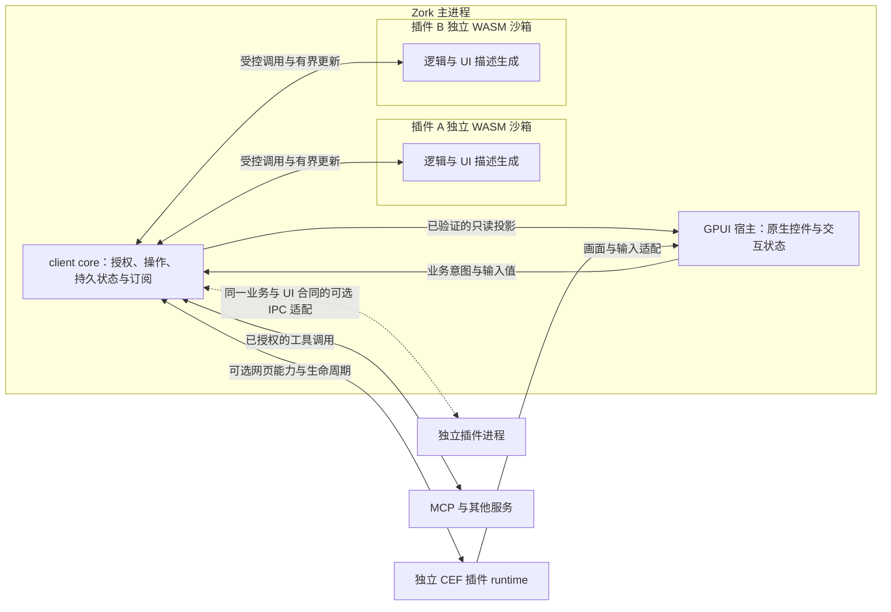

# 插件系统调研：崩溃隔离与 UI 融合

后续具体方案见[PC 与 Android 插件系统 v1 草案](plugin-system-design.md)与[应用级插件 UI 运行时设计](plugin-ui-runtime-design.md)。两端同时可用和复杂 UI 是共同要求；执行后端、通用呈现接入与预算需要通过同包探针收敛。本文保留原调研与备选路线，不把某个运行时、有限组件目录或 Android 后续映射作为最终前提。

2026-09-10 源码盘点，2026-09-11 复核隔离方案。针对 Zork 的桌面 GPUI、Rust client core 和现有 CEF/MCP 基础进行研究，兼顾 Android 与 Web 的后续契约。源码基线为 `2a523b0` 加调研时的未提交工作树；本次只做源码与官方资料核对，没有实现插件运行时、运行故障注入或测量性能。以下 API 名称均为讨论草图，不是已经确定的第三方 ABI。

建议优先验证 **同一进程内为每个插件建立独立的 WASM 沙箱，在 UI 线程外执行，宿主通过受控的 UI 描述协议使用原生组件渲染**。WASM 已经提供进程内的内存与执行隔离；每插件一个 OS 进程是额外增强，用于需要独立回收原生运行时故障或隔离某类宿主能力实现的场景，不作为普通 WASM 插件的默认前提。复杂编辑器、画布及 MCP Apps 另走进程外网页画面。

WASM 实例只能访问自己的线性内存和显式链接的能力；越过内存边界等 guest 错误由运行时报告为 trap，宿主可以处理并停用故障实例。死循环中断和资源额度仍需显式配置。这个沙箱边界并不依赖 OS 进程；UI 的表达与渲染方式也可独立选择。[Wasmtime 安全说明](https://docs.wasmtime.dev/security.html)

这条路线最适合“插件按钮、列表、表单、结果卡片、设置页像 Zork 自己的功能”。它的主要成本是组件协议与各端映射，不能同时承诺插件可以任意调用全部 GPUI API。如果第一类目标是移植任意现成 Web 应用，优先级应改为 CEF/MCP Apps，接受它们作为独立交互区域。

## 当前可以复用什么

| 当前入口 | 源码中已有的基础 | 对插件系统的意义与缺口 |
| --- | --- | --- |
| [zork-ui](../crates/zork-ui/src/lib.rs)、[controls](../crates/zork-ui/src/controls.rs)、[navigation](../crates/zork-ui/src/navigation.rs) | 共享 GPUI 控件、设计 token、导航与交互组件；不承担 Gateway 和持久化 | 可实现插件 UI 节点到正式组件的映射；目前没有通用插件组件协议或动态渲染器 |
| [core 浏览器 worker](../crates/zork-client-core/src/desktop/browser_worker.rs)、[GUI worker](../crates/zork-gui/src/browser/worker.rs)、[GUI bridge](../crates/zork-gui/src/browser/bridge.rs) | worker 与授权桥接的实际实现已进入 core，GUI 包装平台生命周期 | 新插件生命周期与业务入口应沿 core 边界实现；不把插件控制器放进视图。边界文档的迁移清单可能落后于这批未提交代码 |
| [CEF IPC](../crates/zork-browser/src/cdp.rs)、[Browser](../crates/zork-browser/src/service.rs) | 启动独立浏览器 runtime，私有 IPC、包大小检查、断连反馈、关闭与回收 | 已有进程外能力适配的参考；一个 Browser 管理同一 runtime 的多个 tab，不能把 tab 当作插件独立故障域 |
| [CEF 输出](../crates/zork-browser-runtime/src/output.rs)、[GPUI 页面显示](../crates/zork-gui/src/browser/panel.rs) | 输出保留最新待显示帧；GPUI 将收到的像素转换为 RenderImage，并已有输入与 IME 转发 | 可复用画面嵌入经验。当前是像素 IPC 和内存复制，不是 GPU 共享纹理；控制消息 VecDeque 未见显式容量上限，不能原样充当第三方插件通道 |
| [MCP runtime](../crates/gateway/src/mcp/runtime.rs)、[calls](../crates/gateway/src/mcp/calls.rs)、[MCP 说明](mesh-mcp.md) | stdio/HTTP 服务、进程组回收、调用账本、授权与结果未知处理 | 可供插件调用已授权的工具；当前 MCP 初始化不声明 Apps 能力，未实现 UI 资源与 Apps 桥接，不能把已接入 MCP 等同于已有 UI 插件系统 |
| [客户端订阅合同](client-state-subscriptions.md)、[订阅设计](client-subscription-design.md) | 已有共享业务控制器与订阅；统一版本及确认协议仍有提案、迁移和实现的区别 | 插件复用同样的业务权威与消费者基线原则，不新建 UI 业务副本，也不把设计稿中的接口说成全部已落地 |

[Agent 架构](zork-agent-architecture.md)已经要求第三方工具使用 WASM 隔离，并明确没有已确认的第三方工具 ABI。本研究因此优先选择 WASM 插件实验；已有 MCP 外部服务继续使用自己的协议边界，不把它们改成 Agent 进程内的 native plugin。

## 已有产品提供的证据

| 参考 | 可以借鉴的机制 | 不能据此推导的结论 |
| --- | --- | --- |
| [VS Code Extension Host](https://code.visualstudio.com/api/advanced-topics/extension-host) 与 [Webview](https://code.visualstudio.com/api/extension-guides/webview) | 扩展执行与工作台分离，按需激活；常规贡献点与自由 Webview 并存 | 一个 extension host 不等于每个插件各有 OS 进程；Webview 也不会自动获得全部宿主交互行为 |
| [Shopify remote rendering](https://shopify.engineering/remote-rendering-ui-extensibility) | 插件环境构造组件树，经消息传递，由宿主映射为自己的组件 | “remote”指执行环境分开，不要求经过互联网，也不证明 OS 进程隔离 |
| [Shopify Remote DOM](https://github.com/Shopify/remote-dom) | 当前库用 DOM 接口表达远端树，可限制为宿主提供的自定义组件 | 现成接收器主要面向 JS/Web；Zork 仍需 Rust 协议和 GPUI 映射，不是装包就能获得原生插件系统 |
| [Raycast 2023 年插件架构](https://www.raycast.com/blog/how-raycast-api-extensions-work) | React 声明 UI，JSON-RPC/树变化传给 AppKit；独立 Node 进程内使用 worker threads | worker isolate 不是每插件一个 OS 进程；文章也指出宿主 native API 崩溃仍可能影响应用 |
| [Raycast 2.0 技术说明，2026-05-14](https://www.raycast.com/blog/a-technical-deep-dive-into-the-new-raycast) | 后来采用平台原生壳、共享 Web UI、Node 后端和 Rust 模块，说明 UI 契约可以与渲染技术演进分开 | 不能把早期 AppKit 插件案例描述成 Raycast 当前整套 UI 的实现；其整机内存数据也不是 Zork 的性能证据 |
| [Zed 扩展开发](https://zed.dev/docs/extensions/developing-extensions) | 扩展过程代码使用 Rust/WASM，通过明确宿主 API 工作 | GPUI 应用能够运行 WASM 扩展，不意味着 WASM 可以直接挂入任意 GPUI Entity 或闭包 |
| [MCP Apps](https://modelcontextprotocol.io/extensions/apps/overview) | 工具声明 UI 资源，宿主加载 HTML 并通过受限消息通道连接工具；有主题、能力与沙箱约定 | 它解决 UI 交付和互操作，不提供 GPUI 原生组件树；iframe 沙箱也不是“每插件独立 OS 进程”的保证 |

据此推导，最值得借鉴的是 Shopify/Raycast 早期的宿主渲染模式，以及 VS Code 的常规贡献点与 Webview 双路径。MCP Apps 适合作为网页兼容入口，不承担整个 Zork 原生扩展协议。

## 运行隔离与 UI 表达的取舍

下面是架构比较，不是已经完成的性能实验。

| 组合 | 崩溃边界 | UI 融合能力 | 判断 |
| --- | --- | --- | --- |
| 主进程加载动态库，直接调用 GPUI | 与宿主共享地址空间 | 可以直接组合现有控件 | 不满足第三方崩溃隔离目标 |
| 主进程内独立 WASM 沙箱 + 宿主原生渲染 | guest 内存隔离与 trap 可在进程内处理；原生宿主函数和引擎自身故障仍共享 | 很好，需要组件协议 | 推荐主路径，配置中断、资源预算和能力边界 |
| 多个 WASM 沙箱共用一个外部 runtime + 原生渲染 | guest 故障仍按沙箱隔离；原生 runtime 进程故障影响该进程内所有插件 | 很好，需要组件协议 | 需要把整个扩展运行时移出主应用时的折中 |
| 每插件独立进程 + 原生声明式 UI | 可单独终止、重启插件 runtime，进一步隔离其原生代码故障 | 组件、焦点、主题、布局和动效由宿主统一 | 可选增强，以实际故障模型和测量决定 |
| 每插件独立 runtime + 网页画面 | 需实际配置 runtime 故障域，不能只数 iframe/tab | 页面内自由度高；跨区域交互需要桥接 | 推荐复杂页面与 MCP Apps 的补充路径 |
| 插件进程自己用 GPUI 等引擎绘制，主程序合成画面 | 可分离渲染进程故障 | 视觉可以接近；输入、可访问性、弹层仍需跨进程协议 | 可用于专用高性能画布，不宜作为普通列表/表单的第一版 |

`catch_unwind` 只能处理会展开栈的原生 Rust panic；它不是原生 abort 或所有进程错误的恢复边界。[Rust 官方说明](https://doc.rust-lang.org/std/panic/fn.catch_unwind.html)支持这一限制。WASM 的 trap 与内存沙箱是另一套机制，不能用原生 panic 捕获的限制推导出 WASM 插件必须进程外运行。

独立进程提供额外的地址空间故障边界，不自动隔离文件、网络、整机资源压力或 GPU/系统故障。对普通插件的越界、trap 和配置了中断的死循环，优先利用 WASM 已有隔离；只有要覆盖运行时自身或原生宿主实现的进程级故障时，再增加进程边界。放在主进程里的原生 UI 渲染器也不会因为插件移到外进程而自动获得保护。

## 建议的 Zork 结构



插件生命周期由 core 协调，不依赖某个 GPUI 面板存活。第一版按“插件安装实例 + 授权上下文”分配独立 Store、实例、资源预算与能力上下文；不把共享 Memory/Table 或跨实例能力句柄隐式链接给插件。可以共享编译引擎与代码缓存，但不能因此合并各插件的可变状态和权限。

WASM 隔离本身不提供调度公平性。执行使用有界后台调度，配置 fuel/epoch 中断，宿主能力调用使用可取消的异步接口；不在 GPUI 绘制或输入回调里同步执行任意插件代码。trap 后使该实例的句柄失效，需要时以新 generation 重建。可选进程适配另实现 spawn、退出检测和进程树回收，不改变业务及 UI 合同。

职责分配建议如下，名称和拆 crate 与否由实验决定：

| 层 | 所有权 |
| --- | --- |
| 平台无关插件协议 | 插件身份、版本协商、组件节点、事件及错误类型；不包含 GPUI Entity、Context、Rust 指针或回调闭包 |
| `zork-client-core` 插件控制器 | 授权、业务操作、插件处理器调度、可恢复状态、能力代理、投影校验与发布 |
| WASM 插件处理器，默认进程内 | 经 core 调度的插件业务计算、插件领域校验和 UI 描述生成；持久化、网络与 Zork 能力经过 core 管理的接口 |
| `zork-gui` 与 `zork-ui` | 把只读描述映射到正式组件，处理布局、输入法、焦点、滚动、动画和呈现缓存 |
| CEF 平台适配 | 提供网页执行、画面、输入与消息传递能力；业务调用仍交给 core |

插件可以定义自己的业务命令与参数 schema，core 绑定声明、授权和操作 ID，交给已注册的插件处理器。不能因此给 UI 一个任意 `request(method, path, body)` 通道。对 Zork 自身数据的修改继续走既有业务操作，插件也不另存一套模型列表、消息状态或授权事实。

## 原生 UI 融合到什么程度

第一版提供少量明确的扩展位置：任务结果卡片、详情面板、插件设置页和宿主命令入口。宿主决定位置、可见范围和激活方式，插件不修改整个应用组件树。

节点协议优先采用 `Text`、`Button`、`Field`、`Select`、`List`、`Markdown`、`Progress`、受限布局容器等语义组件。长列表提供稳定记录 ID 和可见范围；文本、图片、嵌套深度及节点总量都有预算。传送的是组件类型、属性和动作标识，不传 GPUI 对象，也不提供任意宿主代码求值。进程内通过 WASM 导入/导出接口批量提交描述与更新，不需要 OS IPC，也不要求把所有交互编码成 JSON；下面的 JSON 仅用于解释语义。

下面只是解释数据流的片段，不是 SDK 定义：

```json
{
  "id": "refresh-results",
  "kind": "Button",
  "label": "刷新结果",
  "variant": "secondary",
  "action": "refresh_results",
  "enabled": true
}
```

宿主为它创建正式按钮，按下、焦点和动效立即在本地响应；激活时提交已绑定的业务命令，业务忙碌和完成状态来自 core。插件需要新组件时扩展协议及平台映射，不允许它偷偷把某个字段变成任意 HTML/native 代码。

UI 融合的验收要覆盖以下并列维度，不能只比较截图：

| 维度 | 原生路径的处理方式 |
| --- | --- |
| 主题与布局 | 使用宿主 token、字体角色、间距和语义 variant；暗色、缩放和窗口收窄跟随宿主 |
| 输入与 IME | 输入缓冲、选区和组合输入留在宿主；输入事件带编辑版本，迟到的值更新不能覆盖较新的未提交输入 |
| 焦点与快捷键 | 宿主拥有焦点链、Tab 导航、快捷键冲突规则与 Esc 行为；不能每次按键先等待插件执行 |
| 菜单、提示与对话框 | 使用宿主弹层容器和锚点，统一层级、遮挡与焦点恢复；不在插件画面内伪造所有弹层 |
| 可访问性与自动化 | 由实际组件暴露角色、标签与状态；继承组件实现的能力，并逐项测试，不自动宣称各端已经完善 |
| 故障与恢复 | 由宿主展示插件不可用状态、保留适当的用户输入并提供重试；旧内容如保留须标明已失效并禁用旧动作 |

主要工程成本是维护这一组稳定的组件和交互契约。桌面与 Web GPUI 可以复用实现；Android 仍需 Compose 映射，共享协议不等于共享渲染代码。Web 也可执行 WASM，但后台调度、中断与资源控制需要适配浏览器能力；不能直接照搬桌面 Wasmtime API 或可选进程的 spawn 机制。

## 故障隔离必须落实到协议

- **执行有界。** 每个实例限制并发、输出字节、UI 节点和资源使用。WASM 使用 fuel/epoch 中断与资源限制；宿主能力调用自身需要超时和取消。fuel/epoch 不会打断阻塞的 host call。[Wasmtime Config](https://docs.wasmtime.dev/api/wasmtime/struct.Config.html#method.epoch_interruption)
- **不要误报内存上限。** `memory_size` 针对每一块 Wasm linear memory，不是进程总内存；实例数、table、编译缓存、宿主分配和 IPC 缓冲需要另外控制。支持的 OS 硬限制与监控后的终止应分别标注，不能统称为硬配额。[StoreLimitsBuilder](https://docs.wasmtime.dev/api/wasmtime/struct.StoreLimitsBuilder.html#method.memory_size)
- **宿主不等待插件才能绘制。** 插件执行、参数复制、验证和大批变更准备在 UI 线程外完成；应用呈现变化有预算。可选进程适配另处理 IPC。控制、结果、UI 更新与画面分别管理，防止日志或渲染流堵住停止、退出和错误反馈。
- **插件数据仍需验证。** WASM 插件也可以产生畸形树、极大尺寸、无穷数值、过深嵌套和过量资源。验证长度、句柄与类型，再进行有预算的宿主分配和布局，按实例拒绝异常调用。沙箱保护内存边界，不保证插件返回的数据符合 UI 业务约束；宿主解释器或渲染器自身的 bug 仍需要修复。
- **按代次恢复。** 身份从运行时的实例绑定获得，不信任载荷自报的插件或设备身份；进程外模式再绑定启动与 IPC 身份。每次创建实例分配 generation，消息与动作关联实例、授权上下文、视图和版本。停用后使旧句柄失效；重建从当前快照与持久记录恢复，旧结果不能填回新实例。
- **避免重启风暴。** 有界退避与失败阈值由 core 管理；主动停用与 trap/异常退出区分处理。停止实例时先拒绝新命令，再中断执行、处理在途操作并释放资源。采用进程适配时，另回收完整实例的进程树，不能只杀启动器 PID。
- **恢复执行结果与恢复画面分开。** 已派发的副作用操作在丢失结果后可能是 `outcome_unknown`，不能因插件重启就自动重放。复用稳定 operation ID、账本和原业务幂等规则；关闭面板不等于业务取消。

UI 描述的传递采用带版本的快照/增量。至少区分 source/instance generation、订阅身份、from/to revision 与 batch ID。先注册再读取初值，首次包含空快照；增量相对于消费者已经应用的版本，最多保留一个未应用批次。慢消费者超过有界历史后 Reset 当前订阅范围，不能只留下最后一个依赖前序状态的 patch。

插件到 core 的接收确认，与 core 到 UI 的应用确认是不同边界。解析或投递成功不代表 UI 已应用；平台失败或取消后仍从自己的旧基线恢复。命令结果可靠保留，在线状态/进度可以合并成最新值，画面可以丢中间帧，文本或列表增量不能随意丢弃。复用[订阅设计](client-subscription-design.md)的语义，不把 core 刷新率固定成 UI 帧率。

## 网页与自由绘图路径的边界

现有 CEF 值得复用，但建议为插件另建 runtime/资料与授权域，不把普通网页浏览器的登录资料及控制权限直接送给插件。一个浏览器 profile 或一个 tab 本身不是每插件进程隔离的证据；要分别注入 renderer、browser runtime 和控制连接故障，观察实际影响范围。

MCP Apps 可以放在专用 CEF runtime 的受限 Web 宿主中：宿主加载 UI 资源，保留规定的 iframe/CSP/消息边界，CEF bridge 只适配消息，再由 core 执行获授权的操作。当前普通网页禁止原生业务 IPC 的约束继续适用；新增的是明确的 Apps 宿主能力，不是给任意网页开放 Gateway。无法遵守 Zork core 业务边界的网页应用应按普通外部页面处理，不能冒充已融合的原生插件。[MCP Apps 官方说明](https://modelcontextprotocol.io/extensions/apps/overview)

同样使用 GPUI 在外进程绘制，也只能首先得到画面融合。若没有语义桥接，宿主仍然不知道画面里的按钮、文本选择和可访问性节点；拖拽、弹层、焦点、IME 与 DPI 变化仍要实现。共享 GPU 缓冲可以减少像素复制，但需要平台专属生命周期、同步和故障恢复，不等于共享组件树。

以 1200 × 800 逻辑像素、2× 缩放、每像素 4 字节、60 fps 的整帧流估算，像素载荷约 **879 MiB/s**，还没有计入额外复制。此数只是算术估算，静态页面不会持续产生这样的整帧流，不能作为 Zork 当前带宽或 CPU 的测量结果。首轮先比较原生描述与现有 BGRA 路径，再决定是否值得增加共享纹理协议。

## 最小验证实验

优先在同一宿主进程中做两个独立 WASM 插件实例：A 展示能搜索的结果列表、表单和进度；B 提供故障注入。A 的 UI 使用生产 GPUI 控件；业务处理经过 core 与受控 fixture，插件不接真实账号。首轮使用一个小型 Rust/WASM 插件即可，不先设计完整市场、安装器或多语言 SDK。

| 实验 | 需要保存的证据与通过条件 |
| --- | --- |
| B 的越界访问、guest trap、栈溢出、无限循环 | 越界与 trap 在实例边界处理，死循环按配置中断；A 和主程序仍可交互，B 单独进入失败/恢复状态，没有全局锁等待它 |
| B 超限内存、日志、节点、嵌套与畸形消息 | 在配置预算内拒绝或停止实例，宿主接收、布局与缓冲不会随持续攻击无界增长；WASM 限制与宿主总资源限制分别记录 |
| 插件延迟、UI 暂停消费、旧 generation 消息与版本缺口 | 输入法与未提交输入保持正确，恢复后的最终投影与 core 一致，旧动作失效 |
| 1 万条记录、每秒 100 次变更，慢消费者暂停 2 秒 | 记录跨 WASM 边界的数据准备、平台应用的 p95/p99、传递字节、积压峰值和变化范围；列表虚拟化与 Reset 不退化成持续全量传输 |
| 正常插件与故障插件同时运行 | 比较主界面输入延迟、帧时间及其他插件操作延迟，不能只验证主进程 PID 仍存在 |
| 同一页面的原生描述版与 CEF 版 | 比较冷启动/首个可交互画面、CPU、内存、传输量及输入延迟；说明实例数、缩放、窗口大小与采样方法 |
| 操作执行后丢失回执再重启 | 通过相同 operation ID 查询结果或返回未知；fixture 实际副作用次数不能因自动重试增加 |
| 打开、隐藏、重建与关闭重复循环 | 窗口、订阅、WASM Store 和资源句柄被正确回收；无变化的原生插件不持续轮询业务状态 |

负载是建议的实验起点，尚未运行，也不是已验收的性能承诺。先验证进程内 WASM 沙箱的故障隔离、调度和组件协议能否覆盖真实页面；达到这些条件后再扩大组件目录、加入网页兼容和 Android 映射。只有需要覆盖原生运行时故障时，再增加外进程对照实验，测试原生 abort、OS 强杀、IPC 断开和进程树回收，并比较共享进程与每插件进程的成本。不能把 guest 内的 abort/trap 与宿主进程的原生 abort 混为一谈。

插件语言、插件包版本、UI 协议版本和业务状态 schema 应分开。后续若需要 TypeScript/React 开发体验，可以增加专用 SDK 与合适的隔离运行时，但不能把“React 可以生成描述”说成“任意 npm/Node 插件都能直接编译为 WASM”。第一步要验证的是 WASM 沙箱、宿主能力边界与 UI 合同，而非提前固定整个生态的 ABI。
