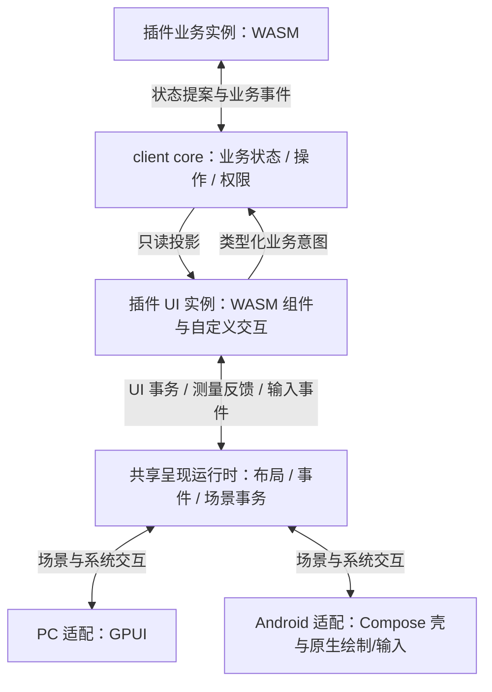

# PC / Android 插件 UI 运行时设计

状态：2026-09-11 设计提案，未实现或实测。本文修订[插件系统 v1 草案](plugin-system-design.md)中的 UI 部分：目标按应用级界面、自定义控件和复杂交互设计；有限的表单组件映射仅作为早期样例。WASM 进程内隔离、core 业务边界与 PC/Android 同包运行保持不变。UI 编程模型、运行时后端和执行预算尚未定版。

## 1. 插件应当能够编写 UI 程序

插件作者应能编写组件、组合状态、定义事件、进行局部自绘，形成编辑器、节点画布或时间轴。宿主不需要为每个新产品形态增加 `NodeEditor`、`TimelineEditor` 等专用组件才能运行插件。

协议应稳定在通用 UI 能力这一层，标准 Button/List/Form 是 SDK 或宿主标准组件库的便利封装。底层需要覆盖：布局与测量、文本、滚动、图层与裁剪、二维绘制、输入会话、焦点、命中和手势、可访问性、弹层与资源生命周期。

这意味着要建设一个可嵌入的 UI 运行时，工程规模明显大于“JSON 转 GPUI/Compose”。React Native 也通过独立的影子树、布局计算和原生挂载过程实现跨端，而不是直接把任意业务组件名对应到一个系统控件。[React Native 渲染流程](https://reactnative.dev/architecture/render-pipeline)

首轮用以下实际复杂度检验抽象：

| 页面 | 必须覆盖 |
| --- | --- |
| 代码编辑器 | 大文档可见区、可变宽文本、语法装饰、光标/选区、中文 IME、剪贴板、撤销、搜索、高亮层与滚动定位 |
| 节点画布 | 任意布局、连线、自定义端口命中、框选、节点拖动、缩放平移、触屏手势、就地文字编辑与悬浮菜单 |
| 时间轴/复杂列表 | 横纵虚拟化、固定表头、同步滚动、拖拽调整、异步数据填充、连续动画与局部失效 |

这些页面以同一插件包分别在 PC 和 Android 操作，不能通过只验收一个设置表单来证明 UI 系统完整。

## 2. 业务与呈现分别执行

上一版把全部插件执行都放到 core 的 `reduce/present` 中，容易使鼠标移动、手势、动画和布局反馈也进入业务调度。这不适合复杂 UI，也不符合 core 不承担平台帧调度的边界。

建议同一插件包提供两个逻辑角色，可以来自同一份 Wasm 模块的不同入口，运行时使用独立 Store/Instance：

| 角色 | 状态与能力 |
| --- | --- |
| 业务实例 | 由 client core 管理；处理插件业务规则、持久状态和业务操作；沿事务与 effects 合同执行 |
| UI 实例 | 由呈现运行时管理；保存组件状态、展开、拖动预览、临时编辑和自定义动画等呈现状态；消费只读业务投影，提交类型化业务意图 |

两种实例不共享可变线性内存，编译代码可以缓存复用。UI 实例不能直接读业务实例内存、网络、数据库或设备凭据；业务实例不持 GPUI/Compose 对象。UI 角色的渲染/布局阶段不能派发写操作，显式事件处理阶段才可经受控接口提交业务意图。不同角色的能力检查由宿主上下文决定，不能靠插件自行选择一个参数绕过。



`zork-client-core` 只订阅业务对象，不定义鼠标坐标、布局节点或动画帧。拟新增共享的 `zork-plugin-ui` 呈现模块承担上述 UI 协调；通用 WASM 执行适配由中立 runtime 模块复用。GPUI/Android 只连接同一 UI 合同与各自平台能力。模块名称仍为提案，不先建立空 crate。

UI 实例可以因窗口关闭、Android Activity 重建或内存压力释放；业务状态和已接受操作仍由 core 恢复。大文档/画布不能被“64 KiB 插件偏好 blob”限制，需要使用 core 管理的文档、资源或版本化记录。未提交编辑与持久草稿的界限按相应业务合同定义。

## 3. 三层 UI 能力可组合

| 层 | 插件可做的事 | 宿主负责的事 |
| --- | --- | --- |
| 应用融合与标准组件 | 使用 Zork 标准按钮、输入、菜单、导航和资源入口 | 主题、平台习惯、窗口/页面接入、权限与系统能力 |
| 通用布局与交互 | 自由组合容器、文本、滚动、图层、焦点域和手势区域 | 共享布局语义、节点生命周期、事件协调、局部失效 |
| 自定义绘制区域 | 绘制路径、连线、波形、选区、坐标轴等，附带命中和语义描述 | 有界绘制指令、文本/图片资源、裁剪、合成、输入与可访问性桥接 |

三层必须能够嵌套：节点画布里可以出现原生文本编辑，标准页面里可以嵌自绘时间轴，自绘图形上可以锚定宿主菜单。不能把 Canvas 当作一块只能看、不能参与宿主交互的图片。

标准组件不代表扩展能力上限；自定义控件可以在插件包内由通用布局、事件和绘图构建，通常无需宿主升级。真正新增平台能力、底层渲染原语或文本协议时才需要升级协议。

“完全任意 UI”仍要定义边界：二维编辑器与一般应用界面是此提案目标。自定义 GPU shader、三维引擎、视频解码、外部 native view 与完整浏览器各有独立接口和资源/故障模型，不能用一个任意执行或不透明指针接口混入通用 UI。

## 4. 布局不能交给两端随意解释

共享呈现运行时维护稳定节点、父子关系、约束、测量依赖和布局版本；布局语义统一。PC 与 Android 不各自实现一套有差异的 Flex/Grid 规则，然后期待复杂布局自然一致。基础布局优先复用成熟引擎，具体引擎需经插件样例和现有 GPUI 接口验证后选择。

字体与系统输入控件仍依赖平台。测量协议至少包含：文本/资源版本、字体角色与回退集合、字重字号、可用宽度、换行规则、语言、方向与字体缩放。测量结果和实际绘制使用同一平台文本实现，禁止按字符数猜宽度或用另一套字体排版结果定位光标。

测量以批次和缓存运行。UI 实例提交结构/约束，共享运行时整理缺失的测量请求；平台完成测量后推进对应 layout generation。依赖未满足的候选场景不发布；不在绘制回调里反复同步调用 WASM/JNI 测量每个字符。必须调用主线程系统 API 的工作单独有界调度。

异步反馈可以引起重新布局，但不能无限循环。需要记录本轮失效原因、限制连续重测、在预算耗尽时保持上一份一致的场景并让该 surface 进入可诊断的延迟状态。宽度、字体缩放、图片尺寸或 IME 遮挡变化使对应测量失效，不重置无关的输入状态。

自定义布局可以由 UI 实例根据约束与测量结果返回子节点位置；结果必须符合有界坐标、资源和节点身份约束。宿主只校验并应用几何，不执行插件传入的原生布局闭包。

## 5. 场景事务包括绘制、命中与语义

只传组件树或像素都不足够。一次展示提交要将相关结构、布局、画面、命中、可访问性、文本会话和弹层锚点绑定为同一版本，避免“画面已经移动，点击还落在旧位置”。

概念上的事务结构如下，不是已发布 ABI：

```rust,ignore
struct SceneCommit {
    surface: SurfaceId,
    incarnation: Generation,
    from: Option<SceneRevision>,
    to: SceneRevision,
    node_changes: NodeChanges,
    layout_changes: LayoutChanges,
    layer_changes: LayerChanges,
    hit_changes: HitChanges,
    semantics_changes: SemanticsChanges,
    text_sessions: TextSessionChanges,
    overlay_anchors: AnchorChanges,
}
```

这些是多份相关索引，不必复制成几棵完整树；关键是共用稳定 ID、坐标空间、生命周期和提交边界。需要原子一致的变化先在宿主暂存并校验，平台挂载时一起切换。未接受的半个事务不改变画面或输入路由。

场景使用 retained 节点/图层。修改一个节点位置只失效相关布局、命中和图层，不反复发布整页像素；列表或文档仅准备可见区及有限预取区域。离开视口可以卸载绘制资源，但稳定对象 ID 和必要的交互状态不能随列表下标变化。

自绘采用有界的 display list，初期原语可包括 Save/Restore、Transform、Clip、Fill/StrokePath、DrawTextRun、DrawImage。文本、路径、图片和大块几何使用版本化资源句柄，更新时上传变化部分，避免每帧传完整波形或文档。

图层应声明裁剪、变换、透明度、合成顺序及内容版本。没有内容变化的平移/缩放或标准动画尽量由宿主合成更新；这不意味着每类动画都可零成本，必须对高密度场景测量。

## 6. 事件系统与连续交互

事件最少需要以下共同概念：

| 概念 | 合同 |
| --- | --- |
| 指针事件 | 稳定 pointer ID、鼠标/触控/笔类型、位置与坐标空间、按键/修饰键、时间和压力等可选属性 |
| 传播 | 明确捕获/目标/冒泡顺序；UI 实例中自定义组件可处理传播，不由两端各猜一套规则 |
| 指针捕获 | 拖动跨出初始区域后仍交给所有者；节点删除、失焦、应用暂停或实例失败时发送取消并释放 |
| 手势竞争 | 滚动、拖动、框选、长按和双指缩放有仲裁；必要的同步策略提前注册在宿主，不能等待异步插件回调后才决定是否滚动 |
| 焦点域 | 同一窗口内的焦点顺序、嵌套作用域、菜单暂借焦点、回退目标；跨插件不能任意夺取键盘 |
| 滚动 | 视口与滚动偏移有明确所有者；支持嵌套滚动边界、惯性、视口锚定、同步区域和虚拟数据请求 |
| 快捷键与命令 | 插件声明命令，宿主解析冲突和平台组合键；Android 必要功能保留触控入口 |

同步机械交互和可延迟的自定义决策需要区分。普通按下反馈、滚动惯性、已声明的拖动变换可以在宿主立即执行；自定义命中细节、吸附预览或拖动时的复杂呈现逻辑可进入 UI 实例后台调度。宿主保存最后一致状态，不能通过同步等待任意 WASM 让整个应用卡住。

框选、拖动预览、弹簧运动属于 UI；“把节点位置保存为业务结果”才提交 core。插件作者不需要把每个 pointer move 都写成持久业务命令。可合并的移动采样保留必要的最新坐标/累计变化，down/up/cancel 和有序编辑不能丢弃。

例如拖动图节点：宿主根据当前命中与策略取得指针 → 即时更新已声明的拖动层 → UI 实例计算吸附、候选连线等预览 → 松手时提交一次 MoveNode 意图 → core 验证并更新业务投影。操作失败时，根据新的业务投影恢复位置并显示错误；不能凭拖动动画结束推断保存成功。

## 7. 文本编辑需要专门的会话协议

完整编辑器不是多行 Field。需要 document/buffer ID、文本版本、字符位置单位、选区方向、组合输入范围、事务化编辑、撤销组、光标几何、滚动到选区、剪贴板与可访问性文本操作。

统一文本协议明确 UTF-8 存储与 UTF-16 平台索引的转换，区分 code point、grapheme 和字节偏移。编辑带基线版本；IME 的 start/update/commit/cancel 与普通插入/删除分开。一次外部文本更新不能隐式提交用户正在组合的中文，也不能覆盖较新的未提交输入。

平台文本输入会话负责与系统输入法对接并提供即时的周围文本/选区查询。它必须有一份有界、已确认的编辑镜像，不能让系统输入法同步等待 WASM。编辑器自己的光标、行号、装饰层、语法高亮和虚拟滚动由共享文本/呈现协议配合插件实现。

原生标准输入可以作为会话的一种实现；自绘代码编辑器也必须实现同一文本输入与可访问性合同。Android 的 InputConnection、选择手柄、软键盘避让，以及 PC 的 IME 候选框定位都需要真正验证。

项目已有 [GPUI 浏览器输入适配](../crates/zork-gui/src/browser/input.rs)，它提供组合输入转发等参考，但不能视为完整编辑器方案：当前部分范围替换/位置查询实现是简化的。不能把这份桥接原样复制后宣称编辑器输入正确。

文档的已保存内容、持久草稿、协作版本与业务撤销由 core/插件业务处理器管理；文本控件对未提交输入的撤销与选区属于呈现会话。两者必须有明确提交界面，不混成第二份可变业务文档。

## 8. 弹层、可访问性与原生能力参与同一场景

菜单、Tooltip、拖拽预览、完成候选和对话框采用 portal/overlay 请求，锚定稳定节点或某版本的文本范围。宿主计算跨滚动、缩放、窗口边界和安全区的坐标，并执行自己的焦点规则。允许弹层超出局部裁剪不等于插件可以覆盖其他插件或系统信任界面。

自绘控件同时提供语义子节点、标签、角色、状态、可执行动作和几何范围。Android 不能只暴露一个“画布”节点；需要原生或虚拟的可访问性层级。官方自定义 View 指南明确说明了虚拟层级和 AccessibilityNodeProvider 的用途。[Android 自定义 View 可访问性](https://developer.android.com/guide/topics/ui/accessibility/views/custom-views)

PC 映射 GPUI 的对应可访问性与自动化能力，Android 映射系统可访问性。语义动作通过相同事件/意图入口处理，不能再维护一套业务分支。减少动画、字体缩放、屏幕阅读器和触控目标也是能力合同的一部分，不靠外观相似推导已支持。

## 9. 两端的实际渲染接入

PC 使用一个或多个 GPUI 自定义 Element 承载通用场景，并在标准组件处复用 `zork-ui`。节点与图层对应稳定的 retained 区域；批量画路径、文字与图片，不为每个绘图指令构造一个顶层业务视图。现有 [Regions](../crates/zork-ui/src/components/region.rs)是局部失效的参考，不是现成插件场景解释器。

Android 保留 Compose 的应用壳、导航和标准组件；自绘区域通过原生绘制 surface 接入，不把每条连线/每个字形都变成一个 Composable。布局、命中、裁剪和资源身份遵循共享运行时，JNI 传递批次与资源变更，不逐图元往返。具体选择 Compose Canvas、自定义 View 或更独立的渲染 surface，需要以嵌套裁剪、原生输入、弹层和高密度绘制实验决定，不能只凭空 Canvas 帧率选型。

两端文本和标准原生控件的实现允许有平台差异；布局与行为合同保持一致。比如画布内容和端口关系相同，PC 是鼠标拖动与滚轮缩放，Android 是触控拖动与双指缩放。自适应布局保持同一业务对象与操作，不单独开发一个删减功能的手机插件。

## 10. 与 GPUI Web / WebView 路线的关系

仓库 [GPUI Web harness](../crates/zork-gui-web/Cargo.toml)依赖 `wasm-bindgen`、`web-sys`、浏览器 WebGPU/WebGL 与 `WebPlatform`。它能证明同一 GPUI 组件实现可在浏览器环境运行；不能证明该二进制能直接装进 Wasmi/Wasmtime 并在 Android 原生绘制。

要让完整 GPUI UI 代码运行在通用 WASM runtime 中，需要一个新的平台/渲染/文本/输入适配层，移除对浏览器对象的直接依赖，并定义上述场景与交互协议。这是值得做兼容性探针的候选，不能当成已有能力。

另一个可选方向是直接承载 Web UI，在 PC/Android 的浏览器视图中获得成熟的布局、文本和交互生态，再做宿主主题、命令、资源和输入融合。这能减少自建 UI 运行时的范围，但形成网页内容区域，并需要单独证明嵌入体验和隔离。若核心目标是运行现成 Monaco/图表/设计工具等 Web 生态，这个方向应与原生通用运行时正面对比，不能事先仅把它放到“少数复杂页面兜底”。

本设计推荐先验证“通用宿主原语 + 自定义绘制 + 完整输入语义”的能力边界；复用 GPUI 内部实现、引入新的共享呈现引擎或 Web UI，属于该验证中要收敛的工程选型。不要同时建设三套生产运行时。

## 11. 隔离、调度与版本

业务实例和 UI 实例都有自己的执行与资源预算。坏 UI 的无限循环、畸形场景、过量路径/文本/图片/语义节点，应使对应插件 surface 失效，主程序仍能关闭它、切换页面和操作其他插件。WASM 无法保护被错误实现的宿主原生渲染器，因此解码、坐标、资源与绘制工作量都要有界；这不是在每个系统调用外包一层 panic 捕获即可完成。

不得用上一版“present 200,000 fuel、2,048 个节点”的小表单实验参数作为所有插件 UI 的能力上限。预算按业务调用、布局、自定义帧、文本处理、资源和可见区域分别测量。标准动画和滚动走宿主快速路径，自定义帧计算可使用 WASM，但要测 Android 上的实际余量和其他 UI 的延迟。

因此 **Wasmi 暂保留为便携基线候选，不固定为复杂 UI 的唯一运行时**。需对真实界面对比解释执行与其他后端；任何后端都要保持同一插件包、能力和错误合同。Wasmtime Android 的成熟度限制仍需考虑，不能只比较 PC 吞吐。

业务订阅继续使用消费者已应用基线；UI 场景事务另有独立版本。完整且自足的最新场景可取代中间帧，依赖前序的结构增量必须按基线合成或 Reset。一次提交中的布局、绘制、命中和文本几何不能分别 conflation。

UI 实例重建使旧 surface generation、事件绑定与资源句柄失效。持久业务操作不随 UI generation 消失；Android 旋转/退后台后的编辑恢复使用呈现恢复状态与 core 持久草稿，不能把整个 WASM 内存当成通用跨端快照。

## 12. 接下来应验证什么

先做同包 PC/Android 的 UI 能力探针，而不是继续扩充表单 JSON：

| 探针 | 要回答的问题 |
| --- | --- |
| 可缩放节点画布 + 原生就地输入 + 跨区域菜单 | 自绘、布局、命中、IME、触屏和宿主弹层能否共同工作；同一帧的几何是否一致 |
| 约 1 MiB 的代码文档、可见区高亮与多行选区 | 文本测量、编辑事务、组合输入、虚拟化和选区范围是否正确；跨 WASM/JNI 的成本在哪里 |
| 时间轴：多轨道、局部更新和双轴滚动 | retained 图层、资源变更和虚拟化能否避免每帧全量传输/重排 |
| 上述 UI 与故障实例同时运行 | 资源预算与执行调度能否保护正常插件、输入响应和 Android 电量/内存 |

记录输入到可见反馈、UI 线程耗时、WASM 计算、布局/文本测量、JNI 与数据拷贝、图层重建和 GPU 时间，区分冷启动与稳态；同时验证 Android 旋转、字体缩放、进程回收与触屏操作。探针通过后再锁定 renderer、WASM 后端、ABI 和具体预算。

本次仅设计和静态核对。没有实施这些探针，没有证明任一候选已达到复杂插件 UI 的跨端要求。
