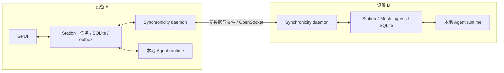

# 用 Synchronicity 构建 Zork Mesh

2026-09-05。设计研究与后续方向。第一条远端任务闭环已实现并通过双隔离节点实验；当前范围见 [实施说明](local-mesh.md)。研究依据 Cue 实际接入代码和它固定使用的 Synchronicity v0.1.8；不以 main 的新增功能作为前提。

## 结论

采用 Synchronicity 作为节点身份、P2P 连接、对象发现和文件传输底座。Zork Station 管理任务、消息、委派、验收、权限和持久重试。首版使用独立 daemon，经本机 gRPC 控制；不把整个 Station 数据库同步成一个文件，也不让 GUI 持有 Mesh 生命周期。

关键发现是它已经提供 `OpenSocket`：文件同步之外，能通过同一个 Iroh endpoint 访问远端激活的服务。可以先用这个入口验证 Agent 通信，暂不另建一套 P2P 网络。这里是同一 endpoint 上的不同 ALPN，并非所有业务强制共用一条 QUIC 连接。

## 已核实的底座

| 能力 | 源码事实 | 对 Zork 的含义 |
| --- | --- | --- |
| Cue 接入 | Electron 管理每个安装实例的 daemon，Unix control socket + token；固定 v0.1.8、control wire 5 | 借鉴安装、校验和控制客户端边界；Zork 使用自己的数据目录和密钥，不复用正在运行的 Cue 节点 |
| 身份和发现 | Iroh 认证设备密钥；支持静态信任、DNSSEC 成员、发现和 relay | 首版个人设备显式交换并核对公钥，双方建立信任；无需先接 Cue 账户体系 |
| 同步 | 每个 origin 发布自己的签名 Merkle trie；元数据复制，内容按需获取，Bao/BLAKE3 校验 | 用于发现不可变产品记录和传输产物；不提供产品任务共识 |
| 多版本 | 同一路径呈现不同 origin 的版本，选择策略可为 newest/origin/strict | 不能把它直接当成 Zork 文件的历史 v1/v2，更不能用 newest 决定任务状态 |
| 远端通信 | `sync/sock/1` 和 gRPC `OpenSocket`；本地激活的 eBPF 程序处理字节流 | 部署一个固定小桥接程序，连接本机专用 Mesh 入口；Agent 仍在现有 runtime 运行 |
| 认证上下文 | `sy_peer_info` 等读取握手身份；`Open.meta` 是调用者输入 | 节点身份必须取自握手，不能相信请求中的 `from_node` 字段 |
| 授权 | rooted member 可读全部 spaces；delegate 按 spaces 限制，授权可合并，撤销需要传播 | Workspace 名称不是安全隔离。首版限同一拥有者的完整信任设备；异主协作另做明确授权 |
| 故障 | Socket 有并发/资源/空闲限制，连接中断会结束 invocation | 字节流不是持久任务队列。断线不等于取消任务，不自动换节点重新执行 |

Cue 的云端 enrollment 会把节点纳入 Workspace 对应的网络与域；裸节点可以先独立运行。Zork 首版不调用 Cue enrollment，不依赖 Cue 中心成员 Registry。公网发现和 relay 仍可能使用外部基础设施，后续可配置自建；不能把“不依赖 Cue 账户”称为“完全无外部服务”。

## 进程与模块



`zork start` 的 Supervisor 管理 Station 和 Agent。Station 直接持有 `synch-engine::Node`，在自己的 Tokio runtime 中运行和回收同步任务；不再启动 daemon 或本地 gRPC 控制服务。每个数据目录由库的生命周期锁保证只有一个持有者；不同测试实例使用不同数据目录和身份。

建议添加 `zork-mesh` 模块/库，封装控制连接、节点状态、对象发布/获取和远端流，不把 Synchronicity proto 类型传入 GUI 或产品数据库。daemon 与控制 proto、wire version 成套固定升级；沿用 Cue 的校验、超时和重启后 token 更新经验。可变操作由持久命令 ID 去重，不能沿用读请求的盲重试。

直接嵌入 `synch-engine` 也是可行路线，但会把其存储、Iroh 和 socket runtime 生命周期纳入 Station。首版 sidecar 更接近 Cue 已有接法，也便于独立定位问题；完成通信实验后再决定是否值得嵌入。

## OpenSocket 桥接

远端 `OpenSocket` 定位到明确 origin 的 `zork-control/mesh.sock`，不能使用默认 newest 路径选择服务。该路径只由 Zork 部署流程写入和本机激活；普通文件提交、远端 adopt 和工作区扫描均不能修改它。上游激活的是路径，未来写入会部署新代码，因此仅记录内容 hash 不能代替部署权限控制。

桥接程序只允许连接一个明确的 loopback TCP 地址和端口。上游已支持 TCP egress；本提案不假设它已有 Unix socket egress helper。这个端口提供有边界的 Mesh 协议，不转发完整 Station 管理 HTTP API。

桥接先从 `sy_peer_info` 取 origin/device key，再向本机 ingress 写一个有长度边界的认证前导，之后才转发请求帧。前导使用独立本机桥接凭据鉴别来源，凭据来自本机 activation config，不能写进同步的 ELF、公开 manifest 或日志。Ingress 每条连接只接受一次前导，绑定所有后续请求的 peer，拒绝载荷改写身份。对同一 OS 用户拥有读取这些本地秘密权限的进程，不宣称实现额外隔离。

身份可信传递、半关闭、短写、断连及凭据轮换都需要实测。`OpenSocket` 和 helper 的存在只证明这条路线有源码支撑，不等于 Zork 桥接已经实现。若实测不适合承载认证上下文，再评估小型上游 host-service 扩展或嵌入 engine；不以信任客户端 header 作为妥协。

## 产品对象和写入权威

保留已经实现的 Task / Run / 显式 final / 人工验收模型。新增稳定 `node_id`、`agent_id`、`workspace_id`，Workspace 在各节点映射为自己的本地目录；远端命令不能提交一个绝对路径来选择执行目录。Agent 绑定节点及配置版本，能力广告只用于选择，执行方重新验证权限。

首版每个 Task 有一个固定 `owner_node_id`：它持久保存目标、参与者和产品决策 revision。每个 Run 有一个固定 executor，只有它提交该 Run 的执行事实。远端设备可以提交操作请求，但 owner 未确认前只能显示待发送/待确认。只读副本离线可用，离线修改先成为本地草稿或命令，不声称已经全网生效。

| 记录 | 谁决定 | 基本约束 |
| --- | --- | --- |
| 目标、委派、取消、重开、验收 | Task owner | `expected_revision`；收到重复命令返回原回执 |
| Run 开始、进度、失败和结束 | 指定 executor | 绑定 owner 发出的 `assignment_id`、`run_id` 和代次 |
| 候选结果及文件 | executor 提交，owner 接纳为产品结果 | 显式 final；引用确切消息、产物 ID 和完整内容 root |
| completed | owner 在用户验收后写入 | 验收确切结果集；运行结束不会自行变成 completed |

验收请求即使从另一台 GUI 发出，也由 owner 做 CAS。新结果/文件已改变 revision 时拒绝旧验收。被撤销委派、旧代次或关闭任务的迟到结果保留审计，但不恢复已关闭状态。首版不做 owner 自动迁移和执行器自动故障转移；这是明确的一致性取舍，owner 长期离线时产品决策等待恢复。

## 持久投递与复制

产品事件在 Station SQLite 事务里落盘，与投影、outbox 一起提交。Synchronicity 发布的是这些记录的不可变导出，另一端导入后构建本地投影。RPC 和同步文件传递同一个事件 ID、内容 digest 和业务载荷，只有一个去重/校验入口，不形成两套可独立修改的任务真相。

建议记录字段：`schema_version / event_id / issuer_node / issuer_seq / task_id / command_id / assignment_id / run_id / expected_revision / payload / payload_digest`，按消息类型取必需字段。远端记录必须匹配认证 origin；转发和导入必须保持原 origin 来源，不能由 relay 把任意复制文件重新发布成原作者。首版不支持跨 origin 的冒名转发。

每个 origin 的不可变导出路径可为：

```text
zork-ws-<workspace_id>/events/<issuer-seq>-<event-id>.json
zork-ws-<workspace_id>/artifacts/<artifact-id>/<full-content-root>
```

origin 是 Synchronicity 自带的来源维度。按发行者游标补齐缺失记录，不按 mtime 排序，也不把不同 origin 的序号当作全局时钟。首次上线先保留日志，不做事件删除/压缩；后续快照、GC 必须有单独协议。

委派流程：

1. A 事务保存委派与 outbox，UI 显示待对端接收。
2. A 用 OpenSocket 发送，失败后重连重发同一个 `command_id`；导出记录也可在重新同步后触发同一个接收入口。
3. B 校验 peer、Workspace 授权、命令代次和资源，在事务内保存 inbox 与待启动 Run，然后发送“持久接收”回执。
4. B 的调度器从已保存状态启动/恢复 Run，执行不依赖流仍然存在。重启时先核对已有 runtime 绑定，不能直接再启动一次。
5. B 持久提交进度、显式 final 和产物清单；A 导入并更新 Inbox，验收决定仍由 A 写入。

投递是至少一次，持久 command/run ID 使重复提交不重复建 Run。任意 shell、外部 API 的副作用不因此获得 exactly-once 保证；无法判断是否已执行时标记需要处理，不自动补跑。取消需要独立命令及执行器停止回执，不能把断线当作停止确认。成员撤销还应关闭已建立的产品连接、拒绝后续命令，并按明确策略处理在途 Run；网络 trust 删除本身不代表外部工作已回滚。

## Drive 如何接上

当前 `task_artifacts` 保存不可变 SQLite 字节快照，先保留这个入口和历史 ID。增加 `origin / space_id / object_path / content_root / byte_length / availability`，Zork 的 v1/v2 继续表示任务提交历史。

Synchronicity v0.1.8 的 gRPC `Read` 按 space/path/policy 读取，不能假设已有按期望 root 读取的强类型参数。因此采用不可变路径，指定 origin，下载后验证完整 BLAKE3 root 和长度才接纳；内容不匹配则拒绝，不能悄悄显示路径上的新内容。Cue adapter 的 `contentsHash` 截断到 19 字符仅用于 UI，不能用于这里的完整性检查。

元数据同步后可以先显示文件；内容分为“仅元数据、下载中、已缓存、固定保留、暂不可用”。点击预览按需下载，结果接收方至少固定保存验收涉及的产物；metadata 到达不代表离线已有字节。文件历史使用不复写路径并设置保留，不能依赖上游有限期 head history 当永久版本库。

跨两个存储系统的发布采用可恢复阶段：本地快照与发布 outbox 落盘 → 上传/发布 → 验证 root → 记录完成并关联产品事件。任何阶段崩溃都能按 ID 重试。迁移现有文件时保留 SQLite 原字节直到验证完成，之后才另行决定回收策略。首轮可只增加 Mesh 副本，不急着迁出全部旧文件或提升 10 MiB 上限。

不自动同步整个工作目录、模型密钥、Profile 凭据或内部 transcript。先只发布用户消息、显式 Agent 消息、任务事件和提交产物。

## 实施顺序及验收

**第一步：底座实验。** 在隔离数据目录启动两个 v0.1.8 节点，核验双向静态信任；完成真实文件发布/按需读取/root 校验，以及 OpenSocket 的认证身份 → 固定 loopback Mesh `Hello`。验证未信任设备被拒绝、伪造 `from_node` 无效、daemon 重启后可恢复。单机双实例用于故障注入，再用两台真实设备验证跨 LAN/relay 连通；不先接真实任务执行权限。

**第二步：一个远端 Run。** 建立持久 inbox/outbox、固定 owner/executor 和 Workspace 映射。A 指派 B，B 运行已有 Agent，显式投递结果。重复命令、ACK 丢失、双方重启、途中断网、取消与迟到结果都必须保持同一 Run 身份，不产生重复启动。

**第三步：完整产品闭环。** 远端消息进入 Conversation，结果进入 Inbox，确切文件版本进入 Drive。A 人工验收后，两端最终看到同一产品状态；删掉原工作区文件和断开 executor 后，已固定产物仍可读取。

**之后再扩展：** 多人空间授权、节点移除与恢复、owner 显式迁移、多 Agent 并行、日志快照/配额，以及身份密钥轮换。key origin 换 key 会换身份，必须设计节点替换和产品归属迁移，不能承诺原地无感轮换。

## 核对来源

- Cue 固定版本：[synch-release.ts](../../cue/clients/apps/electron/scripts/synch-release.ts)，v0.1.8，wire 5。
- Cue daemon/control：[index.ts](../../cue/clients/apps/electron/src/main/modules/synchronicity/index.ts)、[control-client.ts](../../cue/clients/apps/electron/src/main/modules/synchronicity/control-client.ts)。
- Cue Drive 映射与 enrollment：[driveSynchronicityBackend.ts](../../cue/clients/packages/app/src/components/drive/driveSynchronicityBackend.ts)、[driveBackend.ts](../../cue/clients/packages/app/src/components/drive/driveBackend.ts)。这些是本机相邻 checkout 的研究引用。
- 上游固定版本：[DESIGN.md](https://github.com/AFK-surf/synchronicity/blob/v0.1.8/DESIGN.md)、[SOCKETS.md](https://github.com/AFK-surf/synchronicity/blob/v0.1.8/docs/SOCKETS.md)、[control.proto](https://github.com/AFK-surf/synchronicity/blob/v0.1.8/crates/synch-cli/proto/control.proto)。tag 对应 `6d6283f09c32476dc77c09f76a2b2529a42a558d`。
- 本次也比对 main `c2f49afcd926d7a6ee9716f64a8414800f7c71da`：SOCKETS 文档、socket engine 和 control proto 与 tag 无差异；其他模块有变化。示例 C 文件头的旧 CLI 命令不作为可执行接入步骤。
- Zork 现有基础：[产品任务](local-product-tasks.md)、[Drive](local-drive.md)、[整体差距分析](local-first-cue.md)；进程入口 `crates/zork/src/main.rs`，产品数据位于 `crates/station/src/db/`。

2026-09-05 实施更新：已完成底座实验及第一条远端任务闭环，在 mini1 双隔离节点上验证了真实传输、恢复、取消、Inbox / Drive 与人工验收。当前范围、安装步骤和未完成项见 [实现说明](local-mesh.md)。本文中通用复制、多轮工作流、按需下载及跨物理设备验收仍属于后续目标。
